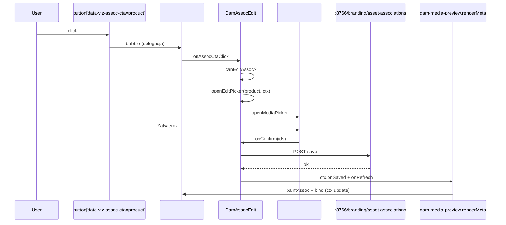
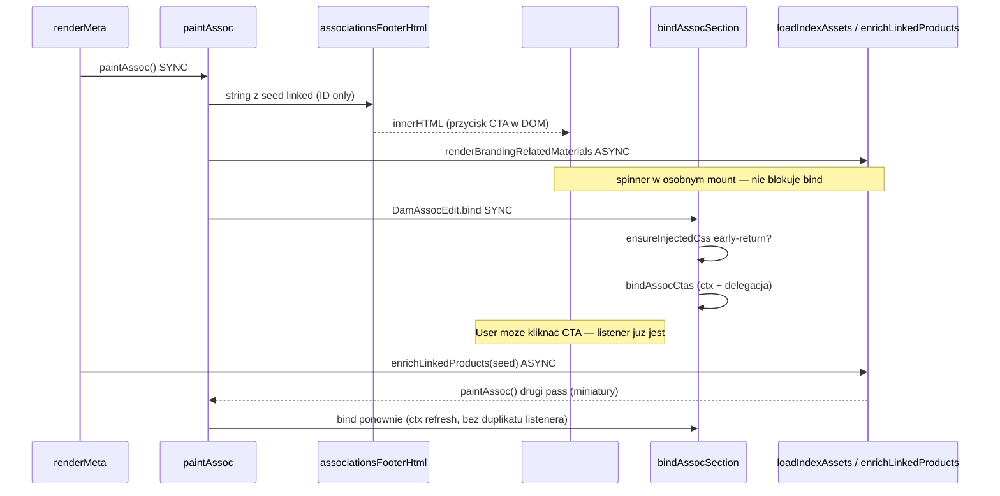

# WYKLADNIA KODU DAM (Code Doctrine) - czytaj ZAWSZE przed zmiana kodu

> Status: OBOWIAZKOWA wykladnia i instrukcja. Dokument nadrzedny nad "przeczuciem".
> Kolejnosc zrodel prawdy: `program-instructions.json` > ten dokument > `memory.md` > kod.
> Ten plik uczy CZYTAC kod DAM, rozumiec DLACZEGO cos dziala (a cos innego nie),
> i podejmowac trafne decyzje szybciej. Nie zgaduj - tu masz mape.

Autor pierwszej wersji: agent, ktory naprawil silnik animacji `reveal` i edytor
skojarzen (2026-07-20). Kazdy kolejny agent DOPISUJE lekcje (patrz sekcja 12).

---

## 0. Jak uzywac tego dokumentu

> **SKILL projektu:** `dam-dobrakaloria` (Cursor Agent Skill, `~/.cursor/skills/dam-dobrakaloria/`).
> Zawiera skrot tej doktryny + obowiazkowa petle weryfikacji:
> **kod -> test (node --check / CDP) -> screenshot+Read -> poprawka = 1 PRZELOT**
> (synonimy usera: tura / pass / podejscie). Minimum 3 przeloty na zadanie wizualne.
> **RUNDA** = seria przelotow na JEDNYM elemencie az do czystego wyniku
> ("10 rund" = 10 elementow, nie 10 screenshotow calosci). Jesli skill jest
> dostepny w srodowisku - uzywaj go przy kazdym zadaniu w tym repo.

- Przed KAZDA zmiana w `apps/web/**` przeczytaj sekcje 1-6 (fundamenty) i te
  studium przypadku (7-8), ktore dotyka Twojego obszaru.
- Gdy cos "nie dziala u usera, a u mnie tak" - sekcja 3 (cache) i sekcja 5 (weryfikacja).
- Gdy edytujesz plik, ktory moze edytowac inny agent - sekcja 4 (wspolbieznosc).
- Gdy dodajesz animacje / overlay / modal - sekcje 7 (reveal) i 8 (z-index warstw).
- Po rozwiazaniu nowego, nieoczywistego problemu - DOPISZ lekcje w sekcji 12.

---

## 1. Mapa systemu (architektura runtime)

DAM to panel bez build-stepu dla warstwy web. To znaczy: **piszesz zwykly ES5-ish
JS/CSS/HTML, ktory przegladarka laduje wprost**. Nie ma bundlera, nie ma transpilacji.
Dlatego:

- Zmiana w pliku `.js`/`.css` dziala dopiero gdy przegladarka pobierze nowa wersje
  (patrz sekcja 3 - cache-busting).
- Skladnia musi byc zgodna z przegladarka (unikaj rzeczy wymagajacych transpilacji,
  trzymaj sie wzorca z sasiednich plikow).

Dwa procesy w tle (uruchamia je user / desktop shell, NIE restartuj bez potrzeby):

| Co | URL | Rola |
|----|-----|------|
| Serwer web (python http.server) | `http://127.0.0.1:8765` | serwuje `apps/web/**` (HTML/JS/CSS/JSON) |
| Most lokalny (`apps/desktop/local_bridge.py`) | `http://127.0.0.1:8766` | dostep do dysku `X:`, podglady, zapis skojarzen, OAuth, finanse |

Dane to statyczne pliki JSON w `apps/web/data/` (nie baza w runtime web):

- `file-index.json` - produkty/warianty (patrz sekcja 6).
- `branding-index.json` - assety brandingowe (linked_products, folder_editable_files, background...).
- `branding-search-index.json`, `program-instructions.json`, override'y.

Most 8766 jest jedynym mostem do `X:` (NFS/Synology). Operacje na dysku sa WOLNE
i moga sie zawiesic (sekcja 9). Web bez mostu nadal renderuje UI z JSON-ow.

---

## 2. Wzorzec modulu i jak znalezc "wlasciciela" funkcji

Kazdy plik JS to IIFE eksportujaca jeden globalny obiekt `DamXxx`:

```js
(function (global) {
  "use strict";
  // ... funkcje wewnetrzne (closure, NIE widoczne z konsoli) ...
  global.DamFoo = { publicMethod: ..., ... };
})(window);
```

Konsekwencje praktyczne:

- Funkcje NIE wymienione w `global.DamFoo = {...}` sa prywatne - nie wywolasz ich
  z konsoli/CDP. Zeby przetestowac prywatna sciezke, wywolaj ja przez UI
  (klik, event) albo przez publiczne API modulu.
- "Kto to renderuje?" -> szukaj po nazwie klasy CSS / id elementu (Grep), potem po
  `global.Dam...`. Mapa modulow: sekcja 11.
- Moduly gadaja przez `window.DamX` (np. `DamPaths`, `DamMediaPreview`, `DamBadges`,
  `DamGridReveal`, `DamAssocEdit`). Zawsze sprawdzaj `typeof` przed uzyciem
  (moga sie ladowac w roznej kolejnosci).

---

## 3. Cache-busting - #1 powod "zmienilem, a nie dziala"

HTML laduje skrypty z wersja: `dam-foo.js?v=jakas-wersja`. Przegladarka cache'uje
po pelnym URL (razem z `?v=`). **Jesli nie zmienisz `?v=`, user dostanie STARY plik**
mimo Twojej edycji.

Zasada:
1. Zmieniasz `apps/web/assets/js/foo.js` lub `.css`? -> zbumpuj `?v=` w KAZDYM HTML,
   ktory go laduje (Grep `foo.js?v=`).
2. Dodanie `?v=` do adresu STRONY (np. `index.html?v=x`) NIE odswieza skryptu -
   skrypt ma wlasny `?v=` w tagu i to on decyduje.
3. Do QA w przegladarce mozesz wymusic swiezosc przez inny `?v=` w tagu skryptu albo
   CDP `Network.setCacheDisabled`. Ale user zobaczy fix dopiero po bumpie w HTML.

Pulapka wspolbieznosci: jesli inny agent wlasnie edytuje ten sam HTML (tagi skryptow),
patrz sekcja 4 zanim zbumpujesz.

---

## 4. Wspolbiezni agenci - wlasnosc plikow (HARD)

W tym repo czesto pracuje kilku agentow naraz (patrz `AGENTS.md`). Edycja tego samego
pliku = nadpisanie cudzej pracy.

Zasady:

1. **Nie edytuj pliku, ktory nalezy do innego, aktywnego agenta.** Jesli zadanie tego
   wymaga - odloz te czesc i zanotuj, albo poczekaj az skonczy.
2. Jak sprawdzic czy agent skonczyl: w transkrypcie subagenta ostatnia linia
   `{"type":"turn_ended","status":"success"}`. Dopiero wtedy jego pliki sa "wolne".
3. **Potrzebujesz stylu, a CSS nalezy do innego agenta? Wstrzyknij CSS z JS.**
   Wzorzec (uzyty w `dam-assoc-edit.js`): jednorazowy `<style id="...">` dodany do
   `document.head`. Zero konfliktu z plikami `.css` agentow.
   ```js
   function ensureInjectedCss() {
     if (document.getElementById("mojeCss")) return;
     var s = document.createElement("style");
     s.id = "mojeCss";
     s.textContent = "...reguly...";
     document.head.appendChild(s);
   }
   ```
4. Z-index / warstwy overlayow potrafi kolidowac miedzy modulami roznych agentow -
   ustawiaj je swiadomie i lokalnie (sekcja 8).

---

## 5. Weryfikacja: DOM/CDP vs screenshot

### 5.0 HARD GATE: serwery zanim przeglądarka (wszyscy agenci)

**Zasada usera:** brak odpowiedzi w **5 s** = port martwy; **nie czekaj** na navigate ani screenshot.

Przed `browser_navigate`, screenshotem lub CDP UI:

1. Smoke `:8765` (HTML) i `:8766` (`/health`) - `curl.exe --max-time 5` lub
   `scripts/ops/smoke-dam-ports.ps1`.
2. Nie 2xx w 5 s -> **nie otwieraj przeglądarki**. Start:
   `python apps/desktop/serve_browser.py` (albo `run-dam.vbs`), smoke ponownie, **kontynuuj zadanie**.
3. Browser MCP wiszący / interrupt po ~10 s+ -> awaria narzędzia; nie kończ tury na
   „Navigated to…”. Timeout na każde curl/fetch/MCP. Raportuj blocker, jedź dalej
   (kod, `node --check`, curl API).

Reguła Cursor: `.cursor/rules/server-timeout-never-hang.mdc`.

Regula repo (`verify-ui-after-changes.mdc`) to HARD GATE: po zmianie wizualnej
robisz screenshot i CZYTASZ go narzedziem Read (vision). To zostaje.

ALE naucz sie dwoch rzeczy:

1. **Dowod liczbowy > "wyglada ok".** Do sprawdzenia logiki (czy element widoczny, jaki
   ma z-index, ile jest wynikow, jaka pozycja) uzywaj CDP `Runtime.evaluate` /
   `getBoundingClientRect` / `getComputedStyle` / `elementFromPoint`. To jest
   deterministyczne i nie klamie.
2. **Stale-frame gotcha (wspoldzielona karta przegladarki).** Gdy kilka agentow dzieli
   te sama karte IDE, `browser_take_screenshot` potrafi zwrocic STARA klatke (np. bez
   swiezo otwartego modala), mimo ze DOM potwierdza, ze modal istnieje. Objaw: DOM mowi
   "overlay display:flex z-index 12100", a screenshot pokazuje czysta strone.
   Obejscie: wymus repaint (drobny scroll / toggle transformu + `void el.offsetHeight`),
   odczekaj klatke, zrob screenshot ponownie. Jesli dalej stale - zaufaj pomiarowi DOM
   i zapisz to jako znane ograniczenie, ale NIE deklaruj "done" wizualnie bez chocby
   jednego swiezego screenshotu kluczowej klatki.

Kolejnosc: najpierw CDP (czy logika dziala), potem screenshot+Read (czy wyglada dobrze).

---

## 6. Model danych (co znaczy co)

`file-index.json` -> `products[]`. Klucze wazne przy skojarzeniach i wyszukiwaniu:

| Pole | Znaczenie | Pulapka |
|------|-----------|---------|
| `id` | slug produktu (np. `tarta-malinowa-nerkowcowy`) | uzywany jako klucz skojarzen |
| `display_name` / `name` | nazwa czytelna / z folderu | `name` moze miec `-` zamiast em-dash |
| `indexes` | WSZYSTKIE indeksy produktu, np. `["000108.00","6300539.01",...]` | pelne, z kropka i wariantem |
| `index_bases` | indeksy bez sufiksu `.NN` | do dopasowan "po bazie" |
| `revisions[].index` | indeks per rewizja | zrodlo `indexes` |
| `search_blob` | gotowy, znormalizowany tekst do wyszukiwania | UZYWAJ GO - juz scala nazwy/indeksy/tagi |
| `path` | sciezka na dysku (`X:/Marketing/...`) | do dopasowania folder->produkt i "otworz folder" |
| `tags` | tagi produktu | |

`branding-index.json` -> assety brandingowe: `linked_products`, `folder_group_id`,
`folder_editable_files`, `background` (transparent/white - z realnego skanu pikseli),
`media_type` (image/video/document/vector). Zapis skojarzen: POST
`:8766/branding/asset-associations` (`asset_id`, `folder_group_id`,
`linked_product_ids`, `linked_variant_ids`).

Lekcja z sekcji 8 (search): NIE buduj wlasnego, ubogiego bloba z `indexes[0]` -
uzyj `search_blob` + pelnych `indexes`/`index_bases`.

---

## 7. STUDIUM PRZYPADKU 1 - Silnik animacji `reveal` (`dam-grid-reveal.js`)

### Co robi
Wspolny silnik "wjazdu" elementow: siatki kart (Projekty, Wizualizacje, Branding,
Dashboard, Eksplorer, Wiadomosci), tresc modali (gora->dol) i sidebar. GSAP jako
biblioteka animacji. API: `DamGridReveal.reveal(container, selector)` (siatki) i
`revealSequence(...)` (modale/sidebar). Tempo (po v2.0.7): `DURATION ~0.4s`,
`STAGGER 0.05s`; belki (toolbary/filtry) animowane jednorazowo przez `revealBars()`.

### Jak dziala i DLACZEGO tak
- Siatki uzywaja **IntersectionObserver** - element animuje sie DOPIERO gdy wjedzie
  w viewport ("jak na prawdziwej stronie"). Bez tego cala siatka 44000px animuje sie
  naraz przy renderze i user nigdy tego nie widzi.
- Modale nie sa scrollowane do widoku - pojawiaja sie - wiec dla nich robimy kaskade
  OD RAZU (`revealSequence`), bez bramki viewportu.
- Modale animujemy **generycznie, przez MutationObserver na `document.body`**, ktory
  wykrywa dodanie `.dam-viz-modal-overlay` i odslania `.dam-viz-modal__thumb` (fade) +
  dzieci `.dam-viz-modal__body` (zjazd z gory). Dzieki temu NIE dotykamy plikow modali
  (`dam-media-preview.js`, `dam-viz.js`) - patrz sekcja 4.
- `#damHelpFab` i stale przyciski NIE animuja sie (nie sa w selektorach).
- `prefers-reduced-motion` => czyscimy style, element od razu widoczny.

### PULAPKA, ktora kosztowala regresje (naucz sie tego na pamiec)
Chcielismy efekt "wycierania" od gory: `clip-path: inset(0% 0% 100% 0%)` w stanie
spoczynku (element scisniety do zera wysokosci), potem animacja do `inset(0 0 0 0)`.

**To zakleszcza IntersectionObserver.** Collapsing `clip-path` zeruje malowany
prostokat elementu, wiec IO raportuje `intersectionRatio = 0` i `isIntersecting=false`
- nawet gdy element jest fizycznie w viewporcie. Skoro IO nigdy nie widzi elementu,
reveal nigdy sie nie odpala => karty zostaja `opacity:0` na zawsze.

Dowod (zmierzony CDP `IntersectionObserver` na tej samej karcie):
- stan z `clip-path: inset(...100%)` -> `ratio 0`, `isIntersecting false`
- po usunieciu `clip-path` -> `ratio 0.61`, `isIntersecting true`

**Zasada (poprawka):** stan spoczynku obserwowanego elementu = TYLKO `opacity: 0`
(prostokat nienaruszony, IO dziala). `clip-path` (wycieranie) dodajemy DOPIERO w
tweenie `fromTo(...)` i czyscimy na koncu (`clearProps`).
```js
gsap.set(nodes, { opacity: 0 });               // stan spoczynku - bez clip-path
gsap.fromTo(nodes,
  { opacity: 0, clipPath: "inset(0% 0% 100% 0%)" },   // clip tylko na czas animacji
  { opacity: 1, clipPath: "inset(0% 0% 0% 0%)", clearProps: "clipPath,opacity", ... });
```

### Powiazana lekcja: `autoAlpha` vs `opacity`
GSAP `autoAlpha` = `opacity` + `visibility`. `visibility:hidden` bywa OK dla IO, ale
zeby wykluczyc ryzyko - dla elementow OBSERWOWANYCH przez IO uzywaj czystej `opacity`.
`clip-path` i `display:none` LAMIA IO; `opacity` i (zwykle) `visibility` - nie.

---

## 8. STUDIUM PRZYPADKU 2 - Edytor skojarzen (`dam-assoc-edit.js`)

### 8.1 Wyszukiwarka nie znajdowala po indeksie (np. `6300539.01`)
Przyczyna: blob wyszukiwania budowano z `productIndexOf(p)`, ktore zwraca
`indexes[0]` UCIETE do kropki (`"6300539.01"` -> `"6300539"`, a czesto tylko
`"000108"`). Wiec caly zbior pozostalych indeksow (i pelna forma z `.01`) nie byl
przeszukiwany. Efekt: "jest tam jak byk, a nie znajduje".

**Zasada:** do wyszukiwania uzywaj bogatego bloba - `search_blob` + `indexes` (pelne)
+ `index_bases` + `tags` + nazwy. Nie wymyslaj ubozszej wersji tego, co indekser juz
policzyl.
```js
function productSearchBlob(p){
  return [p.search_blob||"", p.display_name||"", p.name||"", p.id||"",
          (p.indexes||[]).join(" "), (p.index_bases||[]).join(" "),
          (p.tags||[]).join(" ")].join(" ").toLowerCase();
}
```

### 8.2 Folder picker byl nieklikalny (warstwy z-index)
Overlay edytora skojarzen `.dam-assoc-edit-overlay` ma `z-index: 12100`. Folder picker
`.dam-thumb-picker-overlay` mial `z-index: 10050`. Picker otwieral sie POD nakladka
skojarzen (ktora zaslania caly ekran) => kliki trafialy w spodnia nakladke.

Diagnoza warstw (deterministyczna): `document.elementFromPoint(x,y)` w srodku pickera
- jesli zwraca element spoza pickera, picker jest zaslaniany.

**Zasada:** overlay otwierany "na wierzchu" innego overlaya musi miec WYZSZY z-index.
Poprawka bez ruszania cudzego CSS: ustaw inline w JS `overlay.style.zIndex = "12300"`.
Utrzymuj swiadoma skale warstw (modale ~9999, nakladki edycji ~12100, pickery nad nimi
~12300).

### 8.3 "Dodaj z dysku" nic nie dodawalo
Stara implementacja po wyborze folderu tylko pokazywala toast "dodaj recznie" i
konczyla - nigdy nie mapowala folderu na produkt.

**Zasada:** feature ma faktycznie wykonac akcje. Rozwiazanie: dopasuj folder do
produktu po `path` z `file-index.json` (normalizacja: backslash->slash, bez koncowego
slasha, lowercase), priorytet: exact match -> produkty POD folderem -> produkt bedacy
RODZICEM folderu. Dodane id trafiaja do `selected` i zapisuja sie.

### 8.4 Odznaczanie bylo niejasne
Odznaczona pozycja w "AKTUALNE" zostawala z pustym checkiem - user nie wiedzial, czy
cos sie stalo. Zapis i tak bral `Object.keys(selected)`, wiec logicznie dzialalo, ale
UX klamal.

**Zasada:** komunikuj stan wizualnie. Odznaczona pozycja "aktualna" pokazuje CZERWONY
X (`uil-times`) = "zostanie usunieta". To zamyka petle poznawcza usera.

### 8.5 Ikony w wierszach + indeks jako TAG
User chcial "typowe ikony" (folder, kopiuj link) i indeksy jako tagi. Uwaga
techniczna: **nie zagniezdzaj `<button>` w `<button>`**. Wiersz to `<div opt-row>` z
glownym `<button opt>` (toggle) + osobnym `<span row-actions>` z przyciskami ikon.
Toggle bindujemy TYLKO na `.opt[data-id]`; ikony maja `stopPropagation`. Styl (tag,
ikony) wstrzykniety z JS (sekcja 4).

---

## 9. Pulapki srodowiska (Windows / PowerShell / X:)

- **PowerShell nie akceptuje `&&`** jako separatora. Uzywaj `;` lub osobnych wywolan,
  albo sprawdzaj `$LASTEXITCODE`.
- **`curl` w PowerShell to alias `Invoke-WebRequest`** i potrafi zawisnac przy pipe.
  Do HTTP uzywaj `curl.exe -s --max-time 8 ...`.
- Sciezki repo maja spacje i myslniki - zawsze cytuj `"..."`.
- Dysk `X:` (Marketing) to NFS/Synology - odczyt bywa wolny i moze sie ZAWIESIC.
  Skany pikseli/podglady rob z budzetem czasu i timeoutem; nie blokuj w nieskonczonosc
  (byl realny bug: `ThreadPoolExecutor.shutdown(wait=True)` wisial na martwym odczycie
  NFS - timeout nigdy nie dzialal; fix: watek daemon + `Event.wait(timeout)`).
- **Em-dash ban:** w kodzie/UI uzywaj `-` (hyphen), nie `?`/`?`.

---

## 10. Zasady debugowania (jak myslec)

1. Mikroinput -> makroplan: rozbij zgloszenie na atomy, ustal przyczyne PRZED fixem.
2. Najpierw znajdz PRZYCZYNE (root cause), nie objaw. Dowod > hipoteza (CDP, logi, dane).
3. "Dlaczego dziala X, a nie Y" - szukaj roznicy pomiarowej (np. IO ratio 0 vs 0.61).
4. Nie zgaduj funkcji/pol danych - sprawdz `file-index.json`/`branding-index.json`.
5. Nie ruszaj plikow innych agentow (sekcja 4). Nie restartuj mostu/serwera bez potrzeby.
6. Backup/ostroznosc przy operacjach destrukcyjnych; przy niejasnosci - pytaj.

---

## 11. Slowniczek modulow DamX (gdzie czego szukac)

| Modul (`window.Dam*`) | Plik | Odpowiada za |
|-----------------------|------|--------------|
| `DamGridReveal` | `dam-grid-reveal.js` | animacje reveal siatek/modali/sidebara |
| `DamAssocEdit` | `dam-assoc-edit.js` | edycja skojarzen produktow/wariantow, folder picker |
| `DamMediaPreview` | `dam-media-preview.js` | modal podgladu assetu brandingowego |
| `DamViz` | `dam-viz.js` | modal wizualizacji, warianty |
| `DamBranding` | `dam-branding.js` | siatka/filtry/facety brandingu, search |
| `DamPaths` | `dam-paths.js` | sciezki, `revealInExplorer`, `toPortablePath`, bridgeUrl |
| `DamBadges` | `dam-badges.js` | tagi/badge, klik->filtr |
| `DamMarketingId` | `dam-marketing-id.js` | kody typu assetu (VID/GIF/TIK/YT/REL...) |
| `DamProjects` | `dam-projects.js` | siatka Projekty |
| `DamExplorer` | `dam-explorer.js` | Eksplorer (wiersze produktow/nosnikow) |

Most: `apps/desktop/local_bridge.py` (endpointy: `/folder-browse`, `/folder-images`,
`/media`, `/branding/asset-associations`, `/program-instructions`, finanse, OAuth).

---

## 12. Dziennik lekcji (DOPISUJ tu nowe odkrycia)

### 2026-07-26 — Probe false PASS: openPicker ≠ real click; sync paint ≠ DamSearch async

**Objaw:** Agent raportował „all 4 CTA PASS” (search_ms 0–1) podczas gdy user widział FREEZE na viz CTA. Resilience probe też dawał PASS.

**Root cause (infrastruktura testów, nie dowód niewinności JS):**
1. **Programmatic `openPicker()`** omija realny UI path (card → modal → CTA click) — mierzy inny kod niż user.
2. **Sync paint 0–1 ms** po `input` (natychmiastowe „Szukam…”) ≠ pełny cykl async DamSearch+filter; stare e2e kończyło PASS na sync paint.
3. **`localStorage` / `window` w Node** → `ReferenceError: localStorage is not defined` — diagnostyka poza przeglądarką nic nie mierzy.
4. **Zepsuty WebSocket URL** (DOMException) → warstwa CDP martwa; „connection false-FREEZE recovered” ≠ JS OK.
5. **Resilience PASS ≠ e2e PASS** gdy kryteria się rozjeżdżają — jedna prawda: Mode B.

**Zasada (HARD):**
- overall_pass CTA = **Mode B only**: real card click → real `[data-viz-assoc-cta]` → `#damAssocEditSearch` → poll ≤8s na options / settled message; freeze jeśli main thread >2s lub brak update.
- Mode A (programmatic + sync paint) tylko etykieta diagnostyczna — **nigdy** nie ustawia overall pass.
- Browser API wyłącznie w stringach `Runtime.evaluate` / `Page.addScriptToEvaluateOnNewDocument`.
- WS URL wyłącznie z `/json/list` → `webSocketDebuggerUrl` (normalize `127.0.0.1`), nigdy ręcznie sklejany bez walidacji.
- „Connection recovered” na starym sync-paint probe **nie** dowodzi niewinności kodu.
- Manual Ctrl+F5 usera > automated PASS dopóki Mode B nie jest zielone.
- **Branding hydrate storm:** po siatce kart / `loadSearchIndex` main thread bywa zajęty >5s — Mode B musi czekać na quiet ping (`1+1` <250ms ×3) zanim kliknie CTA. `enrichLinkedProducts` **nie** wolno wołać `ensureFileIndex`/`DamSearch.load` (seed only gdy brak warm cache). Product cold open **nie** woła `ensureFileIndex` po shellu.

**Źródła:** `scripts/qa/lib/dam-cdp-assoc-probe-core.js`, `dam-assoc-picker-e2e-probe.js`, `dam-cdp-resilience-probe.js`.

### REFERENCE: assoc picker search history (2026-07-26)

Źródło: `git log -20` na `dam-assoc-edit.js` / `dam-search.js` / `dam-media-preview.js` / `dam-viz.js`.
v3.1.5 = `2b3873a` — **sync** `input → renderOptions(value)`, bez debounce scheduleListPaint.

| Commit | Version | Search model | Worked / froze | Why |
|--------|---------|--------------|----------------|-----|
| `2b3873a` | **3.1.5** | Sync `input→renderOptions`; init `renderOptions("")`; no DamSearch debounce on picker | **Worked** (golden UX) | Mała lista / sync paint; brak cold full-index scan w handlerze |
| `092821f` | 3.1.6 era | Backup / Geex realign | Mixed | Baseline przed 4.x assoc refactor |
| `e91aba0` | 4.0.48 | Pinned ≠ candidate pool; golden ensureFileIndex | Fixed freeze on open renderPinned | `renderPinned` × tysiące kandydatów |
| `5fb3493` | 4.0.49 | Unify picker; viz variants → product-index search | Worked (unify) | bootstrapQuery + material list; footer Dodaj z dysku |
| `5cf1ca4` | 4.0.57 | **for+break CAP**; viz `productSearchForVariants` + DamSearch; `pickerSkipsWarmFileIndex` | Fixed forEach freeze; **viz still risk** | forEach+return nie break; cold `ensureFileIndex` na visualizations |
| working 4.0.58–59 | 4.0.58/59 | scheduleListPaint + shell-first hydrate; DamSearch `light` | Branding PASS; **viz CDP timeout** | Viz main-thread + poll false-FREEZE; material bez init list paint |
| working **4.0.60** | 4.0.60 | Material always `scheduleListPaint`; sync Szukam; DamSearch `light`; e2e `#damAssocEditSearch` only | Stary e2e: false PASS (sync paint); **Mode B** = prawda (card+CTA+async) | Predykcja viz freeze — weryfikuj Mode B, nie sync 0ms |
| working **4.0.61** | 4.0.61 | Product cold open: **no** `ensureFileIndex()` after shell (DamSearch.load parse = post-CTA FREEZE) | Mode B caught hang; Mode A sync paint false PASS | Manual Ctrl+F5 nadal wyższy priorytet do potwierdzenia |
| **4.0.62 rollback** | 4.0.62 | Przywrócono bundle `5cf1ca4` (`renderOptionsDebounced`, golden `ensureFileIndex`, `pickerSkipsWarmFileIndex` bez product) | **4 CTA open** (baseline v4.0.56); search freeze nadal znany | 4.0.58–61 usunęły debounce + zablokowały cold product open → **żaden przycisk** |

**PREDICTION rule:** po tej tabeli zawsze wskaż CTA najbardziej ryzykowne na bieżącej wersji i zweryfikuj w e2e **Mode B** (patrz `process.md`). Stary raport „connection false-FREEZE cleared” bez Mode B = nieważny.

**Connection resilience (2026-07-26m+):** odpal `scripts/ops/dam-cdp-resilience-watchdog.ps1` (default max **20**, Mode B only). PASS = real UI click + async DamSearch settle. False confidence sources: (1) sync paint PASS; (2) programmatic openPicker; (3) Node `localStorage`; (4) bad WS URL; (5) CDP target `chrome-extension://…`; (6) `#vizSearch` fallback. Logi: `resilience-attempts.jsonl`, `e2e-assoc-report.json`, `last-resilience-report.md`.

### 2026-07-26 — Browser MCP hang != server down (connection watchdog)

**Objaw:** `cursor-ide-browser` (`browser_tabs` / `browser_navigate` / `browser_cdp` Runtime.evaluate) wisi minuty, podczas gdy `curl --max-time 5` na `:8765` / `:8766` wraca 2xx w ~2 ms.

**Lekcja:** Hang MCP przegladarki **nie** oznacza, ze DAM UI/bridge nie zyje. Zawsze przed `browser_navigate`:
1. `powershell -File scripts/ops/dam-pre-browser.ps1` (watchdog + probe w jednym; preferowane przed MCP).
2. Albo osobno: `dam-connection-watchdog.ps1` + `node scripts/qa/dam-browser-probe.js`.
3. Przy stuck: `powershell -File scripts/ops/dam-agent-unstick.ps1 -MaxAttempts 20`.

**FREEZE log:** `logs/dam-connection/freeze-log.jsonl` (pola: ts, tool, url, outcome, latency_ms, diagnosis, recovery_action). Raport: `logs/dam-connection/last-unstick-report.md`.

Format wpisu: data | obszar | objaw | przyczyna | zasada.

- 2026-07-26 | **4.0.58–4.0.61 regresja — żaden CTA** | User: po v4.0.57 wszystkie 4 przyciski
  przestały otwierać picker; v4.0.56 baseline (open OK, search freeze) utracony |
  (1) usunięto `renderOptionsDebounced` z input init/handler; (2) product cold open
  bez `ensureFileIndex()` + pusty `schedulePaintPicker({products:[]})` przy dużym warm
  index; (3) `scheduleListPaint` zastąpił debounce bez golden browse |
  **Zasada HARD:** przed kolejnym „anti-freeze” fixem — **nigdy** nie usuwać
  `renderOptionsDebounced` ani golden `ensureFileIndex` dla `kind==="product"`.
  Rollback = `git checkout 5cf1ca4 -- dam-assoc-edit.js` (+ HTML cache). Baseline
  akceptowalny: 4 CTA open, search może mulić. Lekcja: v4.0.62.

- 2026-07-26 | picker search freeze vs global search | `#damBrandingSearch` / `#vizSearch`
  / `#damFileSearch` OK; `#damAssocEditSearch` zacina cały UI; viz „Dodaj warianty”
  otwiera i natychmiast zacina |
  (1) `products.forEach` + `if (items.length>=CAP) return` — `return` w forEach NIE
  przerywa pętli → O(n) po całym file-index na każdy keystroke; (2) viz-warianty
  cold `ensureFileIndex` na stronie visualizations (branding ma już warm index);
  (3) fallback `productSearchHits || products` wracał do full scan |
  **Zasada:** global search = debounce + indeks/mała lista w RAM. Picker product/viz:
  q≥2 → **tylko** `DamSearch.search` (jak explorer); browse golden q&lt;2 →
  `collectProductPickerRows` z **for+break** na CAP; viz-warianty =
  `pickerSkipsWarmFileIndex` (paint bez file-index) + DamSearch. NIGDY forEach po
  całym `products[]` jako filtr wyszukiwania. Lekcja: v4.0.57.

- 2026-07-26 | GOLDEN path regresja 4.0.54/55 | „Dodaj/Edytuj produkty” w brandingu
  (zawsze działał) przestał działać; wiz warianty też; branding warianty otwiera i zacina |
  `pickerSkipsWarmFileIndex` obejmował `kind==="product"` i `productSearchForVariants`
  → `schedulePaintPicker({products:[]})` bez file-index; input szedł tylko w DamSearch
  async i `return` przed lokalnym `renderOptionsDebounced`; odbiegało od 5fb3493 |
  **Zasada HARD:** golden path product = warm `_DAM_FILE_INDEX` / `ensureFileIndex` +
  lokalny browse z for+break (commit `5fb3493` + v4.0.57). NIGDY nie dodawaj
  `kind==="product"` do skip-warm. Material/brandingSearch/productSearchForVariants
  mogą malować bez products. Przy regresji: `git show 5fb3493:...dam-assoc-edit.js`.
  Lekcja: v4.0.56/57.

- 2026-07-26 | assoc picker search freeze | wyszukiwarka w pickerze zacina całe UI;
  sugestie działają tylko dla 6300728/9; pusty stan „Brak skojarzonych materiałów”
  blokuje CTA; v4.0.54 miał SyntaxError (orphan `else`) — moduł w ogóle nie ładował się |
  (1) `renderOptionsDebounced` na `input` wołał sync `products.forEach` po całym
  file-index (~8MB); (2) `materialCandidates = []` zerowało seed przy braku materiałów;
  (3) fetch branding z `bootstrapQuery: ""` skanował cały indeks; (4) błąd składni
  w `renderOptions` po refactorze product branch |
  **Zasada:** picker search = async only: produkty/warianty viz → `DamSearch.search`;
  materiały/warianty branding → `/branding-search-picker` (min. 2 znaki); nigdy sync
  scan `products`/`file-index` w handlerze `input`; nigdy `materialCandidates = []`
  gdy ctx ma `materialsList`; bootstrapQuery z `pickerBootstrapQueryFromCtx` (630xxxx
  nawet bez linked materials); golden path „Edytuj produkty” nietknięty; agent
  nie wisi na browser_navigate — curl/CDP 5–15s. Lekcja: v4.0.55.

- 2026-07-26 | adaptery Assoc Edit w Viz | sugestie działały, ale produkty/warianty
  wpadały w błąd lub blokadę | CTA bez materiału brandingowego przekazywały
  `ctx.asset = null` do ścieżki POST wymagającej `asset_id`; dodatkowo sugestie
  materiałów są relacją odwrotną (kontekst produktu), a nie edycją jednego assetu |
  **Zasada:** shell `openMediaPicker` jest wspólny, ale adapter zapisu musi odpowiadać
  domenie: branding product/variant -> `saveAssociations(assetCtx)`, Viz suggestions
  -> patch `linked_product_ids` każdego materiału, Viz product variants ->
  `onRefresh({addedVariantPath})` / `onRemoveProductVariant(variant_key)`. Nigdy nie
  wywołuj `saveAssociations` bez `ctx.asset.id`; COMBO zwraca jawny payload `picked`.
  Lekcja: v4.0.26.

- 2026-07-26 | assoc freeze mimo MATCH served=workspace | user: brak reakcji CTA
  mimo v4.0.20 i hash MATCH | (1) `openMediaPicker` robil `renderPinned` +
  `renderOptions` + seed `materialCandidates` **w click stacku** przed return
  (false-green static); (2) `bindVizAssocCtas` per-button + `_damVizAssocCtasBound`
  gubil CTA dodane po pierwszym bind; (3) stale `dam-shell.js?v=4.0.19` w
  branding.html (niezalezny cache bug, nie root cause freeze) | **Zasada:**
  paint-first: shell + „Ładowanie…” sync; populate/fetch w `setTimeout(0)`;
  CTA = jeden delegowany listener; budget click &lt;16ms (harness
  `harness-assoc-click-timing.js`); served=workspace ≠ runtime PASS.
  Lekcja: v4.0.21.

- 2026-07-25 | assoc freeze / viz CTA | UI freeze po Dodaj/Edytuj sugestie|warianty
  oraz Edytuj wszystko | (1) fat path `buildAssocMediaPickerUi` + sync index
  bootstrap w HEAD `6e9462e`; (2) po restore 092821f warstwa 4.0.19 robila
  `editBtn.click()` i `saveAssociations` bez `ctx.asset` dla viz variants;
  (3) `ensureInjectedCss` budowal CSS string przed early-return | **Zasada:**
  Assoc Edit = wspolny shell `#damAssocEditPopover` z jawnymi adapterami
  (product / variant / material); COMBO osobno (`DamFolderPicker`);
  `ensureInjectedCss` return PRZED concat; zapis: `DamApi.ensureSession` +
  optimistic UI + status corner; nigdy `editBtn.click()` z CTA; nigdy
  `asset-associations` bez assetCtx; browser circuit breaker (smoke 5s /
  jedna proba ~10s). Lekcja wdrozenia: v4.0.20.

- 2026-07-22 | explorer zaciety loader | caly panel na "ladowanie", pusty main,
  tagi bez danych | init czekal na Promise chain: 8MB index + loadLifecycleStore +
  bootLifecycleReconcile (admin: skan X: enforce_moves) + syncLifecycleFromDiskIndex
  przed DamLoader.done() | **UI first:** loadExplorerMetaLight + index z timeoutem,
  renderAll, DamLoader.done(), lifecycle w requestIdleCallback; fetchWithTimeout
  na bridge (8-15s); usun debug fetch :7922. Regula serwerow: server-timeout-never-hang.mdc.
- 2026-07-22 | serwery + browser MCP | agent robi `browser_navigate`, wisi 224s,
  tura się urywa; user: curl też nie odpowiadał wcześniej | (a) :8765/:8766 down
  lub zombie; (b) MCP browser hang nawet gdy curl OK | **5 s bez HTTP 2xx = martwe**
  - smoke curl przed navigate; restart `serve_browser.py`; **nie czekać w nieskończoność**;
  timeout na każde żądanie; po blockerze **kontynuuj pracę** (kod/test/process.md).
  Skrypt: `scripts/ops/smoke-dam-ports.ps1`. Reguła: `.cursor/rules/server-timeout-never-hang.mdc`.
- 2026-07-22 | stale Geex Demo shell | user widzi Demo/Layout/App/Features/Pages
  + footer v1.00 zamiast DAM nav + `#damDashGrid` | (a) `dashboard.html` trzymał
  markup Geex jako pre-rewrite (DamShell dopiero po JS); (b) SW `dam-page-1h-*`
  oddawał cached HTML do 1h (cache-first) zanim network; (c) HTTP Cache-Control
  max-age=3600 na HTML | HTML navigations = network-first + bump CACHE name;
  serve_browser: no-cache na `.html`/`sw.js`; charset UTF-8 first; wyrzuć Demo
  nav z markup dashboard (puste `ul`, DamShell wstrzykuje); anti-demo wipe
  guard. Hard refresh gdy stary SW. index.html = Projekty (NIE demo).
- 2026-07-22 | Geex customizer peek clipped | closed DOSTOSUJ ~sliver / "zniknal"
  mimo translateX(100%-50px) i z=12600 | `.geex-customizer` zyl w
  `.geex-main-content` z `overflow-x:clip` (dashboard widgets); fixed child
  jest clipowany do prawej krawedzi main (~15px przed viewport) |
  `mountCustomizerToBody()` przed peek bind; closed = translateX(calc(100%-50px))
  + 50px `.dam-customizer-peek`; open = translateX(0) + fade content;
  NIGDY nie montuj off-canvas pod overflow:clip/hidden.
- 2026-07-22 | Geex customizer vs header | panel "Dostosuj wyglad" pod ikonami
  headera / ledwo widoczny (15px) | (a) Geex z-index 99 < header 200;
  (b) `"css" + /* comment */ + "more"` → `NaN` w inject string;
  (c) `left`+`width`+`right` over-constrain fixed panel | customizer z≥12600,
  header action z=60; NIGDY komentarz JS miedzy `+` w CSS concat; open via
  `left:auto; right:-400px` → `.active { right:0 }` (nie `left: calc(100%-400px)`
  razem z `right:0`).
- 2026-07-21 | preview onerror ≠ Synology | tooltip "Synology Drive / brak sync"
  na kazdym padnietym `` | onerror mylony z cloud-only | onerror = "Podglad
  niedostepny"; stan `online_only` TYLKO z `GET /file-availability` +
  `DamPreviewTruth`. Legalne Synology Share zostaje.
- 2026-07-21 | Redis optional + circuit breaker | connection refused / Docker down
  nie moze spowalniac UI probe'ami na kazdy request | po 3 bledach OPEN = pelny
  bypass; background probe ~12s; HALF-OPEN jedna proba; fallback matrix:
  avail=RAM/recompute, thumb meta=disk PAMIEC SoT, dry-run=RAM, warm=no-op/sync.
  Docker Desktop opcjonalny.
- 2026-07-21 | ELEMENTY preview 404 | panel Elementy: same "podglad niedostepny"
  mimo plikow na X: | branding-index trzyma stara nazwe rewizji (bez `PL EN`),
  dysk ma folder po rename jezykow; `/media` 404 => fallback | most musi fuzzy
  resolve sibling revision po indeksie 7-cyfrowym (`_resolve_missing_media_path`);
  fallback w thumb NIE duplikuje nazwy/ID (sa pod kafelkiem).
- 2026-07-21 | branding thumb overflow | `--dam-viz-img-scale: 1.2` mimo
  `CARD_IMG_BASE_SCALE=1` w dam-branding.js; img rect 272px vs thumb 255px |
  `applyBrandingCardZoom` early-return do `DamCardZoom.apply` (media-preview),
  ktory mial wlasne `CARD_IMG_BASE_SCALE=1.2` | zmieniac skale w DamCardZoom
  (wlasciciel) + dam-viz fallback; po zoom CDP `getBoundingClientRect` +
  `elementFromPoint` (clip CSS moze ukryc paint przy bleed rect).
- 2026-07-21 | samouczek gratulacje / off-path | gratulacje dopiero po "zlym"
  kliku; klik poza celem konczyl/przesuwal faze albo nawigowal precz |
  `onDocClick` chwalil KAZDY klik poza UI samouczka (a poprawny link
  nawigowal zanim user zobaczyl dymek) | gratulacje TYLKO przy `clickHitsTarget`
  + `preventDefault` na celach-linkach (~3.5s); off-path NIE konczy fazy.
- 2026-07-21 | samouczek explore-to-test | off-path z `preventDefault` na KAZDYM
  kliku + recreate companion (sad/wander) = UI zablokowane i spam tekstow |
  `exploreMode`: po 1. off-path companion BR + soft dim (`pointer-events:none`),
  kolejne kliki BEZ preventDefault; copy `tryExplore` throttle 12s; media kroki
  = `explain-assets/image/video` (NIGDY pose-5/present); gender tylko z mapy.
- 2026-07-21 | samouczek praise toast | praise w tipie (`is-congrats` + praiseLock)
  opoznial nextStep i blokowal "poczucie postepu" mimo auto-Dalej |
  `showCongrats` czekal CONGRATS_MS przed advance | advance-first (`nextStep`
  natychmiast), potem opcjonalny nieblokujacy `.dam-tut-praise-toast` (~25%,
  2275ms); rare burst osobno; NIGDY is-congrats na tipie.
- 2026-07-21 | inject CSS string concat | style toast nie mial border mimo reguly w
  zrodle | `s.textContent = a + /* komentarz JS */ + b` daje `a + (+b)` = `a + NaN`
  i psuje CSS | nie wstawiaj JS-comment miedzy operandami `+` w lancuchu CSS.
- 2026-07-21 | FORCE confirm modal cramped | `#damExplorerConfirmModal` zostawal
  520px / bez limitu wysokosci mimo reguly 70vw×90vh | ten sam bug `+ /* */ +`
  w `ensureExplorerCtaUnifyCss` produkował selektor `nan#damExplorerConfirmModal…`
  | komentarz JS NIGDY między `+` w CSS stringu; override
  `.dam-basepath-box.dam-explorer-confirm-modal` z `!important` na width/height;
  panel = flex column, scroll w `__body`.
- 2026-07-21 | branding `#damMediaPreview` dead white above actions | hero ~273px,
  actions sticky przy dnie z ogromna bielia nad CTAs | non-split body mial
  `flex: 1 1 auto` (dam-viz-modal.css) i kradl wysokosc thumbowi; sticky actions
  pinowaly sie do dna wysokiego body | body = `flex: 0 1 auto` (content-sized +
  scroll); thumb `flex: 1 1 0` bierze wolne VH; grid-area `actions`; nie dawaj
  grow na body gdy actions sa sticky w srodku.
- 2026-07-21 | viz all-files doubles+columns | `XL XL L L` + grupy ~187px side-by-side |
  brak dedupe po `size` w grupie Perspektywa|T?o (WIZKI multi-file) + `all-files`
  `auto-fill minmax(168px)` uklada grupy w kolumny | jedna karta na quality (prefer
  active); `all-files` = flex column; `all-group-grid` = horizontal flex.
- 2026-07-21 | viz assoc Shift minus | minus nie pojawial sie mimo bindMaterialsPane |
  `data-linked-asset-idx` siedzi na `.dam-media-preview__assoc-thumb-btn`, nie na
  `.assoc-item` | selektor minus = `.assoc-item--asset` + idx z child `[data-linked-asset-idx]`;
  nie duplikowac drugiej Shift UX w dam-viz ? tylko `DamAssocEdit.bindMaterialsPane`.
- 2026-07-21 | viz variants spam | dziesiatki `PL � index` w `#damVizModal` |
  `expandModalWizkiVariants` sp?aszcza ka?dy plik WIZKI do chipa | UI = branding
  studio (`T?o`/`Perspektywa`/`Jako??` via DamLabels), nie flat `variantChipLabel`.
- 2026-07-20 | sidebar morph | jank przy collapse/expand mimo GSAP 0.5s |
  tween `width+minWidth+maxWidth` + `paddingInlineStart` + `marginRight` ikon
  + stagger etykiet walczyl z Geex `transition: all 0.3s` i robil layout thrash
  co klatke | jedna os: proxy liczbowy -> `--dam-sidebar-w` (dam-app.css steers
  sidebar + main); etykiety tylko `autoAlpha`/`x` bez stagger; podczas morph
  `transition:none!important` + `will-change` na width/pad; kill TL przy toggle;
  `prefers-reduced-motion` => duration 0 / natychmiast.
- 2026-07-20 | wykrojniki XLSX | rejestr pelen `row-N` bez nazw | Kubara
  `opakowania_Kubara_baza_danych.xlsx` ma wiele sekcji z powtarzanym naglowkiem
  (kolumna ?oznaczenie Kubara?, nie `kod` w wierszu 0) | parser szuka wierszy
  naglowka po markerze; nie zakladaj pierwszego wiersza arkusza; UI nie pokazuje
  `python ?` jako glownego UX - bridge `POST /wykrojniki/reimport|link-products`.
- 2026-07-20 | bridge restart | nowe POST routes = `not_found` mimo edycji pliku |
  listener to `pythonw.exe` (watchdog), nie `python.exe` zabity przez agenta |
  przy restarcie mostu zabijaj procesy z `CommandLine` zawierajacym `local_bridge`.
- 2026-07-20 | integrations skeleton | rowne ~5 kart zamiast Bento | `DamGridReveal.skeleton`
  (`auto-fill minmax(220px)`) nie zna `dam-int-bento-grid` / `dam-int-tile--feature` |
  hub: wlasny skeleton na realnych klasach siatki (span-2 + sekcje Integracje/Planowane);
  nie uzywaj generic cards skeleton dla layoutow z `grid-column: span`.
- 2026-07-20 | usermenu | highlight Profil nizej niz ikona/tekst | Geex
  `.geex-content__header__popup__link { align-items: flex-start !important }`
  przebija dam-brand bez !important + min-height | w `#damShellLayerCss` wymus
  `align-items:center !important` + rowne `padding` (nie sam min-height).
- 2026-07-20 | tooltips | stray tip "Konto" w menu profilu | `dam-tooltips.js`
  tipuje kazdy `[aria-label]`, takze `<nav aria-label="Konto">` | nie dawaj
  aria-label na kontenery (nav/legal); `shouldAutoTip` skip NAV / role=menu.
- 2026-07-20 | paths / device | litera dysku ?globalna? dla konta | remote work
  (dom X: vs praca D:) | sciezka Marketing = per `device_id` (KV
  `user-device-paths:{email}` + `/user-device-paths/current`); LS/machine-config
  tylko cache biezacego PC; PI `device-scoped-base-paths`.
- 2026-07-20 | reveal | karty niewidoczne mimo animacji | `clip-path` w stanie spoczynku
  zeruje prostokat -> IntersectionObserver ratio 0 -> deadlock | stan spoczynku = tylko
  `opacity:0`; `clip-path` wylacznie w tweenie.
- 2026-07-21 | viz `#vizGrid` reveal 2× | `DamApi.me()` w `dam-shell.js` po boot
  dispatchuje `dam:admin-mode` → listener w `dam-viz.js` robił `applyFilters()`+`reveal()`
  drugi raz przy tym samym admin/showAll | latch `lastAdminVisibilityKey` + skip gdy
  `!indexData` lub klucz bez zmian; changelog `mountChangeLogInScope()` zostaje.
- 2026-07-20 | skojarzenia/search | brak wynikow dla `6300539.01` | blob z `indexes[0]`
  ucietego | uzywaj `search_blob` + pelnych `indexes`/`index_bases`.
- 2026-07-20 | overlay | folder picker nieklikalny | nizszy z-index (10050) niz nakladka
  skojarzen (12100) | picker musi miec wyzszy z-index (inline 12300); diagnoza
  `elementFromPoint`.
- 2026-07-20 | wspolbieznosc | ryzyko nadpisania CSS innego agenta | wstrzykuj CSS z JS
  (`<style id>`), nie edytuj cudzych `.css`.
- 2026-07-20 | QA | screenshot pokazuje stara klatke | wspoldzielona karta IDE | wymus
  repaint + odczekaj klatke; potwierdzaj logike CDP; nie ufaj samej auto-caption.
- 2026-07-20 | dashboard branding_latest | "Brak assetow w indeksie branding" przy
  7832 assetach | filtr `media_type === "raster"` (legacy) vs indeks z `image`/`vector`/`source`
  | uzywaj `normalizeMediaType` (raster->image) + `isBrandingWidgetThumb`; wspoldziel
  `window.__damBrandingIndex` z brandingiem.
- 2026-07-22 | dashboard branding_latest | "Indeks branding niedostepny" mimo
  branding.html (1000+ OK) i `__damBrandingIndex.assets.length≈51615` | `.catch` na
  renderze traktowal blad POST-JSON (ciezki filter po `search_blob`/OCR zaraz po
  parse ~387 MB) jako brak indeksu; brak bridge fallbacku | (1) dual URL jak
  `dam-branding.js` (`data/` + `/branding-index`), shared promise, (2) filter
  path/name only + `collectRecentBrandingThumbs`, (3) yieldTick + retry ze
  skeletonem; "niedostepny" tylko gdy brak danych po retry.
- 2026-07-20 | skeleton / branding+viz | pusta siatka podczas ladowania indeksu
  | skeleton tylko w costs/invoices; boot brandingu czekal na `await loadIndex()` zanim
  cos w `#damBrandingSectionGrid` | `showInitialBootSkeletons()` synchronicznie na starcie
  `boot()` / `init()`; `skeleton(..., layout:'viz-grid')` wstawia karty bezposrednio do
  `.dam-viz-grid`; po renderze innerHTML + `reveal(vizCard)`.
- 2026-07-20 | dashboard win-btn | Folder Windows nie otwiera po async branding_latest
  | `bindWinButtons(mount)` przed `outerHTML` w `.then()` | delegacja klik na `#damDashGrid`
  + re-bind na hoscie po async/toggle.
- 2026-07-20 | branding ?q | Brak wynikow z kafelka dashboardu | domyslna zakladka
  `campaigns` bez hitow | `bestTabForSearchQuery(q)` + `?tab=` ze sciezki assetu.
- 2026-07-20 | modal unify | dwa systemy podgladu (#damLightbox vs DamMediaPreview)
  | explorer nie ladowal media-preview | adapter `openLightbox` -> `openAsset(mode:
  viz-studio)`; shell close `#damMediaPreview` pierwszy.
- 2026-07-20 | bridge /reveal | okno Eksploratora otwiera sie W TLE | most = `pythonw`
  bez okna pierwszoplanowego, wiec explorer.exe z subprocess nie dostaje fokusu
  (foreground lock) | fokus wymus ALT-trickiem: `keybd_event(VK_MENU)` +
  `SetForegroundWindow` + `ShowWindow` + `BringWindowToTop`; rob to w watku daemon,
  nie blokuj odpowiedzi HTTP.
- 2026-07-20 | bridge /reveal karta | Navigate2 pokazywal dialog "Nie mozna odnalezc
  file:///...%20..." | sciezka podana Navigate2 jako string bywa rozwiazywana jako
  URL-encoded file URI (spacje/myslniki lamia parsing) | ZAWSZE PIDL:
  `SHParseDisplayName(path)` -> `PIDLAsString` -> `VARIANT(VT_ARRAY|VT_UI1)`.
  Nowa karta Win11 (build 26200): rejestr `OpenFolderInNewTab=1` NIE dziala,
  `Navigate2(path, 2048)` nawiguje biezaca karte; dziala fokus okna -> Ctrl+T
  (keybd_event) -> Navigate2(PIDL) na swiezej (pustej `LocationURL`) karcie;
  swieza karta przez chwile rzuca E_ABORT - retry ~8x co 0.4 s.
- 2026-07-20 | dashboard 2x2 | widget z etykieta 2x2 renderowal 1 kolumne | ogolna
  `.dam-widget__list` (display:flex) stala NIZEJ w dam-dashboard.css niz
  `.dam-widget__list--media` (grid) o tej samej specyficznosci - kaskada wygrywala
  flexem | przy rownej specyficznosci wygrywa pozniejsza regula; podbij selektor
  podwojna klasa (`.dam-widget__list.dam-widget__list--media`), nie `!important`.
- 2026-07-20 | branding perf | klik tagu mrozil UI do ~10 s | `renderTagFilters`
  (facet counts = petla assets x ~100 kluczy) w TEJ SAMEJ klatce co render siatki
  | fazuj: skeleton (klatka 1, tylko gdy poprzedni render >150 ms) -> siatka
  (klatka 2) -> tagi/facety (klatka 3, rAF); loader `DamLoader.start/done` na klamrze;
  skeleton musi dostac klatke na PAINT przed ciezkim synchronicznym renderem
  (rAF + setTimeout 0), inaczej nigdy go nie widac.
- 2026-07-20 | badge w title-wrap | chip ID uciety wielokropkiem mimo miejsca w karcie
  | `.dam-viz-card__title-wrap` ma `flex-wrap:nowrap` (dam-brand.css) i chip byl
  sciskany | scope'owany override `:has(.dam-branding-card__id-chip){flex-wrap:wrap}`
  w moim CSS - chip lamie sie do wlasnej linii; nie ruszaj cudzego dam-brand.css.
- 2026-07-20 | clipboard | `navigator.clipboard.writeText` z klikow symulowanych CDP
  odrzuca promise (brak user activation / fokusu dokumentu) | testujac kopiowanie w tle
  weryfikuj mechanizm (handler + toast), nie sam wynik clipboardu; realny klik ma
  aktywacje.
- 2026-07-20 | QA / samouczek | klik "Zakoncz samouczek" w tle NAWIGUJE karte na inna
  strone (fazy samouczka) | przed testami brandingu ustaw flagi dismissu samouczka
  w localStorage albo pracuj na swiezej karcie i sprawdzaj `location.href` przed
  kazdym pomiarem CDP.
- 2026-07-20 | samouczek/CSS custom property | `url('assets/img/...')` w custom property
  ustawianej JS-em w inline style rozwiazywal sie wzgledem pliku CSS (assets/css/), nie
  dokumentu -> 404 | buduj ABSOLUTNY URL przez `new URL(path, location.href).href` zanim
  wstawisz do `--var: url('...')`; nie wracaj do relatywnych sciezek w custom property.
- 2026-07-20 | samouczek/maskotka | bob (GSAP y) ruszal cala maskotke razem z bialym
  medalionem, choc kolko ma stac | pseudo-element (`::after`) NIE da sie animowac GSAP-em,
  wiec bob musial ruszac kontener | rozdziel warstwy: medalion = `::before` na kontenerze
  BEZ transformacji (static), obraz = osobny realny element `.dam-tut__mascot-img` ktory
  jako jedyny dostaje tween y; custom property (`--dam-tut-pose`) na kontenerze dziedziczy
  sie do dziecka. Zasada ogolna: animujesz tylko warstwe, ktora ma sie ruszac, nie rodzica
  z elementami statycznymi.
- 2026-07-20 | samouczek/wznowienie miedzy stronami | test faz przez `localStorage
  damTutorialPhase` + nawigacja bywal "lepki": strona X wznawiala poprzednia faze
  (np. Kalkulator pokazywal Branding) | gdy poprzednia karta ma AKTYWNY samouczek,
  jego stan/`PHASE_KEY` moze kolidowac przy nawigacji (klucz nie zawsze nadpisany na
  czas) | przed ustawieniem nowej fazy wywolaj `window.DamTutorial.stop()` (robi
  `lsDel(PHASE_KEY)`), potem `setItem` docelowej fazy, potem nawiguj/reload. Produkcyjny
  resume (goToPhasePage: savePhase -> location.href -> boot) dziala poprawnie - to byla
  pulapka testowa, nie bug.
- 2026-07-20 | samouczek/wspolbieznosc HTML | rownolegli agenci bumpuja `?v=` w tych
  samych 9 HTML | rob bump WYLACZNIE regexem po wlasnym wzorcu (`dam-tutorial.css?v=` /
  `dam-tutorial.js?v=`), nigdy globalnie po `?v=`, zeby nie ruszyc wersji cudzych plikow.
- 2026-07-20 | samouczek/API | `window.DamTutorial.next()`/`.prev()` nie sa publiczne
  | w testach klikaj `.dam-tut__btn--next`/`--prev` (lub mini-nav `--mini-next`/
  `--mini-prev`), albo steruj przez publiczne `start({phase,step})`/`stop()`.
- 2026-07-20 | Strefa A / skojarzenia lustrzane | user oczekuje sliderow Postanowienia/DPD
  przy produkcie 6300684 (babka), a UI ich nie pokazuje | w `branding-index`
  te assety maja `linked_products` tylko `mix-6x-mini-batoniki-mixy` (brak slug
  babki / indeksu w thumb_url) | matching lustrzany jest OK; brak = blad danych
  indeksera (P15), nie UI. Nie "doklejaj" assetow po nazwie w modalu.
- 2026-07-20 | Strefa A / assocRank | pos_material wyglada jak "slider" w oczach usera
  | w danych to czesto warstwy PSD (Layer 118, LISC4) | `assocRank` daje
  web_hero_slider/web_bundle_tile = 0, pos_material = 1; nie promuj pos_material
  do czola listy tylko bo sciezka zawiera "slider".
- 2026-07-20 | Strefa A / viz "Dodaj miniature" | trudno trafic kafelek z lacksViz
  wsrod pierwszych kart | `showAddManual = manualPairedN > 0 || missingLangs.length
  || items bez thumb/path`; missingLangs = alias_langs/langs minus langs obecne
  w wariantach | do QA szukaj produktu z `alias_langs` szerszym niz obecne wizki
  (np. coconut-orange-date: DE+GB, brak RO/LT/LV/EE).
- 2026-07-20 | QA / CDP click | `HTMLElement.click()` / `dispatchEvent(MouseEvent)`
  w Runtime.evaluate bywa calkowicie martwe w karcie automatyzacji (nawet na
  swiezym buttonie w body), mimo ze MCP `browser_click` raportuje sukces |
  do otwierania pickerow eksportuj API (`DamAssocEdit.openPicker`) albo uzywaj
  MCP click po dismissie `#damTutorialOverlay` (`.dam-tut__btn--end`); nie
  uznawaj "brak popovera po .click()" za regresje UI bez sprawdzenia API.
- 2026-07-20 | Strefa A / thumb picker | tag daty pliku rzadko widoczny |
  most `/folder-images` nie zwraca `mtime` | renderuj date tylko gdy pole
  istnieje; nie udawaj daty z indeksu produktu.
- 2026-07-20 | PowerShell / bump ?v= | inline `$zmienne` w narzedziu Shell sa
  zjadane przez interpolacje hosta | masowe bumpy: tymczasowy `.ps1` +
  `powershell -File`, potem skasuj; unikaj `&&` (uzywaj `;`).
- 2026-07-20 | explorer / otwieranie produktu | klik w tekst "KARTON 6x MINI"
  ustawia filtr opakowania zamiast otworzyc wariant | wiersz =
  `.dam-carrier-toggle-row`; produkt z CDP: `DamExplorer.openProduct(slug)`.
- 2026-07-20 | shell / flash Geex Demo przy nawigacji menu | wiele stron HTML
  (dashboard, explorer, costs, invoices?) zawiera **statyczny markup szablonu Geex**
  (`Demo`, `Server Management`, `Banking`, `Crypto`) w `.geex-header__menu` /
  `.geex-sidebar__menu`; `dam-shell.js` przepisuje menu dopiero na
  `DOMContentLoaded` | miedzy first paint a init shella user widzi stary layout
  (FOUC + flash placeholdera) | fix: `html.dam-booting` + inline critical CSS
  (`#dam-shell-boot-critical`) ukrywa `body` (`opacity:0`) od pierwszej klatki;
  `DamShell.finishBoot()` (double rAF po rewrite chrome) zdejmuje klase i
  fade-in (`dam-shell-boot.css`, `prefers-reduced-motion`); fallback 4.5s w
  `<head>` gdy shell nie wstanie | NIE polegac na samym zewnetrznym CSS boot -
  musi byc INLINE w `<head>` przed body; `?v=` strony NIE bumpuje shella.
- 2026-07-20 | Strefa A3 / Links vs materialy | w "Skojarzone materialy" wpadaja
  surowe pliki z folderu `Links` (flor2, batonik_liscie?) | klasyfikuj po sciezce:
  `\\Links\\` / `\\2 - PROJEKT\\Links` = SUROWE; `\\1 - MATERIA?Y\\ELEMENTY` =
  gotowe elementy | wyrzuc z glownej listy i pokaz w zwijalnej grupie ELEMENTY
  (domyslnie collapsed). Indekser nie indeksuje Links produktu 01-PRODUKTY -
  tylko POS/branding Links; product Links/ELEMENTY resolvuj z dysku przez most
  (`/product-links-elementy`). Gleboki fix skojarzen "skladniki/owoce" w
  indekserze = agent B (`build-branding-index.py`).
- 2026-07-20 | Strefa A3 / "Brak wizualizacji" czerwone | label
  `.dam-viz-modal__missing-langs-label` i chip `.dam-viz-badge--lang-missing`
  uzywaja `var(--danger-color)` w `dam-brand.css` | czerwien = tylko destrukcja;
  przy wspolbieznosci (nie ruszac dam-brand.css) wstrzyknij override
  `<style id="dam-a3-styles">` z tokenem muted (`#8f8b9f` / surface-muted).
- 2026-07-20 | Strefa A3 / broken img w skojarzeniach | `onerror="this.src='data:?'"`
  w atrybucie HTML bywa kruche (escape / petla) i zostawia native broken-icon |
  uzyj `window.__damAssocThumbFallback` = `replaceWith` ikony
  `.dam-media-preview__assoc-thumb--fallback` (uil-image-slash). Dowod: CDP
  `naturalWidth` + `querySelectorAll(...fallback)` > opis vision przy stale-frame.
- 2026-07-20 | Strefa A3 / Inyfinn Image resizer | launcher
  `InyfinnPhotoResizer.exe` (~10 KB) to GUI starter, NIE przyjmuje CLI;
  prawdziwy CLI: `inyfinn_resizer.cli` (`convert -i -o -f png -q 60`) przez
  `BIN/dev/.venv/Scripts/python.exe -m ?` gdy venv istnieje | inaczej GUI +
  `reveal_in_explorer(Links)` (PIDL/foreground ze Strefy D). Endpointy:
  `GET /product-links-elementy`, `POST /open-image-resizer`; po dodaniu
  **wymagany restart mostu** (`BRIDGE_API_VERSION` w `/health`).
- 2026-07-20 | STREFA H / danger zone settings | karta ?Strefa ryzyka?
  sciskala sie do ~1/12 szerokosci | klasa `.dam-sw--danger` nie miala
  `grid-column` w `dam-settings.css` (siatka 12-col) | zawsze jawnie
  `grid-column: 1 / -1` w inline CSS nowej sekcji settings; nie polegaj
  na domyslnym spanie.
- 2026-07-20 | STREFA H / hold-to-delete | dialog ?Czy jestes pewien?? +
  czerwone dekoracyjne X | commitment: `DamDanger.bind` / `data-dam-hold-delete`
  (~300 ms, ring SVG), etykieta czasownika, offset od Confirm/Restart,
  czerwie? tylko na destrukcji, soft-delete `toastUndo` 5?10 s; CSS inject
  z JS (`#damDangerInjectedCss`) gdy nie wolno ruszac cudzego dam-brand.css.
- 2026-07-20 | Integracje / Bento + GSAP revealRows | `DamGridReveal.revealRows`
  (`autoAlpha` + stagger) w IDE browser potrafi **zamarznac w polowie**
  (opacity 0.1?0.5, reszta `visibility:hidden`) mimo ze DOM/rects sa OK |
  po `revealRows` dodaj safety `setTimeout` wymuszajacy `opacity:1` /
  `visibility:visible` na `.dam-int-card` gdy computed opacity < 1 |
  layout bento: osobny `dam-integrations.css` + `opts.layout:"bento"`
  (nie ruszac anatomii `.dam-viz-card` / `.dam-branding-card` = C3).
- 2026-07-20 | Integracje / settings vs hub | ten sam `DamIntegrations.mount`
  serwuje dwa chrome: hub `layout:"bento"` = 4-col, settings
  `layout:"settings-bento"` (lub auto `#damIntegrations`) = 3-col |
  CSS settings osobno (`dam-integrations-settings.css`); przy konflikcie
  H2 na `settings.html` wstrzykuj `<style id="dam-int-settings-bento">`
  z JS; status = chip (`.dam-int-chip`), nigdy geex-badge na 100% szerokosci
  karty; `dam-settings.css` `.dam-int-card` bez grida = belki full-width
  dopoki nie zaladujesz bento CSS + tile markup.
- 2026-07-20 | STREFA VIZ-ASSOC / petla wiz?wiz | `renderLinkedBrandingAssets`
  bierze WSZYSTKIE assety z `linked_products` z branding-index ? w tym
  ~2000 `asset_role=packshot` / `source=wizki` | przy podgladzie wizualizacji
  lista "Skojarzone materialy" zamieniala sie w galerie innych wizek |
  filtr UI: `isVisualizationAsset` (packshot / wizki / sciezka `4 - WIZKI|VISUALS`)
  + `isNoiseBrandKitAsset` (IKONY/logo) + `isRelevantMaterialForProduct`
  (role WWW/social/POS albo tokeny nazwy/indeksu w sciezce) | layout:
  `.dam-viz-modal-box--assoc-split` w `dam-viz-modal.css` (grid 2-col desktop,
  stack hero?meta?assoc <768). Indekser: nie linkuj packshotow jako
  "material brandingowy" przy innym packshocie (PI `viz.assoc_no_visualization_loop`).
- 2026-07-20 | STREFA B follow-up / ELEMENTY skojarzenia | product-folder
  `2 - PROJEKT/Links` + `1 - MATERIALY/ELEMENTY` NIE byly w branding-index
  (scan 01-PRODUKTY tylko WIZKI packshoty) | UI A3 filtruje ELEMENTY po
  sciezce + `search_blob` (skladniki/owoce/owocki), ale brak danych |
  fix: `scan_product_element_assets` + `brand_element_assoc.py` (term in
  search_blob, NIE facet CANONICAL_TAGS) + incremental
  `enrich-branding-element-assoc.py`; linkowanie product_element TYLKO po
  SKU ze sciezki (nie `match_products_by_associations` na nazwie pliku ?
  inaczej kazda "cytryna*.tif" leci na babke). PI:
  `branding.element_assoc_skladniki_owoce`. Pixel-scan tla WYLACZONY dla
  `source=product_element` (TIFF 50?120 MB na NFS).
- 2026-07-20 | STREFA INT-LOAD / skeleton integracji | `#damIntegrationsList`
  zostaje na `dam-skeleton--grid` albo CTA wygladaja na "tylko odswiez" |
  (1) inline mount tylko na `DOMContentLoaded` gdy readyState juz `complete`
  = mount nigdy; (2) skeleton bez hard failsafe gdy Promise/most wisi;
  (3) remount na focus zamyka `<details>` i flashuje skeleton |
  boot: `if (readyState==="loading") addEventListener else mount()`;
  po skeletonie failsafe ~14s ? `showLoadError`; nie remountuj gdy
  `details[open]` / focus w formularzu; foot CTA = `.dam-int-cta`
  (tokeny jak `.dam-welcome-link`), nie `geex-btn--primary-transparent`.
- 2026-07-20 | STREFA B / rebuild indeksu na X: NFS | `build-branding-index`
  + PIL na TIFF 100M?500M px gromadzi watki daemon (`_run_with_timeout`
  5 s) i wisi dziesiatki minut przy CPU?0 | (1) w workerze lap `Exception`
  (DecompressionBombError nie jest OSError), (2) legacy `-- ARCHIWUM --`
  pomijaj pixel-scan tla i `_tiff_has_layers` (editable z zalozenia),
  (3) log progress co N plikow + flush; przy 80+ watkach zabij i restart
  z fixem - nie odpalaj drugiego skanu rownolegle.
- 2026-07-20 | STREFA B / POLSKA-first overlap | folder ARCHIWUM
  `05 - SLIDERY - sklep` moze miec 0 sciezek w indeksie mimo plikow na dysku
  gdy `file_overlap_key(stem+wymiary)` trafia w `- POLSKA/.../SLIDERY` |
  to zamierzony dedup; UI Slider rosnie z kopii POLSKA. META (unikalne)
  wchodzi jako nowe assety `is_archive` + tag `Stara struktura`.
- 2026-07-20 | STREFA B / zakladka wszystko vs tag?tab | klik `channel:meta`
  ustawia tab `social` (FACET_TAB_BY_KEY) i chowa assety sekcji `other`/
  e-commerce ARCHIWUM | po filtrze tagiem wroc na `data-tab="all"` albo
  nie przelaczaj sekcji gdy user jest na "Pokaz wszystko"; popup dna listy
  = IntersectionObserver na `#damBrandingListEnd`, nie `window.onscroll`.
- 2026-07-20 | Integracje / Konfiguruj panel ~56px | open `.dam-int-config__panel`
  wygladal jak pionowy pasek tekstu | panel `position:absolute; left/right:16px`
  kotwiczyl sie w `.dam-int-tile__config` (`inline-flex` + `position:relative`
  ? szerokosc summary ~88px) ? 88?32 ? 56px | nie dawaj absolute left/right
  wzgledem shrink-wrap wrappera przycisku; panel in-flow na `width:100%`
  foota (`flex:1 1 100%` + `position:static`) albo kotwica do samego tile;
  fix wstrzykniety `#damIntConfigPanelFix` z `dam-integrations.js` (wspolbiezni
  agenci na CSS). Auto-caption screenshotu bywa biasowana starym bugiem ?
  mierz `getBoundingClientRect` + ewentualnie szerokosc przycisku w PNG.
- 2026-07-20 | Overlay scroll-trap + close X | `#damFmcgEditOverlay` wheel
  przewijal tlo zamiast tabeli; Zamknij jako fat `.dam-int-cta` konkuruje z Zapisz |
  (1) dialog `width:min(80vw,?); height:min(80vh,?); display:flex; overflow:hidden`,
  scrollport = `.dam-fmcg-edit__table-wrap` + `overscroll-behavior:contain`,
  (2) `body`/`html` class lock + `wheel`/`touchmove` capture: prevent poza wrapem,
  na wrapie prevent tylko na krawedzi, (3) close = `.dam-modal-x` (ikona), CTA akcji
  zostaja `.dam-int-cta`; hold-delete = DamDanger + prefs KV `user-prefs:{email}`.
  Dowod: wrap.scrollTop sie zmienia, window.scrollY = 0.
- 2026-07-20 | Integracje hub / focus remount | przyciski ?tylko od?wie?aj??,
  Konfiguruj sie zamyka, skeleton flash | `window.addEventListener("focus",
  DamIntegrations.refresh)` robi? pe?ny remount (skeleton + wipe `<details>`) |
  NIE remountuj na focus; najwy?ej `visibilitychange` z guardem
  `details[open]` / form focus + debounce; Promise.all z `withTimeout` +
  failsafe clear skeleton; po `revealRows` r�b `gsap.killTweensOf` + force
  opacity (mid-tween wygl?da jak pusty hub / ?zostal skeleton?).
- 2026-07-20 | Sidebar morph / icon recenter jank | width `--dam-sidebar-w` p?ynny,
  ale na `onComplete` klasa `dam-sidebar-collapsed` snapuje `padding` 29?10,
  link `padding` 25?0 + `justify-content:center` (~30px skok ikon) |
  podczas morph trzymaj tor ikon w CSS vars (`--dam-sb-pad-x`, `--dam-link-pad-x`)
  + `justify-content:flex-start`; labels `position:absolute` (bez reflow);
  dim = `filter:brightness` (nie color snap na active); klas? collapsed dopiero
  w `onComplete` gdy pad ? center rail. Cache: `dam-shell.js?v=sidebarmorphsmooth20260720c`.
  Uwaga QA: `document.hidden` w IDE browser pauzuje rAF/GSAP - do mid-tween
  u?yj `gsap.updateRoot(t0+dt)` od bie??cego `globalTimeline.time()`, nie od 0.
- 2026-07-20 | Sidebar morph / pad vars + logout + footer | po morph `clearPadVars`
  + `justify-content:center` z `dam-brand.css` = drugi snap mimo p?ynnego tweenu;
  Wyloguj mid-rail = `margin-top:8px` collapsed + logo `margin-top:auto` zjada
  przestrze?; footer ?znikn??? = poni?ej fold (menu bez `height:100%`) + fallback
  brand_sub | (1) po collapse ZOSTAW `--dam-sb-pad-x`/`--dam-link-pad-x` i
  override collapsed na `flex-start` (inject `#damShellLayerCss`), sta?y slot
  ikony 20/22px, (2) logout `+50px` w obu stanach; menu `min-height:100%`;
  logo collapsed `margin-top:10px` nie `auto`, (3) footer expanded
  `DAM / Dobra Kaloria - Inyfinn / v?`; collapsed `.dam-sidebar-collapsed-meta`.
  Cache: `dam-shell.js?v=sidebarmorph20260720e`.
- 2026-07-20 | Sidebar Y-stable morph | collapse skakal Y (sitemap 227?166),
  wysokosc 1183?982 | root cause: (1) `dam-brand.css` collapsed
  `height:min(80vh,?)` + `padding:12px` vs expanded `calc(100vh-44px)`/`38px`,
  (2) first-child `margin-top:15px` zerowane w collapsed, (3) wrap etykiet
  (Kalkulator/Sesja 80px) + label `position:absolute` w morph kurczy sloty,
  (4) Sesja `margin-top:auto` pcha w dol | fix w inject `#damShellLayerCss`:
  rail `height/max-height:calc(100vh-44px)`, pad-Y 38, sloty linkow `56px`
  + nowrap, first-child margin 15px w obu stanach, ikony box 20px/lh:1,
  Sesja bez auto (footer/logo `margin-top:auto`), morph dur 0.7s dim.
  Y-stable morph = nie kurcz wysokosci raila / nie reflow menu. Cache:
  `dam-shell.js?v=sidebarystable20260720c`.
- 2026-07-20 | Change-log vs ?Baza online? | hint `#damChangeLogHint` = ?Bridge
  offline? mimo zielonego ?Baza online? | `/change-log` wymaga sesji
  (`_require_login`); fetch BEZ `Authorization` dostaje `ok:false,
  login_required`, a UI traktowa? ka?dy `!ok` jak offline. ?Baza online? =
  Postgres/status pill, nie most change-log. Fix: `bridgeAuthHeaders()` na GET
  + rozr�?nij `login_required` vs sie?; copy PL: ?Most zmian niedost?pny -
  Cofnij/Pon�w lokalnie?. Cofnij/Pon�w = undo/redo rename typu/indeksu/plik�w
  na dysku X: przez most 8766 (tylko admin).
- 2026-07-20 | BENTO C3 | pokusa redesignu kart przy chrome hub�w | anatomia
  `.dam-viz-card` / `.dam-branding-card` zamro?ona (memory �123) | freeze spec
  `agents/shared/bento-card-freeze.md` + komentarze FROZEN w CSS; chrome OK,
  kart bez ADR nie restylowa?.
- 2026-07-20 | Kolizja nazw WORKER A/B/C | przygotowano prompty Explorera
  (dodaj produkt/kategori?), potem odpalono inne A/B/C (viz/CTA/PL) ? feature
  nie dosta? ?adnego agenta i utkn?? jako ?czeka na launch? | nazwy stref
  **unikalne per fala** (`EXP-A`/`EXP-B`/`EXP-C`, nie generyczne A/B/C);
  jawne ?odpal/dzia?aj? przed spawn; po launch sprawd? ownership WRITE.
  Efekt naprawy: most `explorer_create.py` + modal `dam-explorer-add-product.js`.
- 2026-07-20 | branding.html PL diakrytyki | user wklei? DOM dump z `element?w`,
  `Wr??` itd. | to NIE by? artefakt schowka/renderu - plik na dysku mial REALNIE
  zapisane literalne `?` (0x3F) i U+FFFD (bajty nie-UTF8) w miejscach polskich
  znakow, prawdopodobnie z wczesniejszego zapisu w zlej stronie kodowej | zawsze
  weryfikuj bajtowo przed poprawka: PowerShell
  `[System.Text.Encoding]::UTF8.GetString([System.IO.File]::ReadAllBytes($path))`
  (Shell tool z `-Command` gubi `$zmienne` w inline stringu - pisz `.ps1` przez
  Write i wolaj `-File`). Przy rozlanej korupcji (calego pliku, nie 1 linii)
  szybciej i bezpieczniej przepisac caly maly plik (Write) niz walczyc z fuzzy
  StrReplace na uszkodzonych bajtach - StrReplace nie znajdzie starego stringu
  gdy oczekiwany znak to inny bajt (`?` ASCII vs U+FFFD) niz w pliku.
- 2026-07-20 | zolte suwaki (Karty vs Skala) | `input[type=range]` bez wlasnego
  `accent-color` dziedziczy motyw UA systemu (zolto-zloty na Windows/Chrome),
  nawet gdy caly reszta UI jest fioletowa | dodaj JEDNA globalna regule
  `input[type="range"] { accent-color: var(--dam-primary) }` w `dam-brand.css`
  (bez klasy-selektora) jako siatka bezpieczenstwa nad lokalnymi regulami -
  nowy suwak nigdy nie "wypadnie" zolty nawet jesli ktos zapomni lokalnej reguly.
  Nowe kontrolki tego typu: dodaj im istniejaca klase chrome (np.
  `.dam-viz-zoom-control`) zamiast duplikowac box/border/height we wlasnym
  selektorze - jedno miejsce prawdy dla wizualu.
- 2026-07-20 | `#damChangeLogHint` (Wizualizacje) | user nie rozumial "status ->
  nieaktualne" - mylil to z "ten log jest przestarzaly", a to byla TRESC zmiany
  (ktos ustawil status PRODUKTU na X=nieaktualne) | rozroznij UI "ten wpis mowi o
  zmianie ktora zaszla" od "te dane sa stare"; dopisuj kontekst (basename sciezki
  z `entry.path`) do wpisu statusu, nie tylko surowe `status_from -> status_to`.
  Zarazem: Cofnij/Ponow na tym poziomie (most-level undo ostatniego wpisu
  change-log) zastapiony jednym przyciskiem "Historia zmian" (popover z pelna
  lista `GET /change-log?limit=20`, read-only) - user: zmiany juz sa logowane
  per-element (lifecycle history, ADR lifecycle.history_visible), wiec undo z
  globalnego bara jest zbedny i mylacy. Backend `/change-log/undo|redo` NIE
  usuniety (moze byc potrzebny gdzie indziej) - zmiana tylko w UI `dam-tag-edit.js`
  (`bindChangeLogBar`/`refreshChangeLogBar`) + `visualizations.html`.
- 2026-07-20 | weryfikacja CDP wielu kart | `browser_take_screenshot` robi zdjecie
  OS-widocznego okna/karty, NIE karty wskazanej przez `viewId` z ostatniego
  `browser_navigate`/`browser_cdp` | gdy w tle jest >1 karta (np. z poprzednich
  sesji), `browser_tabs action:"select"` na docelowy `index` nie wystarcza -
  zamknij (`action:"close"`) pozostale karty, dopiero potem screenshot; inaczej
  dostajesz zdjecie niewlasciwej strony mimo poprawnego CDP targetu.
- 2026-07-20 | `pick_thumb_file` + AUTO | demote po substring `"AUTO" in name`
  trafial w produktowe `AUTOM-GRILL` (burger 6300755) - wszystkie packshoty
  spadaly do tier 9, potem TY? wygral po mtime mimo obecnego FRONT-S |
  demote po TOKENACH (`re.split` na `-_/.`), nie substring; normalizuj `??L`
  zanim szukasz `TYL`/`BACK`; traktuj `ENFACE` jak FRONT w tierach S/L/XL.
  Regeneracja jednego thumb: bridge `/media` + PIL lokalnie gdy NFS `X:`
  rzuca WinError 388 / Errno 22 na `Image.open` / `shutil.copy2`.

- 2026-07-20 | mojibake site-wide (HTML chrome) | PL wygladal jak UrzA...dzenia /
  L>cieL1/4ki mimo <meta charset=UTF-8> | pliki byly UTF-8 odczytane jako
  Windows-1250 i zapisane ponownie jako UTF-8 (podwojne kodowanie); meta OK |
  naprawa: loose encode(cp1250) (+ C1 U+0081 dla L-stroke) -> decode(utf-8);
  skrypt 	ools/_fix_mojibake_utf8.py; NIE ruszac file-index/branding-index;
  zapis apps/web TYLKO UTF-8 bez BOM (Python Path.write_bytes); weryfikuj bajtowo
  (C4 85/C5 9B/C5 BC), nie print w konsoli cp1250 (memory #140).

- 2026-07-21 | Viz Opakowanie facety / TUBA "znika" | produkt byl w file-index +
  viz_latest (carrier TUBA, tag tuba), a UI pokazywal DOYPACK/BATON? bez TUBA |
  `dam-tag-bar` ROW_LIMIT=8 + `OPAKOWANIE_CANON` trzymal `tuba` na pozycji 12
  (za `+8`). Projekty mogly Pass, Viz wygladal jak brak taxonomii. Trzymaj rzadkie
  ale realne nosniki (TUBA) w top-8 kanonu; `packagingTagsFrom` czyta
  `tag_groups.opakowanie` (nie mylic z `pakowanie` = zbiorcze z katalogu).
- 2026-07-21 | `#damVizModalAssoc` warianty | 137 plikow (NUGGETS) = osobne kafelki
  per MOBILE/DESKTOP/TABLET i WxH | grupuj po `folder_group_id` (scope jak branding
  `marketingGroupKey`) + `familyCreativeKey` (creativeKey + strip device +
  `\d+-x-\d+` / `\d+x\d+` - po normalizacji separatorow wymiary sa z myslnikiem) |
  badge N na kafelku; label `N grup � M plikow`; klik = primary (prefer DESKTOP /
  najwiekszy) + siblings = czlonkowie grupy. Nie ruszac `creativeKey` (Rule A
  jakosci - bez strip WxH). Style badge wstrzykniete w `injectA3Styles` (nie
  dam-brand.css - sibling CSS).
- 2026-07-21 | viz modal hero "miekkie" | `#damVizModalHero` bral `thumb_url`
  (`data/thumbs/*`, THUMB_MAX_EDGE=480 JPEG q85) zamiast oryginalu z dysku |
  user zoom ~155% = upscale 288px; na dysku SZKIC 2688x4479. Fix: `heroMediaUrl`
  = most `/media?path=` (raw jpg/png, bez rekompresji); thumbs tylko na kartach
  siatki. Nie mylic z cache - to byl zly src, nie stary plik.
- 2026-07-21 | Poka? wszystkie + karta produktu | search `tuba` ON = BRAK WIZUALIZACJI
  / Zg?o? mimo ze wariant PREZENT ma 3 wizki | `expandVizFromProducts(showAll)`
  dolacza rewizje `has_viz:false`; `groupByProduct` trzyma kolejnosc indeksu;
  `renderGroup` bral `items[0]` (tu: starsza TUBA MINI bez WIZKI, tez `is_latest`) |
  hero karty = `pickCardHero` (prefer latest+thumb sposrod wariantow Z wizka);
  `noViz` tylko gdy ZADEN item grupy nie ma wizki; `orderGroupItemsForCard`
  przed render/modal.

- 2026-07-21 | TUBA MINI PREZENT viz strip + Surowe | disk mial 3x SZKIC w WIZKI,
  modal pokazywal 1 chip (1 wiersz/lang z `firstWizkiPath`/`viz_latest`) |
  w `#damVizModal` expanduj KAZDY plik z `rev.wizki` (`expandModalWizkiVariants`)
  nawet bez FRONT/ENFACE / Bez indeksu. Surowe: NIE matchuj dowolnego `\links\` ?
  tylko `01 - PRODUKTY/.../2 - PROJEKT/links` (+ scope `revision_path`); inaczej
  ARCHIWUM paczka_Sial / 12x_XMAS/LINKS (sernik/szarlotka) wylewa sie jako Surowe.

- 2026-07-21 | Privilege: UI hide != API gate | Audyt: `POST /index/rebuild`,
  `/branding/rebuild`, `POST /notification-groups`, `GET /change-log`,
  `GET /lifecycle-reconcile?mode=boot` byly LOGIN-only mimo PI
  `auth.roles_and_privilege` (mutate = admin Bearer). Regula: kazdy mutate
  dysku/indeksu/settings org-wide = `_require_admin`; UI hide bez server check
  = FAIL. Explorer Odswiez dla non-admin = reload JSON + pull (bez rebuild).
  Anti-spoof UI: `DamApi._sessionRole` z `/auth/me` wygrywa z `localStorage.dam_role`.

- 2026-07-21 | Boot overlay vs i18n vs GSAP page-sub | Objaw: mojibake flash /
  pusty ekran / niewidoczny `.dam-page-sub` mimo poprawnego UTF-8 w DOM |
  (1) `finishBoot` przed `DamI18n` fetch = reveal HTML, potem apply overlay;
  (2) `revealPageEntrance` GSAP `autoAlpha` na subtitle pod `html.dam-booting`
  zostawia `visibility:hidden`; (3) CSS `transition: opacity` na body potrafi
  stucknac CSSTransition w `playState:running` (computed opacity 0 mimo
  `dam-booted`). Kontrakt: `DamI18n.whenReady` -> chrome/nbsp -> `finishBoot`
  (opacity 1 !important, finish animations) -> entrance BEZ subtitle;
  page-sub `opacity/visibility !important` + Jost 300.

- 2026-07-21 | U+FFFD w HTML chrome (nie mojibake reversible) | Branding filtry
  pokazywaly Wyczy? filtry / tydzie? mimo poprawnych tagow PL na tej samej
  stronie | PowerShell/Get-Content albo zly zapis zniszczyl bajty UTF-8 i
  wstawil literalne U+FFFD (EF BF BD) - tego NIE odwraca `_fix_mojibake_utf8.py`
  (brak oryginalnych bajtow) | naprawa: przepisac stringi z kontekstu Pythonem
  `Path.write_bytes(text.encode("utf-8"))`; skrypt `tools/_fix_fffd_chrome_pl.py`;
  obrona: `data-i18n` na krytycznym chrome + DamI18n before reveal; weryfikacja =
  `open(rb)` + CDP `codePointAt` + Range.getBoundingClientRect szerokosc glifu
  (vision bywa biasowane promptem i klamie ze znaki zniknely mimo U+015B w DOM).

- 2026-07-21 | UK != Ukraina (rynki produktu) | Slownik mial `uk:Ukraina` i
  alias `ua->uk`, wiec chip UK / meta Ukraina na angielskich wariantach
  (np. 6300785) | HARD: `UK`/`GB`/`EN` -> `gb` (Wielka Brytania); Ukraina tylko
  `UA` (`ukr`->`ua`). `DamLabels.normalizeLangCode` + naming-dictionary +
  build-file-index. Locale UI `dam-i18n` ISO639-1 `uk`=ukrainski to INNA
  przestrzen nazw niz kody rynku w file-index.

- 2026-07-21 | ASCII `?` zamiast PL (nieodwracalne) | `#vizShowAll` =
  `Poka? wszystkie`, tip `W??cz`/`Wy??cz` mimo UTF-8 meta | PowerShell
  Get-Content/Set-Content albo agent zapisal UTF-8 jako ANSI i **zastapil**
  bajty PL znakiem `?` (albo mieszanka UTF-8 + lone 0xF3) - `_fix_mojibake_utf8.py`
  tego NIE odwraca | naprawa: slownik stringow + `tools/_fix_qmark_chrome_pl.py`
  + `Path.write_bytes(text.encode("utf-8"))`; przy race siblingow: hold+re-read;
  krytyczny chrome dostaje `data-i18n` (show_all / show_archive / back_browse);
  weryfikacja = CDP `codePointAt` (U+017C/U+0142/U+0105), nie vision caption.

- 2026-07-21 | Modal body child reveal + CSS Grid rails | Objaw: po bodyGrid
  (meta-rail | studio-rail) studio niewidoczne mimo poprawnego layoutu w CDP
  (opacity:0 / visibility:hidden inline) | 
evealModal robil 
evealSequence
  na **dzieciach** .dam-viz-modal__body z GSAP utoAlpha; kill/overwrite
  albo niepełny stagger zostawial rail w stanie spoczynku z visibility:hidden
  (doktryna: rest = tylko opacity) | fix: fade **calego** body jako jednego
  wezla; w 
evealSequence fade uzywa opacity nie utoAlpha; po
  paint() studio czysc style.opacity/visibility na railach; weryfikacja =
  getComputedStyle.visibility + getBoundingClientRect same-row meta|studio.
- 2026-07-21 | all-files regroup (Bez tla / Z tlem) + dead space na prawo |
  Objaw: #damVizModalAllFiles mial pusty pas po prawej gdy widac 1-2 grupy,
  kafelki ~56px, grupy Z TLEM/BEZ TLA przeplatane na jednym poziomie |
  przyczyna nr 1: SAMEGO DNIA dwaj agenci dopisali kolidujace fixy do tego
  samego elementu - allrows20260721a (flex column, kafelki 72px) w
  dam-branding.css, potem bodyGrid20260721a w dam-viz-modal.css z
  !important grid-template-columns: repeat(auto-fill, minmax(168px,1fr)) +
  kafelki 56px, ktory nadpisal ten pierwszy fix i przywrocil dokladnie ten
  sam bug co lekcja "viz all-files doubles+columns" wyzej ostrzegala przed
  (auto-fill rezerwuje tory kolumn dla calej siatki, samotny element dostaje
  1 kolumne, reszta pustki) | przyczyna nr 2 (subtelna, po naprawie #1):
  nawet grid-template-columns: repeat(auto-fit, minmax(...)) NIE wystarcza
  gdy liczba elementow nie jest wielokrotnoscia liczby kolumn - grid ustala
  tory kolumn dla CALEJ siatki (wszystkich wierszy), wiec 4 elementy w
  3 kolumnach = wiersz 2 ma 1 element w kolumnie 1, kolumny 2-3 zostaja
  martwa przestrzenia. Flexbox (display:flex; flex-wrap:wrap + dziecko
  flex:1 1 <basis>) NIE ma tego problemu - grow rozklada sie PER WIERSZ,
  wiec ostatni "sierocy" element zawsze rozciaga sie na cala szerokosc |
  zasada: fluid rzad kart o zmiennej liczbie elementow (1..N, nieznana z
  gory) = flexbox z flex:1 1 <min>px, NIE CSS Grid auto-fit/auto-fill -
  grid dobry tylko gdy liczba elementow jest stala/przewidywalna wzgledem
  liczby kolumn. Struktura: sekcje .dam-media-preview__all-section (Bez
  tla / Z tlem, kolejnosc = brak przeplotu) -> .all-section-grid (flex,
  grupy) -> .all-group[data-bg] (etykieta = TYLKO typ/perspektywa, bez
  "* Z TLEM") -> .all-group-grid (flex, kafelki jakosci). Wizualne
  rozroznienie GLOBALNE (viz modal + explorer #damMediaPreview - wspolny
  markup z dam-media-preview.js): data-bg="z-tlem" = fill
  var(--dam-surface-muted,#f5f6fa); data-bg="bez-tla" = transparent +
  border 1px #f5f6fa (subtelne z premedytacji - user podal ten sam token
  dla obu, kontrast wychodzi gdy obie sekcje sa widoczne razem, nie per
  kafelek). Weryfikacja CDP: getBoundingClientRect().width grupy w
  ostatnim wierszu === width kontenera (dowod braku martwej przestrzeni),
  nie tylko "wyglada ok". Pulapka QA: modal otwarty przez dispatchEvent
  syntetyczny w karcie z document.hidden (Multitask/automation) czasem
  zamraza GSAP fade w polowie (opacity 0.0-0.5) - screenshot zwraca STARA
  klatke mimo display:flex w CDP; dowod liczbowy (rect/bg/border/kolejnosc
  sekcji) > screenshot w tym przypadku, ale zanotuj to jako znane ograniczenie
  QA, nie jako "nie dziala".

### 2026-07-21 - viz modal actions: white-on-white hover + body overflow trap + zoom dock parity
- **Objaw A:** `#damVizModalWinExplorer` (Folder) "znika" na hover.
- **Przyczyna:** Geex `.geex-btn:hover { color:white; background:primary }` +
  `#…__actions .geex-btn:not(.geex-btn--primary) { background:#fff !important }`
  = bialy tekst/ikona (currentColor SVG) na bialym tle. Nie opacity:0.
- **Fix:** secondary CTA = outline 1px primary, color primary !important na idle/hover/focus;
  nie walcz z primary `Przejdź`.
- **Objaw B:** `.dam-viz-modal__body` nie scrolluje mimo max-height 520.
- **Przyczyna:** `dam-brand.css` / `dam-branding.css` ustawiaja
  `overflow:visible` (czesto z `#damMediaPreview` - wyzsza specificity niz
  `.dam-viz-modal-box--assoc-split .__body`). Parent `__main { overflow:hidden }`
  ucina content bez scrollporta.
- **Fix:** `#damVizModal|#damMediaPreview … __body { overflow-y:auto !important;
  flex:0 1 auto; min-height:0 }` w dam-viz-modal.css.
- **Objaw C:** zoom pill chowa sie w Explorerze, nie w Viz.
- **Przyczyna:** `initZoomDock` tylko w dam-media-preview.js.
- **Fix:** wspolny `DamModalShared.initZoomDock` - obie skorupy.
- **UTF-8:** nigdy PowerShell Set-Content na apps/web; U+FFFD w HTML = rewrite
  Pythonem `write_bytes(utf-8)`. CDP `charCodeAt` (ż=380) > OCR screenshotu
  (vision bywa myli ż z ◆).

### 2026-07-21 - tutorial na Projekty (index.html): brak CSS = dead controls

- **Objaw:** po wejsciu na `index.html` podczas aktywnego samouczka nie da sie
  kliknac Dalej/Zakoncz; czasem flash "Branding" + pasek w dolnym lewym rogu.
- **Przyczyna A (HARD):** `index.html` nie ladowal `dam-tutorial.css`. Overlay
  montowany z klasami `.dam-tut` / `__ctrl` / `__bubble` bez `position:fixed`
  wpada w document flow. Przy wysokiej siatce projektow (`body` ~45k px)
  pasek sterowania ladowal na `top≈45745` - poza viewportem. Companion
  (style w inject CSS) byl widoczny, wiec wygladalo jak "explore bez paska".
- **Przyczyna B:** FOUC gate `opacity:0` + reveal tylko przez double
  `requestAnimationFrame` - w tle/automation rAF bywa wstrzymany i chrome
  zostaje niewidoczny na zawsze.
- **Fix:** (1) critical shell CSS w `ensureTutCss()` (fixed root/bubble/ctrl
  niezaleznie od linka); (2) `<link dam-tutorial.css>` na index.html;
  (3) reveal: `setTimeout(0/64)` + rAF, nigdy samym rAF; klasa `.is-ready`.
- **Weryfikacja:** CDP `getComputedStyle(ctrl).position==='fixed'`,
  `elementFromPoint` na Dalej = `.dam-tut__btn--next`, finish ->
  `damTutorialFinished=1`.

### 2026-07-21 - Lang EN + PROJEKT/WIZKI + viz_latest thumbs

- **EN canon:** `gb`/`uk`/`en` -> store+chip `en`/`EN` (nie GB). Ukraina = `ua`.
- **Provenance HARD:** `infer_langs_from_files` tylko folder + pliki PROJEKT/WIZKI;
  MATERIALY/Magnific `…-uk_…` to coincidence - filtruj `is_lang_evidence_file`.
- **viz_latest klamie ścieżką:** `onlyLatest` bierze precompute z JSON; KAR6X
  FRONT-L wymaga `enrichVizRowFromProducts` + `firstWizkiPath(carrier)` albo
  patch `viz_latest[].path` po zmianie reguły thumb.
- **Admin apply:** bridge privilege = sesja `role=admin` (nie ufaj body.admin_mode);
  UI bez reload - `DamViz.refreshAfterTagChange` + patch badge DOM.
- **W dam-viz.js:** nigdy `global.` (IIFE bez arg) - tylko `window.` (crash
  applyFilters przy Multijęzyczny).

### 2026-07-21 - Geex realign F5a/F5b/F6 (surfaces + §7 + dark bridge)

- **F5a:** powierzchnie (panel/bento/modal/sidebar) = tylko radius/pad/gap/shadow/bg
  tokeny w `dam-primitives.css` PANELS. Zero `opacity`/`clip-path`/`display` na
  kartach IO (`DamGridReveal`).
- **F5b HARD:** 1 zmiana CSS = 1 cytat doctrine §7 + CDP
  (`intersectionRatio > 0` + `opacity` po reveal). Popovery = surface/shadow;
  nie ruszac `dam-grid-reveal.js`. Przy IO fail: rollback do `geex-phase5a`.
- **F6 white-flash:** early `<script>` DamTheme (pref+system+`colorScheme`)
  **przed** CSS w `<head>`; `dam-tokens` ustawia `color-scheme` + `html`
  background light/dark; `DamTheme.apply` / shell soft-boot ustawiaja
  `style.colorScheme`. Nie polegaj na samym `localStorage.theme` bez pref/system.
- **F7:** cienkie duplikaty anatomii btn/badge w `dam-brand.css` (999px) —
  anatomia w primitives, brand zostawia kolory + lokalna gestosc pad.

### 2026-07-21 - `.dam-btn-icon` ≠ square (labeled CTAs)

- **Objaw:** modal `#damVizModalGoProduct` / `#damVizModalWinExplorer` (~43×43)
  ucinały "Przejdź"/"Folder" jak kółka.
- **Przyczyna:** geex primitives wymuszały `width/height:44` na **całym**
  `.dam-btn-icon` (klasa historycznie = icon+label) + modal
  `border-radius: var(--btn-radius, 50px)` przy w≈h.
- **Zasada HARD:** square tylko `.dam-btn-icon-only` / `.dam-viz-icon-btn` /
  `.dam-icon-btn`. Labeled `.dam-btn-icon` = `width:auto` + compact pad/radius.
  Nie mieszaj text CTA z forced equal w/h.

### 2026-07-21 - Geex dark h5 vs `--dam-text` (inventory close)

- **Objaw:** dark mode — tytuły `.dam-viz-card__title` prawie niewidoczne
  (rgb ~44,43,54) mimo `color: var(--dam-text)` (= `#e6e4ee`).
- **Przyczyna:** Geex `html[data-theme="dark"] h5 { color: var(--gray-color) }`.
  W `dam-tokens` `--gray-color` mapuje na `--dam-border` (#2c2b36), nie tekst.
  Specyficzność Geex (attr+element) biła `.dam-viz-card__title`.
- **Zasada:** dla tytułów kart używaj
  `html[data-theme="dark"] .dam-viz-card .dam-viz-card__title` (albo równoważny
  bump specificity). Powierzchnie filtrów/kart: `#fff` → `var(--dam-surface)`.

### 2026-07-21 - ELEMENTY PNG czarne matte != CSS

- **Objaw:** miniatury w `.dam-media-preview__elementy-panel` maja czarne tlo mimo "przezroczystego PNG".
- **Przyczyna:** eksporty AI/resizer zapisuja palette PNG **bez alpha** z wypalonym czarnym matte (rogi 0,0,0,255). CSS jasny nie pomaga — czarnosc jest w pikselach.
- **Zasada:** most `/media` dla path ELEMENTY (lub `?matte=1`) robi dematte Pillow (RGB<=20 -> alpha=0), zwraca PNG z alpha; UI daje checkerboard. Nie nadpisuj plikow na X:. Pliki z prawdziwym tRNS (np. Liscie) pomijaj dematte.

### 2026-07-21 - Assoc/Elementy split + checker tylko w modalu

- **Objaw:** puste `#damVizModalAssoc` zajmowalo ~cale assoc-pane; Elementy w `max-height:min(240px,32vh)`.
- **Zasada:** wrap grid+host w `.dam-assoc-pane-split` + suwak 44px; default 60/40 gdy sa materialy, 20/80 gdy empty; persist `localStorage["dam-assoc-elementy-split:"+product_id]`. W splocie `elementy-panel` ma `max-height:none`.
- **Checkerboard:** tylko `.dam-media-preview__assoc-thumb` / Elementy — NIE `.dam-viz-thumb__img` na kartach `#vizGrid` (tam plain `#fff`).


- 2026-07-22 | dark mode glare + invisible text | white search/count pills + nearly invisible h1–h6/widget titles | Geex `style.css` paints `body/h1–h6` with `--gray-color`; DAM aliased `--gray-color` to `--dam-border` (#2c2b36 ≈ surface) so headings vanished; count/search used hardcoded `#fff` while `--dam-text` flipped light → unreadable; remapping `--dark-color` to text also broke Geex body `background: var(--dark-color)` | In dark: keep `--dark-color` = charcoal bg; set `--gray-color` to readable light text (#d2cedc) for Geex heading paint; never force white elevated pills; use `--dam-surface` / `--dam-surface-elevated` + `--dam-text`; status pills/nav-back need explicit dark overrides (they use `--gray-color` as fill in light).

### 2026-07-22 - Bento min spans (shrink floor)

- **Objaw:** drag resize shrinkowal `notify_new_viz` / `quick_links` / media ponizej contentu (clip + inner scrollbar).
- **Zasada:** `DamBentoResize.DEFAULT_MIN_SIZES` + `getMinSize` - clamp przy drag i migracja persisted layoutu w gore przy mount; `quick_links` przełącza H/V po aspekcie (`w > h` → horizontal). Nie pozwalaj siblingowi zejsc ponizej jego min przy push.

### 2026-07-22 - Viz card min-height vs border-box (icon rail clip)

- **Objaw:** dolne ikony w `.dam-nav-circles--stack` na kartach `newest_viz_3` / branding "poucinane" mimo `min-height:152px` i bento h=7.
- **Przyczyna:** `.dam-widget__viz-row` ma `box-sizing:border-box` + `padding:~12` + `overflow:hidden`. `min-height:152` liczy padding+border w srodku flooru → contentBox ≈140px < rail 144px (CDP shortfall ~3.4px). Dodatkowo `@container viz-latest (min-width:980px)` obnizalo floor do `clamp(124px…)`.
- **Zasada:** card floor ≥ rail + padY + borderY + oddech (clamp 180–200). Grid `minmax(180px,1fr)`. Bento: viz h≥8, branding h≥9, strip/notify h≥6, quick_links wąski h≥8. Nie obnizaj card min w szerokich container queries.

### 2026-07-22 - COMBO DamFolderPicker extract + bridge mutate window

- **Objaw / kontekst:** branding.html laduje assoc, **nie** dam-viz - nie mozna polegac na `damVizOpenThumbPicker`. Stary `#damAssocFolderPicker` / `#damElementsPicker` do usuniecia.
- **Zasada:** COMBO zyje w `apps/web/assets/js/dam-folder-picker.js` → `window.DamFolderPicker.open`. Chrome HARD: CTA **Otwórz Eksplorator Windows** w toolbarze przy `.dam-thumb-picker__views` (nie footer LD); box `70vw×90vh` + min/max; `#damThumbPickerGrid` padding = baseline+10px. `folderDirFromPath` STAY w viz.
- **Bridge:** restart tylko early (K2 PI seed + K2b Python; K0 cold-start carve-out). Po K2b **nigdy** Stop-Process :8766 rownolegle z CDP. Health green przed kazdym CDP trafiajacym w bridge.

### 2026-07-22 - Asana tasks: complete nie usuwa z biezacej listy

- **Objaw:** checkbox "ukonczone" w Nadchodzace/Zalegle natychmiast chowal wiersz (`filterTab` wymaga `!isDone`) - user nie mogl odznaczyc.
- **Przyczyna:** lokalny `dam_asana_local_done_v1` + re-render filtrowal done z active tab.
- **Zasada:** `state.stickyDoneIds` trzyma id w biezacej zakladce do zmiany tabu; UI `is-done` + line-through; uncomplete usuwa z localStorage i sticky. Liczniki tabow nadal bez sticky. A1 OAuth otwarte - mutacja tylko lokalna, nie Asana API.

### 2026-07-23 - Plus-tile Dodaj: picker 092821f, COMBO tylko z flagi; dwa agenty = jeden wlasciciel pliku

- **Objaw:** Dodaj (skojarzenia/wariant) mrozil DAM - router plus-tile szedl prosto w ciezki COMBO (PRODUKT|BRANDING) budowany synchronicznie.
- **Przyczyna:** po wprowadzeniu TABow zgubiono szybki openMediaPicker z 092821f; dodatkowo opts _vizComboDirect:true przekazywane z call-site plus-tile omijalo picker i wracalo do COMBO.
- **Zasada:** openMediaPicker = jedyne wejscie z plus-tile (shell-first, ensureFileIndex async, nigdy branding-index.json). _vizComboDirect wolno ustawiac WYLACZNIE przyciskowi stopki Przejdz do COMBO (openVizAssocComboPicker), nigdy w handlerach klikniec.
- **Zasada (agenci):** rownolegli agenci NIGDY nie pisza do tego samego pliku JS; wlasciciel = jeden agent, drugi dostaje kontrakt (sygnatura window.DamX). Tokeny ?v= bumpuje orchestrator raz, po scaleniu.
- **Test wzorcowy:** tools/_sim_picker.js (DOM-shim, mierzy czas shellu i fetch-e) + tools/verify-picker-freeze.js.

### 2026-07-24 - Dodaj: ciemny overlay bez widocznego panelu (shell CSS tylko lite)

- **Objaw:** klik `#damVizModalAssoc` Dodaj / `data-product-variant-plus` = UI „tnie się”, nic nie widać (przyciski `is-shift-revealed`).
- **Przyczyna:** `openMediaPicker` → `buildAssocMediaPickerUi` montuje `#damAssocEditOverlay` + `#damAssocEditPopover` z klasami `.dam-tag-edit-popover.dam-assoc-edit-popover`. `ensureShellCssMinimal` stylował **tylko** `.dam-assoc-lite-popover`. Pełny CSS (`ensureInjectedCssFullNow`) był odkładany 45 s i **pomijany gdy overlay otwarty** → ciemny blocker bez dialogu.
- **Zasada:** shell CSS on open MUSI stylować **classic** `#damAssocEditPopover.dam-assoc-edit-popover` (flex center overlay + widoczny panel + actions). Token `classicShell20260724c`. Nie wolno zostawiać overlay bez widocznego dialogu.
- **Test:** `node scripts/qa/sim-assoc-dodaj.js` assert `classicShell` + selector classic; Ctrl+F5 `?v=4.0.10-classicShellVisible20260724`.

### 2026-07-24 - Dodaj bez handlera + freeze listy + brak linked_products w indeksie

- **Objaw:** `#damVizModal` plus `Dodaj` widoczny (`is-shift-revealed`) ale klik nic nie robi albo UI zamarza po otwarciu `#damAssocEditPopover`; w 4.0 brak skojarzonych produktow vs 3.2.
- **Przyczyna (3 warstwy):** (1) `ensureShiftHoverAssocUx` wczesniej wychodzil na `!canEditAssoc()` zanim dopinal `_damAssocPlusBound` - admin wlaczony PO otwarciu modala = brak click handlera; (2) `renderOptions`/`productThumb()` na pelnym katalogu = main-thread freeze; (3) `file-index.json` bez `linked_products` na `viz_latest` (aliasy DK/GC nie zastosowane - brak czlonka grupy w indeksie) + branding wymaga `re-enrich-branding-index.py` po zmianach danych.
- **Zasada:** plus bind **bez** guarda na wejsciu `ensureShiftHoverAssocUx`; `openSkojarzoneFromPlusClick` + capture fallback `_damVizPlusCaptureBound` gdy brak bound; wariant produktu w viz = `kind:"product"` (Skojarzone produkty, nie Warianty materialu); lista w pickerze = `PLACEHOLDER_SVG`, nie `productThumb` per wiersz; **zero** `searchInput.focus()` on open (tag + assoc); zamkniecie `#damVizModalClose` na `.dam-viz-modal-shell` z `z-index:50200` + `removeModal()` strip overlayow.
- **Dane:** po zmianie aliasow / branding: `python apps/web/scripts/re-enrich-branding-index.py`; `apply_product_aliases` w build-file-index (oba czlonki grupy musza istniec w `products[]`).
- **Test:** `node scripts/qa/sim-assoc-dodaj.js` (bez browser MCP gdy user zakazuje).

### 2026-07-25 - Viz modal: plus tiles zamiast CTA; login_required przy Zatwierdz

- **Objaw:** `#damVizModal` plus `Dodaj` / `Edytuj wszystko` / `data-product-variant-plus` = freeze, wrong panel, toast „Blad zapisu: login_required” mimo ADMIN ON.
- **Przyczyna:** (1) plus tiles + capture fallback routowaly do `openEditPickerNow(kind:product)` bez kontekstu branding list / wariantow; (2) `ensureShiftHoverAssocUx` wstrzykiwal plus do `#damVizModalAssoc` i variant strip; (3) `saveAssociations` POST bez `DamApi.ensureSession()` gdy token pusty/demo/qa mimo admin switch.
- **Zasada:** w `#damVizModal` **zero** plus tiles i `dam-assoc-edit-all` — tylko CTA `+Dodaj/Edytuj sugestie|warianty` (`.dam-int-cta.dam-viz-assoc-cta`); sugestie = `#damAssocEditPopover` + `_vizBrandingList`; warianty = `_vizVariantsList`; footer classic = Dodaj z dysku + **Eksplorer** (`data-goto-combo`) + Zatwierdz + Wstecz; **nigdy** inject pelnego assoc CSS on click; save = `ensureBridgeSession()` przed POST; weryfikacja bez browser gdy user zakazuje (`sim-assoc-dodaj.js`).
- **Test:** `node --check` + `node scripts/qa/sim-assoc-dodaj.js`; curl static `dam-assoc-edit.js?v=4.0.13-*` 200.

### 2026-07-26 - v4.0.30 otwarcie sugestii vs v4.0.31 regresja + freeze wyszukiwarki assoc

- **Objaw:** v4.0.30 **Dodaj/Edytuj sugestie** (viz) otwierało `#damAssocEditPopover` natychmiast, ale panel = „Skojarzone produkty” (zla tresc). v4.0.31 poprawilo tresc (`kind:material` + `saveProductMaterialSuggestions`), ale user: freeze po wpisaniu w search; branding **warianty** martwe; tylko **Dodaj/Edytuj produkty** OK.
- **Przyczyna otwarcia v4.0.30:** `openVizMaterialsEdit315` → `openEditPicker(..., "product")` = sync shell + `renderOptions("")` skanuje caly `file-index.products[]` (szybkie gdy cache, zla etykieta).
- **Przyczyna freeze v4.0.31:** (1) kazdy `input` na `#damAssocEditSearch` = sync petla po calym katalogu produktow (`productSearchBlob`); (2) material picker: `loadBrandingMaterialCandidates` na open + ponowny render; (3) branding karta: `data-id` = `assets[0]` (sort nazwy), nie `pickPrimaryMarketing` → klik „Proteina · E-commerce” otwiera inny plik z folderu.
- **Zasada (4.0.32):** picker produktow = **debounce 180 ms** + **min. 2 znaki** przed skanem indeksu; material = kandydaci z `ctx.materialsList` on open, fetch `/branding-search-picker` dopiero przy search >=2 znaki; `resolveProductThumbUrl` fallback `DamAssocEdit.productThumb`; branding `assocLabelRow` bez `data-assoc-edit-all`; karta `cardHtml` → `data-id` = primary marketing asset.
- **Dodaj z dysku vs Eksplorator (4.0.33, legacy):** dwa przyciski wołały `DamFolderPicker` z **różnymi** flagami — `openDiskFolderPicker` miał `allowFolderPick: materialMode` (dla produktu **false** → pliki klikalne) i `showWindowsButton: false`; `openComboExplorerFromAssoc` miał `allowFolderPick: !materialMode` (produkt **true** → pliki wyszarzone) + Windows. **4.0.34:** jeden przycisk **Eksplorator COMBO** = zawsze `openComboExplorerFromAssoc`; `openDiskFolderPicker` = alias. Kontekst PRODUKT vs BRANDING = `opts.kind`: `product` → folder + gray files; `material` → file pick.
- **Test:** `node scripts/qa/sim-assoc-dodaj.js` v4.0.32; user Ctrl+F5 `?v=4.0.32-assocPickerFreeze20260726a`.

### 2026-07-26 - openModal: spaczone folder_variants bez primary = zly asset w podgladzie

- **Objaw:** klik karty **Proteina · E-commerce** (`br-005515`, M-SHOP405515-06-26) otwiera modal **ZESTAWY-BATON** (`br-005510`, M-SHOP405510-03-26); zle miniatury wariantow/skojarzen.
- **Przyczyna:** w indeksie `br-005515.folder_variants` zawiera `br-005510` z **innego folderu** (Orzech Solony vs BLIX ADINSERT). `openModal` budowalo `list` tylko z variantow **bez primary**; `findIndex(id)` = -1 → `list[0]` = obcy asset.
- **Zasada (4.0.33):** `ensurePrimaryFirstInList` + `filterFolderVariantsForPrimary` (ten sam `assetDirKey`); nigdy nie pokazuj variantow spoza folderu primary. Product picker: przywroc sciezke open 4.0.31 + **debounce** na input (bez min-2-chars gate). Ext tag JPG/PNG inline na koncu tytulu (`injectTitleExtLayoutCss`).
- **Test:** Ctrl+F5 branding; karta Proteina → modal PROTEINA-NISKI-INDEKS; przycisk Dodaj/Edytuj produkty otwiera picker.

### 2026-07-26 - Linki dev UI: NIE `/4.0.x/` na domyslnym :8765

- **Objaw:** user dostaje **Error response 404** na `http://127.0.0.1:8765/4.0.33/branding.html`.
- **Przyczyna:** `serve_browser.py` serwuje `apps/web/` z roota — **brak** fizycznego folderu `4.0.33/` w WEB_ROOT. Prefiks `/{version}/` dotyczy **rownoleglych worktree** (`8767` / `8769`), nie biezacego `:8765`.
- **Zasada:** link dla usera na main dev = `http://127.0.0.1:8765/branding.html?v=<cacheToken>` (to samo: `explorer.html`, `visualizations.html`, `dashboard.html`). Wersja aplikacji = `version.json` + `?v=` na **assetach JS/CSS**, nie segment sciezki URL.
- **Smoke:** `curl.exe -s -o NUL -w "%{http_code}" http://127.0.0.1:8765/branding.html` musi byc **200** zanim podasz link.

### 2026-07-26 - v4.0.34: ujednolicony COMBO + branding Produkty toggle

- **Objaw:** „Dodaj z dysku” i „Eksplorator” w pickerze produktow wygladaly jak to samo COMBO, ale pliki raz aktywne, raz wyszarzone; brak „Otworz Eksplorator Windows” na dysku. Branding nie mial zwijanej listy **Produkty (N)** jak viz **Elementy / Surowe elementy**.
- **Nazwy funkcji:** kanoniczny = `openComboExplorerFromAssoc(opts, selected, onDone)`; legacy alias = `openDiskFolderPicker` (4.0.34 deleguje). W `DamFolderPicker.fileItemHtml`: `allowFolderPick === true` → `<div ...--file-disabled>` (wyszarzenie).
- **Kontekst PRODUKT vs BRANDING:** program wie z `opts.kind` przekazanego przy otwarciu pickera (`openEditPicker` / `openMediaPicker`): `product` → `mode: folder`, `allowFolderPick: true`, `matchProductsByFolder`; `material` → `mode: file`, pliki klikalne, `resolveBrandingAssetId`.
- **Fix:** jeden footer **Eksplorator COMBO**; branding `linkedProductsHtml` → `[data-produkty-host]` + toggle `Produkty (N)` (reuse klas `elementy-toggle` / `elementy-panel`).
- **Test:** `node scripts/qa/sim-assoc-dodaj.js` + `sim-assoc-ui-contracts.js`; user Ctrl+F5 `?v=4.0.34-comboUnifyProduktyTab20260726a`.

### 2026-07-26 - REFERENCE (zloty path): branding „Dodaj/Edytuj produkty” — pelny lancuch

**Cel wpisu:** ten jeden przycisk w `#damMediaPreview` (branding) jest **wzorcowy** — dziala przed
i po otwarciu pickera, zapisuje przez bridge, odswieza modal. Inne CTA (viz sugestie/warianty,
plus-tile, stary `data-assoc-edit-all`) ida innymi galeziami i latwiej sie psuja. Przy debugu
alignu COMBO / pickera **najpierw** porownuj z tym path.

#### DOM (co user klika)

```
#damMediaPreview                          ← modal podgladu materialu brandingowego
  .dam-viz-modal-box
    #damMediaPreviewAssoc                 ← STABILNY host (nie jest kasowany przy re-renderze calego modala)
      .dam-media-preview__assoc
        .dam-media-preview__assoc-col--products
          .dam-media-preview__assoc-label-row
            button.dam-viz-assoc-cta[data-viz-assoc-cta="product"]
              „Dodaj/Edytuj produkty”
```

Selektor kanoniczny: `[data-viz-assoc-cta="product"]` w `#damMediaPreviewAssoc`.

#### Kto buduje przycisk (HTML)

| Krok | Plik | Funkcja |
|------|------|---------|
| 1 | `dam-media-preview.js` | `assocLabelRow("Skojarzone produkty", "product")` — generuje `<button … data-viz-assoc-cta="product">` |
| 2 | `dam-media-preview.js` | `linkedProductsHtml(linked)` — owija kolumne `.dam-media-preview__assoc-col--products` |
| 3 | `dam-media-preview.js` | `associationsFooterHtml(asset, groupContext, options)` — dwie kolumny: warianty + produkty |
| 4 | `dam-media-preview.js` | `renderMeta(a)` → `paintAssoc()` → `assocHost.innerHTML = associationsFooterHtml(...)` |

**Wazne:** przycisk jest **w HTML stringu** i ginie przy kazdym `innerHTML` — **nie ma** wlasnego
`addEventListener` na buttonie.

#### Kto podpina handler (dlaczego dziala ZAWSZE)

| Krok | Plik | Funkcja | Mechanizm |
|------|------|---------|-----------|
| 5 | `dam-media-preview.js` | `renderMeta` → `DamAssocEdit.bind(assocHost, ctx)` | po kazdym malowaniu sekcji assoc |
| 6 | `dam-assoc-edit.js` | `bindAssocSection` → `bindAssocCtas` | **delegowany** `click` na `#damMediaPreviewAssoc` |
| 7 | `dam-assoc-edit.js` | flaga `root._damAssocCtasBound` | listener dodawany **raz**; kolejne `bind()` tylko aktualizuja `root._damAssocCtx` |

```js
// bindAssocCtas — sedno „dziala przed i po pickerze”
root._damAssocCtx = ctx;           // ZAWSZE swiezy kontekst (asset, onRefresh, …)
if (root._damAssocCtasBound) return; // drugi+ bind NIE duplikuje listenera
root.addEventListener("click", onAssocCtaClick);
```

**Przed pickerem:** modal otwarty → `paintAssoc()` → `bind()` → ctx + listener OK.  
**Po pickerze:** `onRefresh` / `onSaved` → `renderMeta(asset)` → nowy HTML przycisku, ale
**ten sam** listener na rodzicu + **nowy** `_damAssocCtx`.

Branding **NIE** uzywa `bindVizAssocCtas` (to sciezka `#damVizModal` z galeziami sugestie/warianty).

#### Klik — `onAssocCtaClick`

Plik: `dam-assoc-edit.js`

1. `e.target.closest("[data-viz-assoc-cta], [data-assoc-edit-all]")` — trafia w przycisk.
2. `canEditAssoc()` — wymaga **roli** `admin|power_user` (`DamApi.role` / `dam_role`) **ORAZ**
   `localStorage dam_admin_mode=1` lub `dam_viz_admin_mode=1`. Bez tego: toast, stop.
3. `kind = btn.getAttribute("data-viz-assoc-cta")` → `"product"`.
4. **NIE** wchodzi w galezie `suggestions` / `variants` (to tylko viz modal).
5. `col = btn.closest(".dam-media-preview__assoc-col")` — kolumna produktow.
6. `ctx = root._damAssocCtx` — obiekt przekazany z `renderMeta`.
7. `openEditPicker(col, "product", ctx)`.

#### `openEditPicker` — przygotowanie kontekstu

Plik: `dam-assoc-edit.js`

- `collectLinkedIdsFromCtx(ctx, "product")` — ID juz przypietych produktow (preferuje
  `groupContext.linked_products` / `linked_product_ids`, dedupe po indeksie).
- Auto-czyszczenie duplikatow indeksu w DB jesli w asset wiecej ID niz po dedupe.
- `excludeIds` / `excludeIndexes` — nie proponuj self-assoc (product_id z kontekstu grupy).
- `filterType: "product"` — lista w pickerze bez „wizualizacji jako produktow”.
- `openMediaPicker(colEl, { kind:"product", selectedIds, pinnedIds, asset, groupContext, assocCtx: ctx, onConfirm: … })`.

#### `openMediaPicker` — UI pickera

Plik: `dam-assoc-edit.js`

- `closePicker()` — zamyka stary overlay jesli byl.
- `ensureInjectedCss()` — shell CSS (obecnie `dam-thumb-picker-box` jak COMBO).
- `ensureFileIndex()` → `paintPicker(fi)` — buduje `#damAssocEditOverlay` + `#damAssocEditPopover`.
- Footer pickera: **Wstecz** | **Dodaj z dysku** (`data-goto-combo`) | **Zatwierdz**.
- **Dodaj z dysku** → `openComboExplorerFromAssoc` → `DamFolderPicker.open({ stackOnAssoc:true })`.

#### Zatwierdzenie — zapis

1. User klika **Zatwierdz** → `onConfirm(ids)`.
2. `saveAssociations(ctx, pids, vids)` → `POST :8766/branding/asset-associations`
   `{ asset_id, folder_group_id, linked_product_ids, linked_variant_ids }`.
3. Wymaga sesji bridge: `ensureBridgeSession()` (inaczej `login_required`).
4. `ctx.onSaved(productIds, variantIds)` — z `renderMeta`: aktualizuje `a.linked_product_ids`,
   `groupContext`, opcjonalnie `enrichLinkedProducts` z file-index.
5. `ctx.onRefresh()` → `renderMeta(asset)` — **pelny repaint** sekcji assoc + **ponowny** `bind()`.

#### Obiekt `ctx` przekazywany z brandingu (kontrakt)

Ustawiany w `dam-media-preview.js` → `DamAssocEdit.bind(assocHost, { … })`:

| Pole | Znaczenie |
|------|-----------|
| `asset` | biezacy asset brandingowy (`a`) — `id`, `path`, `linked_product_ids`, … |
| `groupContext` | warianty folderu, `linked_products`, `folder_group_id` |
| `onRefresh` | `function(){ renderMeta(asset); }` — repaint modala |
| `onSaved` | patch pol asset + enrich + `renderMeta` |

#### Diagram przeplywu (skrot)



#### Diagram fazy bind→paint (renderMeta **przed** klikiem CTA)

**Cel:** osobny od diagramu klik→zapis. Tu jest root cause freeze z lekcji **v4.0.20 / v4.0.21**
(`ensureInjectedCss` przed early-return; blokada `paintAssoc` na `enrichLinkedProducts` /
`ensureFileIndex`; sync `renderOptions` w click stack pickera). Przy fixie viz **sugestii**
nie wolno wrzucac ciezkiego skanu katalogu do tej fazy — tylko do **otwarcia pickera**
(deferred) albo do **async** po malowaniu seed UI.

##### Branding `#damMediaPreview` — co robi `renderMeta(a)`

| Krok | Sync / Async | Plik | Funkcja | Uwaga |
|------|--------------|------|---------|-------|
| 1 | **SYNC** | `dam-media-preview.js` | `renderMeta` | tytul, filename, badges, sourceMount, quality pills |
| 2 | **SYNC** | `dam-media-preview.js` | `paintAssoc()` | wywolane **natychmiast** (nie czeka na indeks) |
| 3 | **SYNC** | `dam-media-preview.js` | `associationsFooterHtml` | HTML string: warianty + `linkedProductsHtml(seed)` — **bez** `ensureFileIndex` |
| 4 | **SYNC** | `dam-media-preview.js` | `assocHost.innerHTML = …` | kasuje stary DOM przycisku; buduje nowy |
| 5 | **ASYNC** (nie blokuje bind) | `dam-media-preview.js` | `renderBrandingRelatedMaterials` | `loadIndexAssets()` → filtr po `linked_product_ids`; spinner w `#damMediaPreviewBrandingRelatedMaterials` |
| 6 | **SYNC** lub **ASYNC** | `dam-media-preview.js` | `renderLinkedBrandingAssets` | branding bez `productContext`: early return; viz-studio: async `loadIndexAssets` + pozniej `bindMaterialsPane` |
| 7 | **SYNC** | `dam-assoc-edit.js` | `DamAssocEdit.bind` → `bindAssocSection` | patrz tabela ponizej |
| 8 | **SYNC** | `dam-media-preview.js` | `bindProduktyToggle`, `renderVizStudioControls`, `scheduleFitChrome` | po bind |
| 9 | **ASYNC** (drugi pass) | oba | `enrichLinkedProducts(seedLinked)` → `paintAssoc()` | **po** pierwszym paint; komentarz `brandComposer20260721a` |

```js
// dam-media-preview.js — sedno „paint seed first”
paintAssoc();  // SYNC — CTA + lista z ID/display_name seed
if (seedLinked.length) {
  DamAssocEdit.enrichLinkedProducts(seedLinked).then(function (linked) {
    a.linked_products = linked;
    paintAssoc();  // drugi pass — miniatury/nazwy z file-index
  });
}
```

##### Wewnatrz `bindAssocSection` (krok 7) — wszystko **SYNC** w tej turze

| Krok | Plik | Funkcja | Koszt / ryzyko |
|------|------|---------|----------------|
| 7a | `dam-assoc-edit.js` | `ensureInjectedCss()` | **early-return** gdy token OK — NIE buduje stringa CSS (fix v4.0.20) |
| 7b | `dam-assoc-edit.js` | `assocEl._damAssocCtx = ctx` | swiezy kontekst asset/onRefresh |
| 7c | `dam-assoc-edit.js` | `ensureShiftHoverAssocUx` | DOM: plus-tile, quick-minus — tylko gdy `canEditAssoc()` |
| 7d | `dam-assoc-edit.js` | `bindAssocCtas` | delegowany `click` **raz**; kolejne bind = tylko ctx |
| 7e | `dam-assoc-edit.js` | per-col / per-item listeners | `[data-assoc-name]` klient → `ensureFileIndex().then(...)` **dopiero na klik**, nie przy bind |

**Na bindzie branding produkty NIE ma:** fetch `file-index.json`, petli po calym katalogu produktow,
`renderOptions`, `openMediaPicker`.

##### Viz `#damVizModal` — inna sciezka malowania (kontrast)

| Faza | Sync / Async | Gdzie | Co |
|------|--------------|-------|-----|
| Otwarcie modala | **SYNC** | `dam-viz.js` | `insertAdjacentHTML` + `bindVizAssocCtas(modal, {})` — listener sugestie/warianty |
| Kolumna materialow | **ASYNC** | `dam-media-preview.js` → `renderLinkedBrandingAssets` | `loadIndexAssets` → filter → `innerHTML` kart → **`bindMaterialsPane`** (CTA materialow + Shift UX) |
| Pasek wariantow produktu | **SYNC** | `dam-viz.js` | `ensureShiftHoverAssocUx` + `bindVizAssocCtas` z `variantsCtx` |
| CTA sugestie | handler juz na modalu | `dam-assoc-edit.js` | `onAssocCtaClick` → `openVizMaterialsEdit315` → **`openMediaPicker`** — ciezki load **po** kliku, nie w `renderMeta` brandingu |

##### Diagram sekwencji bind→paint (branding, pierwszy pass)



##### Reguly anty-freeze (fix viz sugestii — trzymaj sie tego)

1. **Nigdy** `await ensureFileIndex()` / pelny skan katalogu **przed** pierwszym `innerHTML` sekcji assoc.
2. **Nigdy** sync `renderPinned` + `renderOptions` w tej samej turze co `openMediaPicker` — tylko shell + „Ladowanie…”, populate w `setTimeout(0)` (v4.0.21).
3. **`ensureInjectedCss`:** return **przed** concat stringa CSS (v4.0.20).
4. **Search w pickerze:** debounce / budget — nie sync petla `productSearchBlob` na kazdy `input` (v4.0.31).
5. **Async panele** (`renderBrandingRelatedMaterials`, `renderLinkedBrandingAssets`): OK — o ile nie `await`-uja glownego watku przed `bindAssocCtas`.
6. Fix **sugestii viz** = gałąź `openVizMaterialsEdit315` / zapis `saveProductMaterialSuggestions` — **nie** zmieniaj `paintAssoc` brandingu produktow.

##### `seedLinkedProducts` — skad bierze sie seed (sync)

Plik: `dam-media-preview.js`

- Preferuje `groupContext.linked_products` / `asset.linked_products`.
- Fallback: `folder_linked_product_ids` → `{ id, display_name:id, thumb_url:"" }`.
- To wystarcza do **natychmiastowego** HTML przycisku i listy; enrich uzupelnia pozniej.

#### Dwa typy awarii assoc (nie mylic z „freeze”)

| Typ | Objaw | Mechanizm | Przyklad |
|-----|-------|-----------|----------|
| **A — silent freeze** | UI zawieszone, brak reakcji | sync petla / await indeksu / CSS concat przed return | v4.0.20 `ensureInjectedCss`, v4.0.21 `renderOptions` w click stack |
| **B — responsywny odmowa** | klik reaguje, toast / brak akcji | listener OK, **brak ctx** lub pusty seed | viz sugestie: „Brak kontekstu materiałów” przed koncem `loadIndexAssets` |

Agent naprawiajacy „freeze” musi najpierw ustalic typ **A** vs **B** — inaczej szuka zlego mechanizmu.

#### Tabela warstw: listener / kontekst / dane listy (branding vs viz)

| Warstwa | Branding produkty (`#damMediaPreviewAssoc`) | Viz sugestie (`#damVizModal`, stan **4.0.41**) |
|---------|---------------------------------------------|-----------------------------------------------|
| **1. Listener CTA** | **SYNC** — `bindAssocCtas` na `#damMediaPreviewAssoc`, delegacja, `_damAssocCtasBound` na rodzicu | **SYNC** — `bindVizAssocCtas(modal)` zaraz po `insertAdjacentHTML`, `_damVizAssocCtasBound` na `#damVizModal` (fix v4.0.21 **utrzymany**, brak per-button) |
| **2. Kontekst do pickera** | **SYNC** — `_damAssocCtx` w `paintAssoc()` przed bindem | **ASYNC** — `_damMaterialsCtx` tylko w `bindMaterialsPane` w `.then()` po `loadIndexAssets` → klik przed fetch = toast „Brak kontekstu materiałów” (**typ B**, nie A) |
| **3. Dane listy (seed → enrich)** | **SYNC seed** (`seedLinkedProducts`) → **ASYNC enrich** (`enrichLinkedProducts`) | **ASYNC calosc** — `materialsList` / `selectedIds` / `materialCandidates` dopiero po skan `branding-index` w `renderLinkedBrandingAssets` |

**Korekta dokumentacji (2026-07-26):** wczesniejsze sformulowanie „bindMaterialsPane czeka na loadIndexAssets” bylo **mylace** —
dotyczy warstwy **2–3**, nie warstwy **1**. Listener sugestii jest od razu; **otwarcie pickera** wymaga ctx, ktorego jeszcze nie ma.

##### `_damVizAssocCtasBound` — potwierdzenie (pytanie 2)

Plik: `dam-assoc-edit.js` → `bindVizAssocCtas(root, opts)`

- Flaga: `root._damVizAssocCtasBound` na **`root`** (`#damVizModal`), nie na przycisku.
- Handler: jeden `root.addEventListener("click", onAssocCtaClick)` + `closest("[data-viz-assoc-cta]")`.
- Kolejne wywolania (np. z `bindMaterialsPane`) tylko merguja `_damVizAssocCtasOpts` — **bez** duplikatu listenera.
- Zgodne z `program-instructions.json`: „jeden delegowany listener na root”.

#### Zasada: **sync ctx przed async enrich** (obowiazkowy wzorzec)

Analogicznie do **sync seed, async enrich** dla **danych** w brandingu (`brandComposer20260721a`), obowiazuje tez dla **kontekstu** potrzebnego do otwarcia pickera:

1. **SYNC:** minimalny ctx (IDs, `productContext`, puste `materialCandidates` / seed `selectedIds`) — picker moze sie otworzyc bez toastu.
2. **SYNC:** delegowany listener + przypisanie ctx na stabilnym rodzicu.
3. **ASYNC:** enrich listy (miniatury, pelne kandydaty, filtr indeksu) — **po** kroku 1–2, bez blokowania bind.

**Branding produkty:** wzorzec spelniony (ctx + seed sync, enrich async).  
**Viz sugestie:** warstwa 1 OK; warstwa 2 **niespelniona** w 4.0.41 — to luka typu B, nie regresja v4.0.21.

#### Backlog **P1** (otwarty — **nie** zrobione w 4.0.41)

**Tytul:** viz sugestie — sync seed `_damMaterialsCtx` przy otwarciu modala.

**Objaw:** CTA „Dodaj/Edytuj sugestie” reaguje na klik, ale przed zakonczeniem `loadIndexAssets` pokazuje toast „Brak kontekstu materiałów”.

**Kierunek fixu (propozycja, do wdrozenia):**

- W `dam-viz.js`: zaraz po `bindVizAssocCtas(modal)` (lub w tym samym bloku sync) ustawic **minimalny** `modal._damMaterialsCtx` / wywolac lekki helper (np. `DamAssocEdit.seedMaterialsCtx(modal, productContext)`).
- W `.then()` po `loadIndexAssets`: `bindMaterialsPane` **uzupelnia** `materialsList`, `shownPrimaries`, `selectedIds` — drugi pass (enrich), bez kasowania listenera.

**Preflight przed implementacja (potwierdzone w kodzie 2026-07-26):**

| Pole minimalnego ctx | Zrodlo | Czy wymaga `loadIndexAssets`? |
|----------------------|--------|-------------------------------|
| `productContext.id` | `resolveBrandingProductId(first.product_id, index)` w `dam-viz.js` | **NIE** — `first` z `buildModalItems(group)`, juz w pamieci |
| `productContext.name` | `productName` z `first.product_name` | **NIE** |
| `productContext.index` | `displayIndex(first)` / `first.index_base` | **NIE** |
| `productContext.revision_path` | `first.revision_path` | **NIE** |
| `groupContext.product_id` | `first.product_id` | **NIE** |
| `materialsList` / `selectedIds` / `materialCandidates` | filtr `branding-index` po `linked_products` | **TAK** — seed moze startowac jako `[]`, enrich async (jak branding produkty) |

**Wniosek preflight:** fix P1 jest **mozliwy bez** czekania na fetch — `productContext` nie zalezy od async danych; tylko lista kandydatow wymaga enrich. Nie obiecywac „prostego przeniesienia jednej linii” bez osobnego seed-kroku dla pustej listy w pickerze materialow.

##### Bramka przed wdrożeniem P1: pusty `materialCandidates` (2026-07-26)

**Pytanie:** czy `openMediaPicker(kind:material)` z pustym seed toleruje otwarcie bez freeze w click stacku?

**Test:** `node scripts/qa/sim-assoc-material-empty-seed.js` (DOM-shim, produkcyjny `dam-assoc-edit.js`).

**Wynik:** **PASS** (sync < 16 ms, 0 fetch w click stacku):

| Sciezka | sync ms | fetch w open | Uwaga |
|---------|---------|--------------|-------|
| `openPicker` + `materialCandidates: []` | ~0,4 | 0 | shell OK |
| `openVizAssocSuggestionsPicker` + seed ctx pusty | ~0,2 | 0 | ta sama gałąź co CTA |

**Kontrakty w kodzie (potwierdzone statycznie + harness):**

- `kind === "material"` → `paintPicker({ products: [] })` **bez** `ensureFileIndex()` (linia ~1523).
- Pusta lista: `renderOptions("")` **pomijane** gdy `materialEntries.length === 0` (linia ~1472–1474) — brak sync skanu katalogu przy open.
- Fetch kandydatow dopiero po wpisaniu ≥2 znakow w search (`scheduleMaterialSearchFetch` → `loadBrandingMaterialCandidates`, debounce).

**Status bramki:** `[x]` picker toleruje pusty seed — **zielone światło na wdrożenie sync ctx** (krok kodu P1).  
**Nadal wymagane po kodzie:** user Ctrl+F5 + klik sugestii zaraz po otwarciu modala (runtime WebView2).

**Status P1 (całość):** `[x]` sync ctx w `dam-viz.js` + `seedMaterialsCtx` — **4.0.43** · harness PASS · runtime Ctrl+F5 USER `[ ]`.

**Pliki (plan):** `dam-viz.js` (sync seed ctx), `dam-assoc-edit.js` (ctx refresh po enrich), `dam-media-preview.js` (`renderLinkedBrandingAssets` enrich pass).

#### Czemu INNE sciezki bywaja zle (kontrast)

| Wejscie | Handler | Uwaga |
|---------|---------|-------|
| Branding **Dodaj/Edytuj produkty** | `bindAssocCtas` → `openEditPicker(product)` | **WZORZEC** |
| Branding **Dodaj/Edytuj warianty** | ten sam listener, `kind=variant` | inny picker (warianty folderu) |
| Viz **sugestie** | `bindVizAssocCtas` → `openVizMaterialsEdit315` | `kind:material`, inny zapis |
| Viz **warianty** | `openVizAssocVariantsPicker` | lista `_vizVariantsList` |
| Shift+klik kafel / plus-tile | `ensureShiftHoverAssocUx` / capture | osobne sciezki, latwiejsze regresje |
| Stary `data-assoc-edit-all` | usuniety z brandingu (4.0.32) | tylko w legacy HTML |

#### Checklist QA (ten path)

1. Admin ON + rola privileged.
2. Klik CTA → `#damAssocEditPopover` w DOM w <500 ms (shell-first).
3. `GET`/`POST` `:8766` po Zatwierdz — 200, nie `login_required`.
4. Po zapisie: `renderMeta` — lista **Produkty (N)** i toggle sie odswieza.
5. Drugi klik CTA (po zamknieciu pickera) — ten sam flow (delegacja + ctx refresh).

#### Pliki (mapa 1:1)

- HTML przycisku: `dam-media-preview.js` (`assocLabelRow`, `linkedProductsHtml`)
- Bind + click: `dam-assoc-edit.js` (`bindAssocSection`, `bindAssocCtas`, `onAssocCtaClick`)
- Picker + COMBO: `dam-assoc-edit.js` (`openEditPicker`, `openMediaPicker`, `openComboExplorerFromAssoc`)
- Zapis: `dam-assoc-edit.js` (`saveAssociations`) + `apps/desktop/local_bridge.py` endpoint
- Repaint: `dam-media-preview.js` (`renderMeta` → `paintAssoc`)

**Test statyczny:** `node scripts/qa/sim-assoc-dodaj.js` (exporty + brak `data-assoc-edit-all` w preview).
**User:** Ctrl+F5 `http://127.0.0.1:8765/branding.html?v=<token>`.

#### Model domenowy: branding vs viz (skojarzenia)

| Obszar | Perspektywa | Warianty | Produkty | Materiały powiązane |
|--------|-------------|----------|----------|---------------------|
| **Branding** (`#damMediaPreview`) | **material-centric** — warianty = pliki w folderze materiału (PSD/JPG…) | kolumna WARIANTY (`folderVariantsHtml`) | kolumna Produkty — produkty przypięte **do materiału** | „Skojarzone materiały” = **inne foldery** wskazujące te same produkty (`renderBrandingRelatedMaterials`) |
| **Viz** (`#damVizModal`) | **product-centric** — warianty = indeksy/języki **produktu** | pasek wariantów produktu (`dam-viz.js`) | zwykle zbędne (produkt jest kontekstem modala) | „Skojarzone materiały” = assety brandingowe wskazujące ten produkt (`renderLinkedBrandingAssets`) |

**Zasady zapisu (adaptery — lekcja v4.0.26):**

| CTA / kind | Kontekst | Zapis | Wymaga `ctx.asset.id` |
|------------|----------|-------|------------------------|
| branding `product` / `variant` | materiał brandingowy | `saveAssociations` → `POST /branding/asset-associations` | **tak** |
| viz `suggestions` | produkt (material picker) | `saveProductMaterialSuggestions` — patch `linked_product_ids` na materiałach | **nie** (kontekst produktu) |
| viz `variants` | produkt | `onRefresh({ addedVariantPath })` / `onRemoveProductVariant` | **nie** |

Źródło prawdy copy/reguł: `apps/web/data/program-instructions.json` (4 entry pointy assoc).

#### Macierz priorytetów fixów (2026-07-26)

| Priorytet | Co naprawiać | Czego **nie** ruszać |
|-----------|--------------|----------------------|
| **P1** | Viz sugestie — **sync seed `_damMaterialsCtx`** + enrich listy po `loadIndexAssets` (**wdrozone 4.0.42**, typ B) | branding `data-viz-assoc-cta="product"` (złoty path) |
| **P2** | Viz warianty — `openVizAssocVariantsPicker` | wspólny `paintAssoc` brandingu |
| **P3** | Align COMBO ↔ picker shell (`stackOnAssoc`, `dam-thumb-picker-box`) | embed COMBO w `#damAssocEditPopover` (cofnięte 4.0.41) |
| **P4** | Unifikacja handlerów (delegacja, jeden `openEditPicker` entry) | zamiana `DamFolderPicker` pickera produktów (inna rola: dysk vs indeks) |

**Benchmark UI modali:** shell **COMBO** (`#damThumbPicker` overlay) — picker skojarzeń **dociąga się do COMBO**, nie odwrotnie (v4.0.41).

#### Ocena propozycji unifikacji (2026-07-26)

| Propozycja | Werdykt | Uzasadnienie |
|------------|---------|--------------|
| Wspólny wzorzec bind (delegowany click + ctx refresh) | **TAK** | działa w złotym path; viz ma `bindVizAssocCtas` — ten sam model |
| Wszystkie CTA → `openEditPicker` | **CZĘŚCIOWO** | product/variant OK; viz suggestions = `kind:material` + inny save |
| Scal `bind` + `bindVizAssocCtas` w jeden moduł | **TAK, ostrożnie** | różne rooty DOM (`#damMediaPreviewAssoc` vs `#damVizModal`) |
| Jeden picker zamiast COMBO + assoc picker | **NIE** | COMBO = browse dysku/folder; assoc picker = indeks produktów/materiałów |
| `ctx.asset` obowiązkowy wszędzie | **NIE** | viz suggestions/variants nie edytują jednego assetu |
| `openMediaPicker` jako wspólny shell | **TAK** (już jest) | adaptery `onConfirm` / kind decydują o zapisie |

#### Historia skrócona 4.0.18 → 4.0.41 (assoc/COMBO — co zostało)

| Wersja | Co weszło / wyszło |
|--------|-------------------|
| **4.0.18** | restore baseline `092821f` |
| **4.0.19** | `DamFolderPicker`, shell-first picker, częściowy viz CTA bind |
| **4.0.20–21** | anty-freeze: `ensureInjectedCss` early-return; paint seed przed enrich; deferred populate pickera; delegowany CTA |
| **4.0.24** | ponowny full restore assoc do `092821f` |
| **4.0.25+** | CTA Dodaj/Edytuj, viz pickers, dedupe produktów, modal chrome unify |
| **4.0.36** | `dedupeProductIds` / `dedupeLinkedProductRecords` globalnie |
| **4.0.37–38** | zamknięcie modala + `dam-dialog-actions` footer grid |
| **4.0.39** | COMBO `stackOnAssoc`, Wstecz wraca do pickera |
| **4.0.40** | embed COMBO w popover — **FAIL, cofnięte** |
| **4.0.41** | picker = `dam-thumb-picker-box`; COMBO overlay; kierunek: picker → COMBO shell |

**Aktualna wersja:** `4.0.44` · token cache `4.0.44-vizAssocLite20260726a`.

#### Wyjaśnienie po ludzku (dlaczego produkty branding działają)

1. Przycisk jest w HTML, ale **klik łapie rodzic** `#damMediaPreviewAssoc` — **strażnik (listener) stoi przy szafie raz** (delegacja), więc po przerysowaniu guzików w środku drugi klik nadal dochodzi do handlera.
2. Przy **każdym** `bind()` karteczka **ctx jest wymieniana na nową** (`root._damAssocCtx = ctx`) — po zapisie / `renderMeta` masz świeże ID produktów, nie starą karteczkę sprzed pickera. **Nie mylić:** zostaje strażnik, **nie** ta sama karteczka.
3. Przed kliknięciem modal **maluje od razu** listę produktów z ID (seed), a dopiero potem **w tle** dociąga nazwy/miniatury (enrich) — UI nie czeka na kuriera.
4. Zapis: picker → `saveAssociations` → bridge → `renderMeta` → `paintAssoc` + `bind()` (nowa karteczka + ten sam strażnik).
5. Viz sugestie to **inna gra** (inny ctx, inny zapis) — patrz typ awarii B w słowniku.

#### Słownik pojęć (metafory) — ASSOC

Pelna wersja dla GitHub / onboarding: [`docs/ASSOC-GLOSSARY.md`](../../docs/ASSOC-GLOSSARY.md).

Skrót — **bind = dwie osobne rzeczy**:

| Zjawisko | Co zostaje / co się zmienia | Metafora | Kod |
|----------|----------------------------|----------|-----|
| **Delegacja listenera** | Strażnik **zostaje** (jeden na rodzicu) | Drzwi szafy `#damMediaPreviewAssoc` | `_damAssocCtasBound` + `addEventListener` raz |
| **Odświeżenie ctx** | Karteczka **wymieniana** przy każdym `bind()` | Nowa karteczka z aktualnym assetem / ID | `root._damAssocCtx = ctx` zawsze |

**Sync / async / typ A vs B / seed / enrich / P1 bramki** — w [`docs/ASSOC-GLOSSARY.md`](../../docs/ASSOC-GLOSSARY.md) § sekcje odpowiednio.

