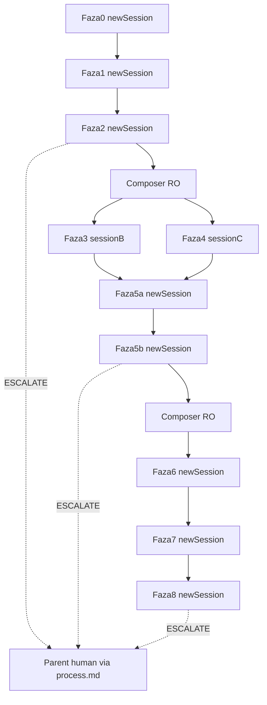

# Geex Design System Realignment — v6.1

**STATUS: CLOSED** (2026-07-21) on `origin/main` tip inventory `df870e2`.  
**Changelog:** [`geex-realign-CHANGELOG-2026-07-21.md`](geex-realign-CHANGELOG-2026-07-21.md)  
**Rollback:** [`geex-realign-ROLLBACK-2026-07-21.md`](geex-realign-ROLLBACK-2026-07-21.md)

**Brief lustro:** [`agents/shared/geex-realign-plan-2026-07-21.md`](agents/shared/geex-realign-plan-2026-07-21.md)  
**Hierarchia modeli:** [`agents/shared/model-hierarchy-2026-07-21.md`](agents/shared/model-hierarchy-2026-07-21.md)  
**Manifest regresji (w repo):** [`agents/shared/geex-realign-regress-manifest.md`](agents/shared/geex-realign-regress-manifest.md)  
**Audyt (w repo):** [`agents/shared/geex-realign-audit-2026-07-21.md`](agents/shared/geex-realign-audit-2026-07-21.md)  
**Handoff równoległy (B/C, nie process.md):**  
[`agents/shared/geex-realign-handoff-faza3.md`](agents/shared/geex-realign-handoff-faza3.md) · [`agents/shared/geex-realign-handoff-faza4.md`](agents/shared/geex-realign-handoff-faza4.md)

---

## Decyzje domykające dziury (v6)

### A. PNG — poza repo (HARD)

**Decyzja:** nie commitujemy baseline/regresyjnych PNG do gita (ani 36×N w historii). Powód: 300+ binarek psuje clone/diff; bisect kodu i tak idzie po tagach `geex-phase*`.

| Artefakt | Gdzie | Git |
|----------|-------|-----|
| PNG `phase{N}-*-{theme}-{vp}.png` | `apps/web/_qa/geex-realign-baseline/phase{N}/` (lokalnie / dysk P) | **gitignore** — nigdy w commitach faz |
| Metadane zrzutu (opcjonalnie JSON obok PNG) | ten sam katalog lokalny | gitignore |
| Manifest PASS/FAIL + nazwy + sha256 (opcjonalnie) + świadome delty | [`agents/shared/geex-realign-regress-manifest.md`](agents/shared/geex-realign-regress-manifest.md) | **commit** z każdą fazą |
| README w `_qa/...` „PNG local only” | jeden mały `.md` w `_qa` albo tylko wpis w gitignore komentarz | commit samego ignore + ewentualnie `apps/web/_qa/geex-realign-baseline/README.md` (bez PNG) |

**Faza 0:** dodać do `.gitignore`: `apps/web/_qa/geex-realign-baseline/**/*.png` (oraz `*.json` metadanych jeśli lokalne). Commit fazy = kod + briefy + **aktualizacja manifestu**, nie foldery PNG.

Porównanie regress: lokalnie phaseN vs phase0; wynik wpisać do manifestu.

### B. Parent przy escalate = człowiek (Ty)

**Parent** = użytkownik-operator (Ty), nie Lead-agent i nie Composer.

Escalate = wyłącznie:
1. Wpis w [`process.md`](process.md) zaczynający się od linii `ESCALATE geex-realign faza N:` + 3–6 zdań (objaw, co próbowano, tag do rollbacku).
2. **Natychmiastowy stop** — agent **nie** otwiera kolejnego cyklu, **nie** zakłada że dostanie push notification.
3. Czeka na Twoją decyzję w nowej wiadomości / nowej sesji.

Lead Grok przy stagnacji **nie** „pyta parenta w chacie Task” jako domknięcie — bo nie ma gwarancji, że to zobaczysz. Kanał eskalacji = `process.md` + stop.

### C. Reset kontekstu — każda faza = nowa sesja (HARD)

**Decyzja:** Lead / Agent B / Agent C **nie** ciągną jednej sesji czatu przez Fazy 0→8.

| Zasada | Treść |
|--------|--------|
| 1 faza = 1 czat | Nowa rozmowa Cursor (lub nowy Task z pustym kontekstem) na start fazy |
| Wejście | Czyta **tylko:** brief lustro + (jeśli jest) audit md + manifest regresji + `git log -5` / diff vs ostatni tag `geex-phase*` + sekcję „Handoff faza N-1” w `process.md` |
| Zakaz | „Kontynuuj z pamięci poprzedniej fazy”; dziedziczenie historii tooli z Faz 0–5 w sesji Fazy 6 |
| Wyjście | Ritual: commit + tag + wpis handoff w `process.md` (Done / pliki / znane ryzyka) + aktualizacja manifestu PNG |

Dzięki temu budżet przebiegów per fazę ma sens: kontekst nie puchnie z poprzednich faz.

Fazy 3∥4 = **dwie równoległe nowe sesje** (B i C), nie forki z historii Fazy 2. Handoff: patrz decyzja **D** (osobne pliki — nie równoległy append do `process.md`).

### D. Handoff B∥C — osobne pliki, Lead scala przy join (HARD)

**Problem:** dwa agenty dopisujące do `process.md` w tym samym oknie = race (nadpisanie / utrata wpisu), analogicznie do lekcji współbieżności w code-doctrine.

**Decyzja:** nie współdzielimy `process.md` ani głównego manifestu podczas Faz 3 i 4.

| Agent | Może pisać | Zakaz |
|-------|------------|--------|
| **B (Faza 3)** | własny plik [`agents/shared/geex-realign-handoff-faza3.md`](agents/shared/geex-realign-handoff-faza3.md) (nadpisz całość lub jeden właściciel pliku); opcjonalnie `…-regress-notes-faza3.md` | `process.md`, główny `geex-realign-regress-manifest.md`, handoff-faza4 |
| **C (Faza 4)** | [`agents/shared/geex-realign-handoff-faza4.md`](agents/shared/geex-realign-handoff-faza4.md) (+ notes-faza4) | `process.md`, główny manifest, handoff-faza3 |
| **Lead (join przed 5a)** | scala treść handoff 3+4 → jeden wpis w `process.md`; scala notes → `geex-realign-regress-manifest.md`; bump `?v=` | start 5a dopiero po scaleniu |

**ESCALATE w 3/4:** pierwsza linia własnego handoff: `ESCALATE geex-realign faza 3:` (lub 4) + stop. Parent czyta te pliki; Lead przy join **przenosi** ESCALATE do `process.md` jeśli jeszcze nie widać decyzji.

**Heartbeat / status w trakcie 3∥4:** tylko do własnego handoff (krótki append na końcu pliku **własnego** — jeden writer na plik, zero race). Nie używamy optimistic StrReplace na `process.md`.

**Join gate (obowiązkowy, sesja Lead, przed 5a):**
1. Istnieją tagi `geex-phase3` i `geex-phase4`.
2. Lead czyta handoff-faza3 + handoff-faza4 (+ notes).
3. Jeden wpis w `process.md`: `Handoff join 3+4` (skrót Done/ryzyka z obu).
4. Update głównego manifestu z notes 3+4.
5. Zbiorczy bump `?v=` jeśli potrzeba.
6. Dopiero potem nowa sesja Fazy 5a.

---

## Jednostka pracy (HARD)

Limit = **przebiegi / tool calls / cykle weryfikacji**, nie godziny.

- **Przebieg** = kod → check → screenshot lokalny 3vp → Read → poprawka lub PASS.
- **Escalate** → Parent (Ty) via `ESCALATE` w `process.md` + stop (patrz B).

---

## Routing modeli

| Slot | Model | Rola |
|------|-------|------|
| Lead per faza (nowa sesja) | Grok 4.5 | wykonanie |
| Agent B / C (osobne sesje) | Grok 4.5 | WRITE sets |
| Reviewer F2 + F5b (osobny Task RO) | Composer 2.5 | diff vs brief; zero WRITE |

---

## Matryca właścicieli / budżet przebiegów

| Faza | Sesja | Budżet | Escalate → Parent (Ty) |
|------|-------|--------|-------------------------|
| 0 | nowa | **1 przebieg** deterministyczny (backup, freeze, gitignore PNG, baseline **lokalnie**, manifest, tag). Zero pętli UI. | Fail strukturalny env → `ESCALATE` + stop; zero CSS |
| 1 | nowa | **maks 18** Grep/Read/CDP; stop criteria | Po 18 bez kompletnego audytu → partial + `ESCALATE` jeśli blokuje F2 |
| 2 | nowa | **maks 3** cykle + **maks 2** Composer RO | 3 fail regresji pod rząd **lub** Composer FAIL ×2 → `ESCALATE` + stop |
| 3 | nowa (B) | **min 3 / maks 5** cykli; handoff → **tylko** `handoff-faza3.md` | 3 fail / konflikt WRITE → `ESCALATE` w handoff-faza3 + stop |
| 4 | nowa (C) | **min 3 / maks 5** cykli; handoff → **tylko** `handoff-faza4.md` | j.w. w handoff-faza4 |
| join | Lead (nowa) | 1 przebieg scalenia (D) | brak obu tagów / ESCALATE w handoff bez decyzji Parent → stop, nie startuj 5a |
| 5a | nowa | **maks 3** cykle layout; zakaz reveal | 3 fail → `ESCALATE` w `process.md` |
| 5b | nowa | **1 zmiana = 1** §7+CDP; maks 2 cykle regresji fazy; maks 2 Composer RO | IO fail → reset `geex-phase5a`; 3 fail pod rząd → `ESCALATE` |
| 6 | nowa | **maks 3** cykle (top3 white-flash) | 3 fail → tag z backlogiem + opcjonalnie `ESCALATE` |
| 7 | nowa | **maks 2** cykle thin | Token na zapas → revert; nie rozpychaj |
| 8 | nowa | **maks 3** cykle final QA | Regresja 390 po 3 → **nie merge** + `ESCALATE` |

**Heartbeat global:** 3 nieudane cykle pod rząd bez commita / zmiany strategii → `ESCALATE geex-realign faza N` + stop. Solo fazy: wpis w `process.md`. Fazy 3/4: wpis w własnym `handoff-fazaN.md` (nie `process.md`). Agent nie zgłasza się „do siebie”.

---

## Composer RO (F2, F5b)

Jak v5; osobny Task bez historii Lead. PASS wymagany przed tagiem (maks 2 przebiegi review).

---

## Stop criteria Fazy 1

Jak v5 (tabele, top 50 hex, 6 CDP, 5–8 edge, ≤20 tokenów draft, ≤18 tooli) → zapis do `geex-realign-audit-2026-07-21.md`.

---

## Współbieżność B / C

- WRITE sets jak wcześniej (sekcje BUTTONS vs BADGES; zakaz `dam-brand.css` dla obu).
- **Handoff / log / ESCALATE / notes regresji:** decyzja **D** — osobne pliki, zero równoległego zapisu do `process.md`.
- Join Lead przed 5a obowiązkowy (nie zaczynaj 5a „z pamięci” jednej z faz).

## Ritual końca fazy

**Fazy solo (0, 1, 2, join, 5a, 5b, 6, 7, 8):**
1. Regress lokalny (PNG poza git).
2. Update głównego `geex-realign-regress-manifest.md`.
3. Commit (bez PNG) + tag `geex-phaseN`.
4. Handoff w `process.md`.
5. Zamknij czat — następna faza = nowa sesja.

**Fazy 3 i 4 (równoległe):**
1. Regress lokalny.
2. Zapisz wynik do **własnego** handoff (+ opcjonalnie notes-fazaN) — **nie** `process.md`, **nie** główny manifest.
3. Commit tylko plików z WRITE set agenta + własny handoff: `geex-realign: faza 3 buttons` / `faza 4 badges`.
4. Tag `geex-phase3` / `geex-phase4`.
5. Zamknij czat. Scalenie = osobna sesja Lead (join).

---

## Visual regression — 3 viewporty

**1440 / 1024 / 390** × light+dark × 6 slotów. Pliki lokalnie; w repo tylko manifest. Priorytet Read: **390**.

---

## FAZA 0 — 1 przebieg (nowa sesja)

Backup → push → branch → brief lustro → freeze → **gitignore PNG** → baseline lokalnie → README `_qa` → inicjalizacja manifestu → commit + `geex-phase0` (bez PNG).

---

## FAZY 1–8

Zakres merytoryczny jak v5 (audyt → tokens → B∥C → **join** → 5a → 5b+§7 → dark → thin → QA/merge), z twardymi regułami A–D.

---

## Kluczowe pliki (FREEZE)

Jak wcześniej + manifest + audit + **handoff-faza3/4** (włączone w freeze: tylko B/C/Lead wg tabeli D).  
Lokalne PNG: `apps/web/_qa/geex-realign-baseline/` (gitignore).

## Poza zakresem

Logika biznesowa; pełne `style.css`; Tailwind; tokeny bez konsumenta; PNG w git; jedna sesja 0→8; szacowanie w godzinach; **równoległy append B+C do `process.md`**.
