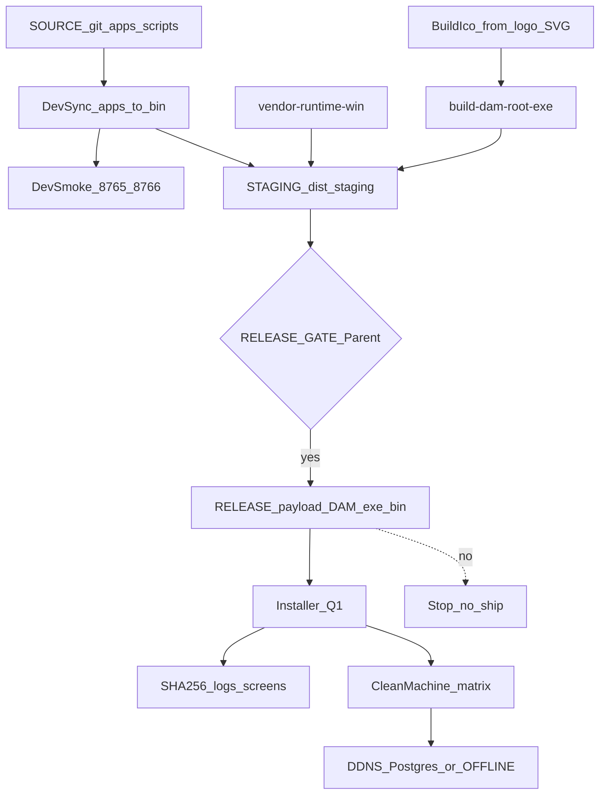

# Planner round 1 draft — DAM portable installer + Synology

```yaml
name: DAM portable installer Synology
overview: >-
  Zbudować release installera Windows z pełnym embed Python (bin/runtime/win),
  czystym layoutem user-facing, ikonami logo DK, bezpiecznym DDNS Postgres,
  bramką release (nie pełny installer po każdej edycji), macierzą clean-machine
  i ownership dla workerów pod Parentem.
plan_mode: create
revision: 1
revisedAt: 2026-08-11
plannerSession: dam-portable-installer-synology/session-01
canonical_plan_path: C:\Users\krzysztof.wieczorek\.cursor\plans\dam-portable-installer-synology.plan.md
isProject: false
status: DRAFT_R1_AWAITING_CRITIC
```

## 0. Decyzje Plannera (jawne — nie TBD w treści wykonawczej)

| ID | Decyzja | Uzasadnienie |
|----|---------|--------------|
| D1 | **Workflow build:** verified incremental **dev sync** (`apps→bin`) + smoke lokalny; **pełny installer/release TYLKO** na bramce RELEASE (tag/wersja / komenda Parent). | Pełny vendor+PyInstaller+installer po każdej edycji JS = ryzyko godzinowych przebiegów, race z workerami UI, fałszywe „release” bez regresji. Cel usera „zawsze gotowa app” = obowiązkowa bramka przed oddaniem na inny PC, nie rebuild przy każdym `?v=`. |
| D2 | **Supported launch modes:** (1) zainstalowana lokalna app (Program Files / `%LOCALAPPDATA%\DAM` — final path z Q1), (2) kompletny portable folder lokalny NTFS z `DAM.exe`+`bin\runtime\win\python`. **Unsupported:** `file://` / UNC / share IP z niepełnym drzewem; heal page wyjaśnia „użyj installera / skopiuj pełną paczkę”. | Screenshot usera = klasyczny missing_runtime na share. Nie da się wiarygodnie uruchomić embed Python z niepełnego UNC bez runtime. |
| D3 | **Trzy warstwy katalogów:** SOURCE (git `apps/`, `scripts/`, `agents/`) · STAGING (`dist/staging/...`, gitignored) · RELEASE (`dist/release/...` installer+payload, gitignored; do gita tylko manifest hashy). | Cleanup nie rusza source; payload bez `.git`/agent docs/tooling caches. |
| D4 | **DB switch kontrolowany:** ADR-009 pozostaje prawdą multi-PC; po PASS connectivity **zmiana default** `db-prefer` release → `mode=auto`, `synology=true`; SQLite = offline/fallback (nie „SQLite only forever”). Stary LAN IP w example → placeholder / env-only, **bez zgadywania nowego IP**. | User chce Synology; kod ma już DDNS-first + OFFLINE; freeze 2026-08-03 jest do odwrócenia świadomie. |
| D5 | **Ikony:** przebudowa `dam_app.ico` (+ warianty installer) z oficjalnych SVG `logo-dk-green.svg` / `logo-dobra-kaloria.svg` — **zakaz** dalszego generowania samego tekstu „DAM” na zielonym kafelku jako brand. | memory + istniejące assety; `build-dam-ico.py` dziś NIE spełnia HARD. |
| D6 | **Evidence-only DoD:** PASS tylko z artefaktami w `agents/shared/planner-runs/dam-portable-installer-synology/session-01/artifacts/` (lub `dist/evidence/`) — hashe SHA256, logi, screenshoty/video; deklaracje bez plików = FAIL. | Brief §9. |

### Blokery wymagające Parent (AskQuestion) — STOP przed fazą implementacji

Te punkty **nie blokują** dalszych rund debaty, ale **blokują** start workerów implementacji:

**Q1 — Format + lokalizacja instalacji**
- A) Inno Setup → `%LOCALAPPDATA%\Programs\DAM` (per-user, bez admin)
- B) Inno Setup → `C:\Program Files\DAM` (all-users, wymaga UAC)
- C) Inne (MSI/WiX/MSIX/NSIS) — Parent napisze

**Q2 — Code signing / SmartScreen**
- A) Brak certu teraz: unsigned + dokumentacja SmartScreen + hash verification w README release
- B) Jest cert Authenticode (Parent poda gdzie / jak podpisać w CI/lokalnie)
- C) Inne

**Q3 — Provisioning credentials Postgres na czystym PC**
- A) First-run wizard w app (user wkleja hasło / importuje `dam-connection.env`) — nic w installerze
- B) Osobny prywatny `connection.sealed` dostarczany poza gitem (IT) + installer kładzie szablon bez sekretu
- C) Inne

**Q4 — Nowy LAN IP Synology (fallback lista)**
- A) Parent poda aktualny LAN IP do wpisania TYLKO w `pg-config.example` jako drugi host po DDNS
- B) Example zawiera wyłącznie `inyfinn.synology.me`; LAN tylko w lokalnym gitignored config
- C) Mesh VPN host (Tailscale) jako primary zamiast publicznego DDNS (memory §85 CGNAT)

**Q5 — TLS do Postgres**
- A) Obecny model: TCP 5433 jak dziś (ADR-009), bez wymuszania TLS w kliencie w v1; checklist weryfikacji port/connectivity/fallback
- B) Wymuś SSL `sslmode=require` + cert policy w tej samej fazie
- C) Inne

---

## 1. Konwencje obowiązujące w projekcie

- Stos: desktop pywebview + bridge `:8766` + web `:8765`; **brak bundlera** dla `apps/web`.
- Layout: GIT_ROOT = katalog z `DAM.exe` + `bin` + `.git`; CONTENT_ROOT = `bin`.
- Portable HARD (PI `runtime.portable_embed_path`): tylko `bin\runtime\win\python\pythonw.exe`; system Python wyłącznie `DAM_ALLOW_SYSTEM_PYTHON=1` (dev).
- Em-dash ban; język planu PL, snippety EN.
- Sekrety: `.gitignore` już pokrywa `pg-config.json`, `dam-connection.env`, `.env*`.
- ADR-009 (`bin/docs/ADR/`) + ADR-007 offline SQLite.
- Weryfikacja: przebiegi (przeloty), nie godziny; evidence-only.
- Parent = człowiek; eskalacja = AskQuestion / plik ESCALATE w process.md.
- Zakaz kasowania source przy „cleanup folderu user-facing”.

---

## 2. Kontekst (read-only — NIE wykonywać)

### 2.1 Root cause błędu cross-PC

1. `DAM.exe` / `DAM.cmd` / `run-dam.vbs` szukają `GIT_ROOT\bin\runtime\win\python\pythonw.exe`.
2. Brak pliku → `boot-heal.html?reason=missing_runtime` („Brak silnika w folderze”) lub MessageBox.
3. Typowy wektor: otwarcie / skopiowanie niepełnego drzewa z share (UNC/IP) albo release ZIP bez spakowanego runtime.
4. Na maszynie deweloperskiej runtime **jest** (po `vendor-runtime-win.ps1`); na drugim PC bez vendor / bez pełnej paczki — fail.

### 2.2 Co już istnieje (reuse, nie reinvent)

| Komponent | Stan |
|-----------|------|
| `vendor-runtime-win.ps1` | Buduje embed 3.12.10 + site-packages z `requirements-portable.txt` |
| `build-dam-root-exe.ps1` | Thin `DAM.exe` PyInstaller |
| `sync-apps-to-bin.ps1` | Dev sync source→content |
| `build-release-zip.ps1` | ZIP staging — **niedostateczny** jako installer; nie gwarantuje runtime; kopiuje zbyt dużo / złe wykluczenia względem user-facing |
| `install-desktop-shortcut.ps1` | Skróty; tekst nadal wspomina „Python 3.10+” — sprzeczne z portable HARD |
| `pg_db.py` | DDNS-first sort, env + json config |
| `dam_db.py` | prefer sqlite default (do odwrócenia kontrolowanie) |
| Logo SVG | obecne; ICO nie z logo |

### 2.3 Regresje do ochrony (HARD)

Po packingu smoke musi objąć (nie deklaracja): branding preview click latency, quiz, titles, gazetka, live indexes — checklista QA z CDP + screenshot+Read na zainstalowanej instancji (nie na raw share).

---

## 3. Architektura docelowa (draft)



**Release payload (user-facing) — minimalny szkielet:**

```text
DAM/                          # po instalacji lub portable unzip
  DAM.exe
  DAM.cmd                     # fallback
  README-START.txt            # 5 linii: start, heal, support
  bin/
    runtime/win/python/       # PEŁNY embed + site-packages
    apps/desktop/             # launch.py, bridge, boot-heal.html, data/ (puste + examples)
    apps/web/                 # UI + data indexes potrzebne offline-cold
    THEME/                    # jeśli wymagane runtime (nie cały geex kit źródłowy jeśli zbędny)
  Uninstall.exe               # jeśli installer (Q1)
```

**Poza payloadem (zostaje w SOURCE repo):** `.git`, `agents/`, planner-runs, `_qa_screenshots`, tooling caches, node_modules, pełne historie restore, agent docs (chyba że Parent chce README skrót w payload).

---

## 4. Ownership matrix (no-overlap WRITE) + merge order

| Worker | WRITE set (wyłączność) | READ |
|--------|------------------------|------|
| **W-Pack** Packaging/Release | `scripts/ops/build-release-*.ps1`, `scripts/ops/build-installer.*`, `dist/**` (staging/release), nowy `scripts/ops/release-gate.ps1`, `VERSION` stamp | apps, bin |
| **W-Runtime** Desktop launcher | `apps/desktop/dam_root_launcher.py`, `run-dam.vbs`, `DAM.cmd`, `boot-heal.html`, `bin/scripts/ops/build-dam-root-exe.ps1`, `vendor-runtime-win.ps1` | — |
| **W-Icons** | `apps/desktop/scripts/build-dam-ico.py`, `apps/desktop/dam_app.ico`, ewentualnie `apps/web/assets/img` tylko jeśli generuje PNG pochodne w `apps/desktop/assets/` | logo SVG |
| **W-DB** | `apps/desktop/dam_db.py` (tylko default prefer + komentarze), `pg-config.example.json`, `dam-connection.env.example`, krótki ADR note / memory wpis po APPROVAL | `pg_db.py`, ADR-009 |
| **W-QA** | `scripts/qa/release-clean-machine-*`, evidence pod `dist/evidence/` lub session artifacts; **zero** prod JS feature | zainstalowany payload |
| **Parent** | APPROVAL bramki, Q1–Q5, odbiór | wszystko |

**Merge order (sekwencja join):**
1. W-Icons → ICO gotowe  
2. W-Runtime (launcher + heal copy + vendor smoke) równolegle z W-DB (examples/prefer) — **różne pliki**  
3. Sync `apps→bin` (jeden agent / Parent-gated)  
4. W-Pack staging + exe + installer  
5. W-QA clean-machine  
6. Parent RELEASE APPROVAL  

**Stop:** 3 nieudane przebiegi tej samej bramki pod rząd → ESCALATE Parent (nie „jeszcze raz godzinę”).

---

## 5. Plan wykonawczy — fazy / kroki (budżet w PRZEBIEGACH)

Jednostka: **przebieg** = 1 cykl kod/skrypt → weryfikacja komendą → artefakt. Godziny zakazane.

### Faza A — Discovery freeze + AskQuestion (Parent)

**KROK A0 — Freeze faktów**
- **Cel:** Zapisać baseline ścieżek, wersji, obecności runtime.
- **Pre-conditions:** Brak.
- **Komendy/Snippety:** PowerShell: `Test-Path bin\runtime\win\python\pythonw.exe`; odczyt `dam-version.js`; lista logo SVG.
- **Weryfikacja:** Expected: runtime True na build machine; wersja string zapisana do `session-01/artifacts/baseline.md`.
- **Output:** `artifacts/baseline.md`
- **Budżet:** 1 przebieg.

**KROK A1 — Parent Q1–Q5**
- **Cel:** Odblokować format installera, signing, credentials, LAN IP, TLS.
- **Pre-conditions:** A0.
- **Weryfikacja:** Odpowiedzi A/B/C wpisane do changelog.
- **Output:** `artifacts/parent-decisions.md`
- **Stop:** Brak odpowiedzi → nie start W-Pack installer (można robić staging portable ZIP bez installera jako interim TYLKO jeśli Parent wybierze „najpierw portable”).

### Faza B — Ikony marki

**KROK B1 — Przebudowa ICO z logo SVG**
- **Cel:** `dam_app.ico` multi-size z `logo-dk-green.svg` (lub rasteryzacja oficjalnego logo — bez wymyślania marki).
- **Pre-conditions:** A0.
- **Owner:** W-Icons.
- **Weryfikacja:** Plik ICO istnieje; screenshot właściwości pliku / podgląd 256px w evidence; porównanie z SVG (Read vision).
- **Output:** `apps/desktop/dam_app.ico`, `artifacts/icon-proof.png`
- **Budżet:** 3 przebiegi (raster → ico → visual QA).
- **Rollback:** przywróć poprzedni `dam_app.ico` z git.

### Faza C — Runtime + launcher + heal (launch modes)

**KROK C1 — Vendor runtime idempotent na build machine**
- **Cel:** `vendor-runtime-win.ps1` → smoke `import webview, bcrypt, psycopg2`.
- **Owner:** W-Runtime.
- **Weryfikacja:** exit 0 + log size_mb; hash tree runtime zapisany.
- **Output:** `bin/runtime/win/python/…`, `artifacts/runtime-vendor.log`
- **Budżet:** 2 przebiegi (vendor + re-smoke).

**KROK C2 — Rebuild thin DAM.exe z nowym ICO**
- **Pre-conditions:** B1, C1.
- **Weryfikacja:** `DAM.exe` timestamp/hash; Properties → ikona niegeneric.
- **Output:** `GIT_ROOT/DAM.exe`, `artifacts/dam-exe.sha256`

**KROK C3 — Heal + launch policy copy**
- **Cel:** `boot-heal.html` + launcher komunikaty: jasno „unsupported: share/UNC niepełny”; CTA „zainstaluj z oficjalnej paczki”.
- **Weryfikacja:** otwarcie `boot-heal.html?reason=missing_runtime` lokalnie (file lokalny OK jako strona pomocy); tekst zawiera zakaz polegania na share.
- **Budżet:** 2 przebiegi.
- **Uwaga:** NIE „naprawiać” uruchamiania z UNC bez runtime — to unsupported (D2).

**KROK C4 — `install-desktop-shortcut.ps1` zgodny z portable**
- Usunąć wymóg „Python 3.10+” z komunikatu; target = zainstalowany/exe path.

### Faza D — DB / Synology controlled switch

**KROK D1 — Config templates bez starego IP hardcode**
- **Cel:** `pg-config.example.json` + `dam-connection.env.example`: primary host = `inyfinn.synology.me`, port 5433; LAN tylko wg Q4.
- **Owner:** W-DB.
- **Weryfikacja:** Grep brak starego IP jeśli Q4=B; brak prawdziwych haseł; `REPLACE_ME` only.
- **Budżet:** 1 przebieg.

**KROK D2 — Connectivity policy verification (evidence)**
- **Cel:** Skrypt/check: DDNS resolve + TCP 5433 timeout; przy fail → OFFLINE path udokumentowany.
- **Weryfikacja:** log z host order (DDNS before private); screenshot/status UI „Baza online” lub świadomy offline.
- **TLS:** wg Q5 — jeśli A, checklist „no TLS enforced” + ryzyko zapisane; jeśli B, test `sslmode`.
- **Budżet:** 3 przebiegi.

**KROK D3 — Prefer switch (po PASS D2 + Parent APPROVAL)**
- **Cel:** Release default / first-run: `mode=auto`, `synology=true` (lub migracja `db-prefer.json` przy instalacji bez nadpisywania user choice).
- **Weryfikacja:** na clean PC z siecią → engine postgres; bez sieci → sqlite-offline + hint.
- **Rollback:** przywróć `_DEFAULT_PREFER` sqlite + synology false.
- **Stop:** bez APPROVAL Parent nie zmieniać default w kodzie (konflikt z memory „SQLite only until Synology returns” — ten plan jest właśnie kontrolowanym powrotem).

**KROK D4 — Docs ADR note**
- Dopisek do ADR-009 lub memory: LAN IP aktualizacja polityka; primary DDNS; data switch 2026-08-11 (po approve).

### Faza E — Staging + release pipeline (D1 workflow)

**KROK E1 — `release-gate.ps1` kontrakt**
- **Cel:** Jedna bramka: sync → vendor check → exe → stage payload → hash manifest → (installer jeśli Q1) → evidence folder.
- **Dev path (po każdej zmianie feature):** tylko `sync-apps-to-bin.ps1` + `smoke-dam-ports.ps1` + feature test — **bez** pełnego installera.
- **Release path:** pełna bramka obowiązkowa przed oddaniem na inny PC / dystrybucją.
- **Weryfikacja:** skrypt failuje gdy brak `pythonw.exe` w staging; failuje gdy brak ICO brand; failuje gdy sekrety w payload (scan `.env`, `pg-config.json` z hasłem).
- **Budżet:** 5 przebiegów na doprowadzenie bramki do zieleni.

**KROK E2 — Stage payload (nie cały repo)**
- Kopiuj allowlist: `DAM.exe`, `DAM.cmd`, `bin/runtime/win/**`, `bin/apps/desktop/**` (bez lokalnych sqlite/session), `bin/apps/web/**` (data indexes potrzebne; thumbs opcjonalnie), wymagany THEME subset, licenses.
- Exclude: `.git`, `agents`, planner-runs, `_restore_*`, `tooling/downloads` caches, `__pycache__`, `.env*`, `pg-config.json`.
- **Weryfikacja:** drzewo staging; rozmiar; `Test-Path …\pythonw.exe`.

**KROK E3 — Installer (po Q1)**
- Generuj installer z ikoną brand; shortcuts; uninstaller; version z `dam-version.js` / VERSION.json.
- **Weryfikacja:** instalacja silent/unattended na VM lub drugim profilu Windows; skróty; taskbar icon screenshot.
- **Signing:** wg Q2.

**KROK E4 — Versioning + rollback**
- Stamp `VERSION.json` + bump policy (release only).
- Artefact previous installer kept in `dist/release/archive/`.
- Rollback: odinstaluj → zainstaluj poprzedni hash; albo portable previous zip.

### Faza F — Clean-machine acceptance matrix (W-QA)

Każdy wiersz = min. 1 przebieg evidence (log lub screenshot/video). FAIL dowolnego wiersza CRITICAL = brak ship.

| ID | Scenariusz | Expected |
|----|------------|----------|
| CM1 | PC bez Python w PATH, bez repo | App start z installera/portable |
| CM2 | Inny Windows user + path ze spacjami | Start OK |
| CM3 | Sieć OK + DDNS | Postgres/auto online (po D3) lub świadomy status |
| CM4 | Sieć OFF | OFFLINE SQLite + hint; UI nie udaje online |
| CM5 | Reinstall / upgrade | Dane user (local) nie skasowane bez ostrzeżenia; skróty OK |
| CM6 | Uninstall | Usunięte binaria; brak orphan shortcut (policy: leave user data) |
| CM7 | Ikona taskbar/shortcut/exe | Logo DK, nie generic |
| CM8 | Próba UNC niepełnego drzewa | Heal page; **nie** silent crash; unsupported udokumentowany |
| CM9 | Regresja functional | branding preview latency, quiz, titles, gazetka, live indexes — CDP+screenshot |
| CM10 | Secrets scan payload | 0 haseł / 0 `.env` real |

**Budżet QA:** 10–15 przebiegów (macierz + 3 przeloty UI na krytycznych ekranach).

### Faza G — Governance handoff

**KROK G1 — Ownership lock + process.md**
- Parent publikuje WRITE sets; workery nie wchodzą w cudze pliki.
- Po każdej fazie: tag/artefact + Parent checkbox.

**KROK G2 — Po CONVERGED debaty**
- Orchestrator UPDATE `canonical_plan_path` tym draftem (po ACCEPT Critic + decyzje Parent).
- Dopiero potem Task workery implementacyjne.

---

## 6. Todos (szkielet front-matter po CONVERGED)

- `step-A0-baseline`
- `step-A1-parent-q1-q5`
- `step-B1-brand-ico`
- `step-C1-vendor-runtime`
- `step-C2-rebuild-exe`
- `step-C3-heal-launch-policy`
- `step-C4-shortcut-script`
- `step-D1-config-templates`
- `step-D2-connectivity-evidence`
- `step-D3-prefer-switch`
- `step-D4-adr-memory-note`
- `step-E1-release-gate`
- `step-E2-stage-payload`
- `step-E3-installer`
- `step-E4-version-rollback`
- `step-F-clean-machine-matrix`
- `step-G-governance-handoff`

---

## 7. Weryfikacja globalna / DoD ship

- [ ] Clean PC bez Python uruchamia app z release artefaktu
- [ ] `bin\runtime\win\python\pythonw.exe` obecny w każdej paczce (hash w manifeście)
- [ ] Ikony brand (exe, shortcut, installer, uninstaller)
- [ ] DDNS primary; brak credentiali w gicie; LAN wg Q4
- [ ] Prefer/Synology switch tylko po APPROVAL + evidence D2
- [ ] CM1–CM10 PASS z plikami evidence
- [ ] Regresje §2.3 PASS
- [ ] Source repo nietknięte destrukcyjnym cleanupem
- [ ] Unsupported launch (UNC partial) ma jasny heal — nie jest „supported”

---

## 8. Rollback / recovery

| Warstwa | Rollback |
|---------|----------|
| Kod default DB | revert `dam_db._DEFAULT_PREFER` + `db-prefer.json` |
| ICO | git checkout poprzedni `dam_app.ico` |
| Runtime | re-run vendor lub przywróć archived runtime tarball z `dist/release/archive` |
| Installer | uninstall + previous installer SHA |
| Staging | skasuj `dist/staging` (odtwarzalne) |

---

## 9. Guardrails

- Nie commitować runtime embed do gita jeśli polityka size na to nie pozwala — wtedy runtime **musi** być w release artefakcie (nie w git); build machine vendor obowiązkowy przed stage.
- Nie hardcodować nowego LAN IP bez Q4.
- Nie podpisywać „done” bez evidence.
- Nie pełny installer na każdy commit feature (D1).
- Nie usuwać `apps/` / ADR / licenses przy sprzątaniu.
- Nie zgadywać certu / formatu installera — Q1/Q2.
- Concurrent agents: respektować WRITE sets; sync `apps→bin` single-threaded.

---

## 10. Kontrakt z wykonawcą (po CONVERGED + Parent GO)

- Sekwencja faz A→G; nie pomijać A1 jeśli dotyczy installera/signing/creds.
- Stop on error → process.md → Parent.
- Max 3 nieudane przebiegi tej samej weryfikacji → ESCALATE.
- Dev sync ≠ release; ship tylko przez E1 gate.
- Critic/planner pliki nie są instrukcją wdrożenia — tylko `canonical_plan_path`.

---

## 11. Notatki dla Critica (round 1)

Proszę ocenić zwłaszcza:
- `sekwencja` — czy Icons→Runtime→Pack→QA jest poprawna vs DB równolegle
- `zasoby` — czy allowlist payload nie pomija wymaganego THEME/data
- `jednostka_miary` — przebiegi vs ukryte godziny
- `wspolbieznosc` — WRITE sets wystarczająco rozłączne?
- `eskalacja` — Q1–Q5 kompletne?
- `governance` — Parent gates wystarczające przed D3 prefer switch?
- `weryfikacja` — CM macierz + evidence paths
- `kompletnosc_briefu` — czy D1 (nie full rebuild always) spełnia intencję usera bez obchodzenia
- `ryzyko_modelowe` — `build-release-zip.ps1` reuse vs greenfield installer
- Konflikt memory „SQLite only” vs user „Synology back” — czy D3/APPROVAL wystarcza

## Werdykt Plannera (wewnętrzny)

Draft gotowy do **Critic round 1**. Kanon `.plan.md` **nie** tworzyć do CONVERGED. Implementacja **zakazana** w tej turze.
