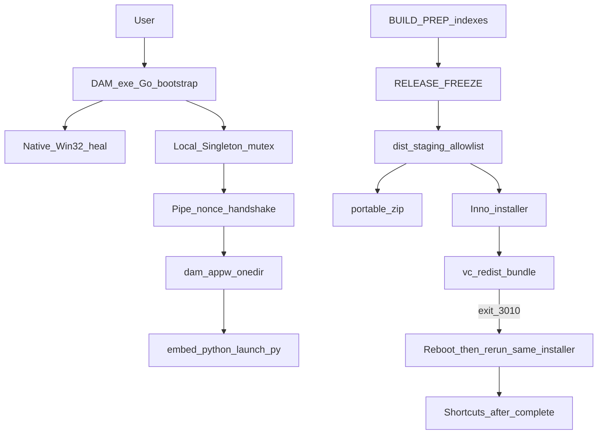

# Planner round 10 draft — FINAL CANDIDATE (executable)

```yaml
name: DAM portable installer Synology
overview: >-
  Portable+installer Windows z Go bootstrap (native heal), onedir engine, embed
  Python, CRT discovery, Inno+vc_redist (3010=reboot+re-run installer), PREP→FREEZE,
  slim indexes, DDNS Synology za bramkami Parent Q1–Q7, evidence-only clean-machine.
plan_mode: create
revision: 1
draft_round: 10
revisedAt: 2026-08-11
plannerSession: dam-portable-installer-synology/session-01
canonical_plan_path: C:\Users\krzysztof.wieczorek\.cursor\plans\dam-portable-installer-synology.plan.md
isProject: false
status: DRAFT_R10_FINAL_CANDIDATE_AWAITING_CRITIC
changelog_from_r9: 9 ACCEPT / 0 REBUT (K+W); expected open criticals = 0
note: Kanon NIE tworzony w tej turze — UPDATE canonical_plan_path dopiero po Critic CONVERGED + polecenie orchestratora.
```

todos (pending — po CONVERGED+GO Parent):

- id: step-00-setup
  content: "KROK 0 — Setup workspace + evidence dirs"
  status: pending
- id: step-01-backup
  content: "KROK 1 — Backup + tag pre-portable"
  status: pending
- id: step-02-a0-baseline
  content: "KROK 2 — A0 size/latency baseline + CM1-profile"
  status: pending
- id: step-03-a0-qa-tools
  content: "KROK 3 — QA-tools bootstrap pinned hashes on PoC VM"
  status: pending
- id: step-04-a0-gui-poc
  content: "KROK 4 — A0 Win32 GUI+a11y PoC PASS/FAIL"
  status: pending
- id: step-05-parent-checklist
  content: "KROK 5 — Parent AskQuestion Q1–Q7 recorded (gates only)"
  status: pending
- id: step-06-icons
  content: "KROK 6 — Brand ICO/PNG from official logo DK"
  status: pending
- id: step-07-ipc-names
  content: "KROK 7 — ipc_names + Go/Python contract test"
  status: pending
- id: step-08-bootstrap
  content: "KROK 8 — Go bootstrap DAM.exe + native heal + mutex"
  status: pending
- id: step-09-engine-onedir
  content: "KROK 9 — PyInstaller onedir dam-appw + handshake"
  status: pending
- id: step-10-crt
  content: "KROK 10 — CRT extract discovery into engine dirs"
  status: pending
- id: step-11-heal-migrate-mutex
  content: "KROK 11 — launch.py mutex migrate + README exit codes"
  status: pending
- id: step-12-prep-indexes
  content: "KROK 12 — BUILD PREP indexes allowlist commit"
  status: pending
- id: step-13-freeze
  content: "KROK 13 — RELEASE FREEZE"
  status: pending
- id: step-14-stage-gate
  content: "KROK 14 — Stage allowlist + release-gate + manifests"
  status: pending
- id: step-15-portable-cm
  content: "KROK 15 — Clean-machine Tier-A portable matrix"
  status: pending
- id: step-16-installer
  content: "KROK 16 — Inno installer + vc_redist (requires Q1)"
  status: pending
- id: step-17-installer-cm
  content: "KROK 17 — CM5/CM6/CM12b (requires Q1)"
  status: pending
- id: step-18-db-pi
  content: "KROK 18 — PI + DB templates/prefer (D3 requires Q3+APPROVAL)"
  status: pending
- id: step-19-tier-b
  content: "KROK 19 — Tier-B CM3/CM4b (requires Q3)"
  status: pending
- id: step-20-dod
  content: "KROK 20 — DoD evidence pack + Parent sign-off"

---

## 1. Konwencje obowiązujące w projekcie

- Layout: GIT_ROOT = `DAM.exe` + `bin` + `.git`; CONTENT_ROOT = `bin`.
- UI: Geex; em-dash ban; język planu PL, snippety EN.
- Portable HARD: embed `bin\runtime\win\python`; public entry tylko bootstrap `DAM.exe`.
- Fat `branding-index.json` OUT payload; cold path grid-head/index.
- PI+KV przed decyzjami biznesowymi (D3 Synology).
- Evidence-only; deklaracje bez plików = FAIL.
- Q1–Q7: **zero silent default** — STOP za bramką (§3).
- Dist kanoniczny: `GIT_ROOT/dist/{prep,staging,release,evidence,manifests}`. Zakaz `bin/dist/`.
- `build-release-zip.ps1` DEPRECATED — nie w release path.
- Kanon po CONVERGED: wyłącznie `canonical_plan_path` (ten draft go nie tworzy).

---

## 2. Kontekst (read-only — NIE wykonywać)

### 2.1 Problem
Cross-PC `Brak silnika w folderze` = brak `bin\runtime\win\python` przy launch z niepełnego share/UNC. Cel: pełny portable/installer z embed runtime, brand icons, DDNS Synology, clean-machine evidence.

### 2.2 Architektura docelowa (LOCKED R10)



### 2.3 Ownership (no-overlap WRITE)

| Worker | WRITE set |
|--------|-----------|
| W-Runtime | `apps/desktop/bootstrap/**`, `ipc_names.json`, `launch.py` mutex, heal UI, handshake, onedir build scripts, CRT extract script |
| W-Icons | `dam_app.ico`, heal logo PNG from official SVG |
| W-Pack | `scripts/ops/release-gate.ps1`, stage/manifest/verify, Inno script, `dist/**`, vc_redist pin |
| W-DB | `program-instructions.json` (db policy), `pg-config.example.json`, `dam-connection.env.example`, `dam_db.py` prefer **po APPROVAL** |
| W-QA | `dist/evidence/**`, `scripts/qa/**` harness; **zero** prod feature JS |
| Parent | Q1–Q7 answers, FREEZE ACK, D3 APPROVAL, Tier sign-off |

**Merge order:** Icons → Runtime(+IPC) ∥ DB templates → PREP commit → FREEZE → Pack stage/gate → QA portable → (Q1) Installer → QA installer → (Q3) DB prefer/Tier-B → Parent DoD.

**Stop:** 3 nieudane przebiegi tej samej asercji → ESCALATE Parent.

---

## 3. Parent AskQuestion Q1–Q7 + gate matrix

### 3.1 Pytania (rekomendacja = A; wykonawca NIE auto-wybiera)

**Q1 — Gdzie instalować?**  
A) Inno per-user `%LOCALAPPDATA%\Programs\DAM`  
B) Inno `C:\Program Files\DAM` (UAC)  
C) Inne  

**Q2 — Signing / SmartScreen?**  
A) Unsigned + hash README + Parent checkbox SmartScreen×2  
B) Authenticode (Parent poda cert)  
C) Inne  

**Q3 — Credentials Postgres na czystym PC?**  
A) First-run import `dam-connection.env`  
B) IT sealed file poza gitem  
C) Inne  

**Q4 — LAN IP w example?**  
A) Parent poda IP jako drugi host po DDNS  
B) Example tylko `inyfinn.synology.me`  
C) Tailscale/VPN primary  

**Q5 — TLS Postgres v1?**  
A) TCP 5433 jak ADR-009, bez force TLS  
B) `sslmode=require` teraz  
C) Inne  

**Q6 — WebView2?**  
A) External prereq + native heal reason webview2 + Evergreen link w copy  
B) Installer silent Evergreen  
C) Inne  

**Q7 — CM3 DDNS FAIL?**  
A) Tier-A only; §7 deferred  
B) VPN/Tailscale + retry CM3  
C) Inne  

**Q8 (warunkowe)** — CM12 FAIL×3: A docs+heal / B bundle strategy change / C inne.

### 3.2 STOP matrix (brak odpowiedzi)

| Brak Q | Dozwolone | STOP |
|--------|-----------|------|
| Q1 | KROK 0–15 Tier-A portable | KROK 16–17, brief §8 DONE |
| Q2 | Hash lab | Authenticode expectation / SmartScreen-free claim |
| Q3 | Offline Tier-A | KROK 18 D3 apply, KROK 19 Tier-B |
| Q4 | DDNS-first code | Commit LAN IP w example |
| Q5 | TCP docs | sslmode require code |
| Q6 | Native heal | Silent WV2 install path |
| Q7 | Tier-A deferred prep | §7 DONE / Tier-B ship |

---

## 4. Plan wykonawczy — kroki

### KROK 0 — Setup workspace
- **Cel:** Katalogi evidence/dist + smoke narzędzi build.  
- **Pre-conditions:** Brak.  
- **Komendy/Snippety:** PowerShell z GIT_ROOT: utwórz `dist\evidence`, `dist\prep`, `dist\staging`, `dist\release`, `dist\manifests`; `go version`; `python --version`.  
- **Weryfikacja:** Katalogi istnieją; go+python OK. `# Expected: exit 0`  
- **Output:** `dist/evidence/k0-setup.log`  
- **Rollback:** N/A  

### KROK 1 — Backup
- **Cel:** Punkt przywracania przed destrukcyjnymi zmianami.  
- **Pre-conditions:** KROK 0.  
- **Komendy/Snippety:** `git status`; `git tag pre-portable-installer-r10-$(Get-Date -Format yyyyMMdd)`; opcjonalnie stash tylko jeśli dirty za zgodą Parent.  
- **Weryfikacja:** Tag widoczny w `git tag -l pre-portable*`.  
- **Output:** tag name w `dist/evidence/k1-backup.txt`  
- **Rollback:** `git checkout` / tag restore.  

### KROK 2 — A0 size/latency baseline
- **Cel:** Zmierzyć rozmiary MUST data + runtime; latency cold branding.  
- **Pre-conditions:** KROK 1.  
- **Komendy/Snippety:** Skrypt mierzący MB plików §MUST (file-index, search-index, grid-*, branding-search-index, runtime tree); jeden pomiar cold open branding (ms).  
- **Weryfikacja:** Plik JSON z max_mb per plik. `# Expected: branding-index NOT in payload candidates`  
- **Output:** `dist/evidence/a0-size-baseline.json` (budżet gate = max*1.25 lub +5 MB; hard caps 100/120/800)  
- **Rollback:** N/A  

### KROK 3 — QA-tools bootstrap (PoC/CM VM)
- **Cel:** Narzędzia a11y na VM testowej **poza** release payload.  
- **Pre-conditions:** KROK 0.  
- **Komendy/Snippety:** Katalog `D:\DAM-QA-TOOLS\` (lub `%LOCALAPPDATA%\DAM-QA-TOOLS`) na VM: pinned zip Accessibility Insights **lub** Inspect + harness `scripts/qa/export-uia-tree.ps1`; plik `qa-tools-manifest.json` z SHA256 każdego narzędzia (oficjalne źródło Microsoft).  
- **Weryfikacja:** `Get-FileHash` == pin; tools uruchamiają się. `# Expected: hashes match`  
- **Output:** `dist/evidence/a0-gui-poc/qa-tools-manifest.json` + install log  
- **Rollback:** Usuń `DAM-QA-TOOLS` (nie w release).  
- **Uwaga:** Clean runtime VM = brak app Python/VC++ deps; **QA tools dozwolone**.  

### KROK 4 — A0 GUI + a11y PoC
- **Cel:** Udowodnić Win32 heal shell przed pełną implementacją.  
- **Pre-conditions:** KROK 3; minimalny bootstrap PoC zbudowany (comctl6 manifest).  
- **Komendy/Snippety:** Build PoC `CGO_ENABLED=0 go build -ldflags="-H=windowsgui"`; uruchom na VM; zbierz evidence.  
- **Weryfikacja PASS/FAIL (wszystkie wymagane):**  
  - A0-NAR: Narrator Tab×3 buttony + Enter/Esc — `a0-narrator-keyboard.md`  
  - A0-UIA: export z pinned tools — Name/ControlType/State/Invoke per control — `a0-inspect-tree.txt` + PNG  
  - A0-HC, A0-DPI125, A0-DPI200 screenshots  
  - A0-TAB: body→Ponów→Log→Zamknij (logo Image poza tab — OK)  
  - A0-NOCON: brak konsoli  
  - Max **2** PoC runs; FAIL → AskQuestion PoC (nie kontynuuj C).  
- **Output:** `dist/evidence/a0-gui-poc/*`  
- **Rollback:** Usuń PoC binaria.  

### KROK 5 — Parent checklist Q1–Q7
- **Cel:** Zapisać odpowiedzi lub jawny STOP.  
- **Pre-conditions:** Brak.  
- **Komendy/Snippety:** AskQuestion; zapisz `dist/evidence/parent-decisions.md`.  
- **Weryfikacja:** Plik istnieje; każda brakująca Q oznaczona STOP per §3.2.  
- **Output:** `parent-decisions.md`  
- **Rollback:** N/A  

### KROK 6 — Ikony DK
- **Cel:** `dam_app.ico` multi-size z oficjalnego SVG (nie tile „DAM”).  
- **Pre-conditions:** KROK 1.  
- **Owner:** W-Icons.  
- **Komendy/Snippety:** Rasteryzacja `logo-dk-green.svg` / `logo-dobra-kaloria.svg` → ICO 16..256.  
- **Weryfikacja:** Properties + `icons-matrix.png` (exe/shortcut/installer/uninstaller/taskbar plan).  
- **Output:** `apps/desktop/dam_app.ico`, `dist/evidence/icons-matrix.png`  
- **Rollback:** `git checkout -- apps/desktop/dam_app.ico`  

### KROK 7 — IPC names contract
- **Cel:** Jedna konwencja Local\ mutex/event/pipe.  
- **Pre-conditions:** KROK 1.  
- **Komendy/Snippety:** Utwórz `apps/desktop/ipc_names.json`; generuj/aktualizuj stałe Go+Python; `python scripts/qa/test-ipc-names-contract.py`.  
- **Weryfikacja:** `# Expected: exit 0; names match`  
- **Output:** ipc_names + test log  
- **Rollback:** git checkout.  

### KROK 8 — Go bootstrap + native heal
- **Cel:** Publiczny `DAM.exe` — mutex first, heal Win32, comctl6, DPI, branding.  
- **Pre-conditions:** KROK 4 PASS, KROK 6, KROK 7.  
- **Owner:** W-Runtime.  
- **Komendy/Snippety:** Implement `apps/desktop/bootstrap/`; build pin go.mod; embed ico/logo; reasons: missing_runtime, vcredist, webview2, corrupt_manifest, db_config, network.  
- **Weryfikacja:** provenance JSON; manifest dump comctl6; no browser heal.  
- **Output:** bootstrap sources + `dist/evidence/bootstrap-build-provenance.json`  
- **Rollback:** git revert bootstrap.  

### KROK 9 — Engine onedir + handshake
- **Cel:** `bin/runtime/win/dam-app/` onedir; reliability handshake (nonce+pipe+heartbeat≤60s); exit 17 bez handshake **przed** CreateMutex.  
- **Pre-conditions:** KROK 8.  
- **Komendy/Snippety:** PyInstaller onedir; listing layout → evidence; spawn absolute path; cwd=engine dir.  
- **Weryfikacja:** CM-bypass double-click → 17; CM-slow-VM ≤60s; no HMAC.  
- **Output:** onedir tree + `prep-onedir-layout.txt`  
- **Rollback:** usuń dist engine build.  

### KROK 10 — CRT discovery
- **Cel:** App-local CRT z oficjalnego `vc_redist.x64.exe` /layout (pin hash+MS sig) do katalogów z PE scan.  
- **Pre-conditions:** KROK 9; dumpbin na **build host**.  
- **Komendy/Snippety:** `extract-vcruntime-app-local.ps1`; copy per discovery (exe dir + `_internal` if needed); THIRD_PARTY notice.  
- **Weryfikacja:** `prep-dll-dependents.json`; hijack tests root+_internal+cwd+PATH+TEMP.  
- **Output:** CRT in tree + evidence  
- **Rollback:** usuń skopiowane DLL.  

### KROK 11 — launch.py mutex migrate + README
- **Cel:** Usunąć stary Global mutex; użyć ipc_names; README exit codes.  
- **Pre-conditions:** KROK 7.  
- **Komendy/Snippety:** Edycja `launch.py` / `runtime_config.py`; README-START exit table.  
- **Weryfikacja:** contract test + grep brak starego Global name.  
- **Output:** zaktualizowane pliki  
- **Rollback:** git checkout.  

### KROK 12 — BUILD PREP indexes
- **Cel:** Wygenerować slim indexes; allowlist git commit.  
- **Pre-conditions:** KROK 2.  
- **Komendy/Snippety:**  
  1. `python apps/web/scripts/build-file-index.py` (assert count>threshold lub Parent cached note)  
  2. `python apps/web/scripts/build-branding-grid-index.py` (generation_id vs fat; fat NOT packaged)  
  3. preserve branding-search-index + freshness  
  4. THIRD_PARTY_NOTICES from site-packages  
  5. secret scan  
  6. `git add` **tylko** enumerated MUST paths — **zakaz `git add -A`**  
  7. commit → `prep_commit` SHA; `prep-commit-files.txt`  
- **Weryfikacja:** grep gate no `git add -A`; fat absent from commit list.  
- **Output:** prep_commit, notices, logs  
- **Rollback:** `git reset` do KROK 1 tag.  

### KROK 13 — RELEASE FREEZE
- **Cel:** Zamrozić `apps/web/**` na `freeze_commit == prep_commit`.  
- **Pre-conditions:** KROK 12.  
- **Komendy/Snippety:** Zapisz `dist/release/FREEZE.json`; `git diff freeze -- apps/web` empty.  
- **Weryfikacja:** empty diff. `# Expected: no output`  
- **Output:** FREEZE.json  
- **Rollback:** invalidate freeze; restart PREP jeśli dirty.  

### KROK 14 — Stage + release-gate + manifests
- **Cel:** Staging allowlist; full-tree manifests poza payload; verify-manifest; budgets; secrets; shortcut target=bootstrap only.  
- **Pre-conditions:** KROK 8–13; sync lock.  
- **Owner:** W-Pack.  
- **MUST IN (slim):** grid-head/index, branding-search-index, file-index, search-index, naming-dictionary, lang-overrides, product-name-pl, product-status, carrier-types/overrides, viz-flags, thumb-overrides, bulk-packaging, branding-associations-overrides, program-instructions, app-settings **stub**, tag-proposals/inbox **empty stubs**, THEME geex + kit, desktop launch/bridge/heal assets, runtime python, dam-app onedir, DAM.exe bootstrap, LICENSE, notices, VERSION, BUILD_PROVENANCE.  
- **OUT:** fat branding-index*, secrets, sqlite, env, dam-runtime/identity, PS boot-host as entry, LFS pointers.  
- **Komendy/Snippety:** `release-gate.ps1` — Test-Path MUST; size budgets from A0; LFS detect; reject reparse; payload/portable/artifact manifests; `verify-manifest.ps1`; grep no `bin/dist`; provenance match.  
- **Weryfikacja:** gate exit 0; negative 1-byte flip ≠0.  
- **Output:** `dist/staging/DAM/`, `dist/release/portable/`, `dist/manifests/*`  
- **Rollback:** usuń staging.  

### KROK 15 — Clean-machine Tier-A portable
- **Cel:** Evidence CM bez Q1.  
- **Pre-conditions:** KROK 14.  
- **Owner:** W-QA.  
- **Macierz (każdy → `dist/evidence/cm/<ID>/`):**  
  CM1a, CM-double-bootstrap, CM-bypass, CM-slow-VM, CM-hijack, CM12a, CM-heal-*, CM7a–e (+icons-matrix), CM8 native missing_runtime, CM5p (preserve desktop/data; kill-fail abort), CM10/10b/13, CM-REG-1 (smoke :8765/:8766 + branding cold screenshot), verify-manifest.  
- **Weryfikacja:** Wszystkie CRITICAL PASS z plikami.  
- **Output:** evidence tree  
- **Rollback:** N/A  

### KROK 16 — Inno installer + vc_redist (**requires Q1**)
- **Cel:** Installer offline z bundled `vc_redist.x64.exe` (hash+MS Authenticode verify).  
- **Pre-conditions:** KROK 14; **parent-decisions Q1 set**.  
- **Komendy/Snippety:** Inno script; install path per Q1; `[Files]` include vc_redist; run redist before app files finalize.  
- **vc_redist exits:** 0 continue; 1638 continue; **3010 → finish installer as reboot-required, NO shortcuts/app complete, message: po restarcie uruchom PONOWNIE ten sam podpisany installer**; UAC deny → rollback/no launch.  
- **Po reboot (HARD — bez RunOnce/DPAPI):** User relaunches **same** installer EXE; installer idempotent: detect VC++ OK → atomic copy remaining files → create shortcuts → success page **without** auto-launch DAM (user starts DAM.exe). Cancel mid-flight → cleanup partial. Portable never runs redist.  
- **Signing:** per Q2.  
- **Weryfikacja:** Offline install log; 3010 UI screenshot; post-reboot second run log.  
- **Output:** `dist/release/DAM-Setup-<ver>.exe` + logs  
- **Rollback:** uninstall / delete staged.  

### KROK 17 — Installer CM (**requires Q1**)
- **Cel:** CM5, CM6, CM12b (offline redist, UAC deny, 3010 re-run cycle).  
- **Pre-conditions:** KROK 16.  
- **Weryfikacja:** evidence folders; uninstall removes shortcuts, keeps user data, leaves VC++.  
- **Output:** `dist/evidence/cm/CM5|CM6|CM12b/`  
- **Rollback:** N/A  

### KROK 18 — PI + DB templates / prefer (**D3 requires Q3 + APPROVAL**)
- **Cel:** PI `db.synology_prefer_policy`; examples DDNS-first; LAN example **tylko po Q4**; prefer switch dopiero po APPROVAL.  
- **Pre-conditions:** KROK 11; for D3 apply: Q3+Parent APPROVAL+D2 connectivity evidence.  
- **Komendy/Snippety:** Update PI+seed KV; edit examples per Q4/Q5; `GET /program-instructions` evidence; connectivity script DDNS:5433; migrate dry-run only (redact).  
- **Weryfikacja:** no secrets committed; old LAN removed only if Q4 answered.  
- **Output:** PI evidence, templates, dry-run log  
- **Rollback:** revert prefer/PI.  

### KROK 19 — Tier-B CM3/CM4b (**requires Q3**)
- **Cel:** Online Synology evidence lub Q7 path.  
- **Pre-conditions:** KROK 18 D3 allowed; Q3.  
- **Weryfikacja:** CM3 pack (DB status screenshot, tcp log no password, TLS mode per Q5); CM4b revert prefer; Q7A → offline hint + §7 deferred checkbox (not §7 DONE).  
- **Output:** `dist/evidence/cm/CM3/`, `CM4b/`  
- **Rollback:** prefer sqlite.  

### KROK 20 — DoD + Parent sign-off
- **Cel:** Pakiet odbioru.  
- **Pre-conditions:** KROK 15 minimum; 16–19 per answered Q.  
- **Weryfikacja tabela:**  

| Gate | Required |
|------|----------|
| Tier-A portable | KROK 4+14+15 PASS; icons-matrix; manifests; FREEZE; CM-REG-1 |
| Brief §8 | Q1 + KROK 16+17 PASS |
| Tier-B / §7 | Q3 + KROK 18–19 PASS **or** explicit §7 deferred |
| SmartScreen claim | Q2=B signed **or** Q2=A + 2 screenshots + checkbox |

- **Output:** `dist/evidence/DOD-PACK.md`  
- **Rollback:** N/A  

---

## 5. Załączniki

### A. Jednoblokowy release (PowerShell, build host)

Z GIT_ROOT po PREP+FREEZE: uruchom `scripts/ops/release-gate.ps1` (sync lock → provenance → stage → manifests → verify → optional Inno if Q1).  
`# Expected: exit 0; manifests written; portable under dist/release`

### B. Mapa zależności

Patrz mermaid §2.2. KROK 16–17 zależą od Q1; 18–19 od Q3; 4 od 3; 14 od 13; 15 od 14.

### C. Kontrakt z wykonawcą

- Sekwencyjnie KROK 0→20; nie pomijaj bramek Q.  
- Po każdym KROKU: todos status=completed + evidence path.  
- Backup KROK 1 obowiązkowy.  
- Stop on error → process.md → Parent.  
- Max 3 próby / asercja → ESCALATE.  
- DoD = tabela KROK 20.  
- Po Critic CONVERGED: orchestrator UPDATE `canonical_plan_path` tym draftem — **nie** FINAL.md.

### D. Guardrails finalne

- No silent Q defaults.  
- No browser heal; no HMAC-as-security.  
- No onefile engine; no assumed `_internal` without listing.  
- No HKCU RunOnce / DPAPI resume — tylko **re-run installer after reboot**.  
- No fat branding-index in payload.  
- No `git add -A`.  
- No public dam-appw shortcuts.  
- QA tools outside release payload.  
- Em-dash ban; evidence-only.

---

## 6. Notatki dla Critica (round 10)

Oczekiwane **0 Krytyczne** jeśli: (1) 3010 = reboot+re-run jasne bez DPAPI/RunOnce, (2) QA-tools bootstrap pinned + Narrator+UIA mandatory na PoC VM, (3) plan executable kompletny z gate Q, (4) brak TBD.  
Kosmetyczne OK. CONVERGED możliwe dla **architektury+gates**; implementacja nadal za Q1/Q3.

## Werdykt Plannera

**Final candidate R10** gotowy na Critic round 10. Open criticals expected: **0**. Kanon nie utworzony.
