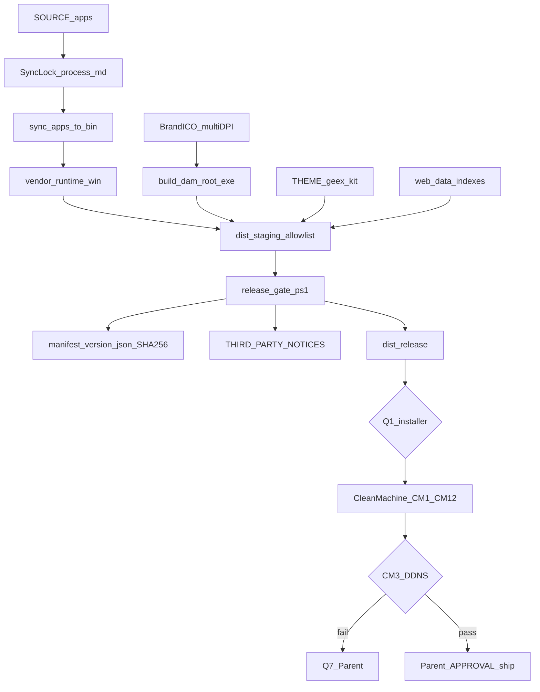

# Planner round 2 draft — DAM portable installer + Synology

```yaml
name: DAM portable installer Synology
overview: >-
  Release Windows z pełnym embed Python, allowlist payload (THEME+indexes),
  SBOM/notices, manifest SHA256, replace starego ZIP, ikony logo DK, WebView2/VC++
  w clean-machine, DDNS Postgres z PI+KV przed switch prefer, bramka RELEASE
  (nie installer po każdej edycji).
plan_mode: create
revision: 1
draft_round: 2
revisedAt: 2026-08-11
plannerSession: dam-portable-installer-synology/session-01
canonical_plan_path: C:\Users\krzysztof.wieczorek\.cursor\plans\dam-portable-installer-synology.plan.md
isProject: false
status: DRAFT_R2_AWAITING_CRITIC
changelog_from_r1: 18 ACCEPT / 0 REBUT (K+W)
```

## 0. Decyzje Plannera (jawne)

| ID | Decyzja | Uzasadnienie |
|----|---------|--------------|
| D1 | Dev = sync `apps→bin` + smoke; **pełny release TYLKO** na bramce RELEASE. Gate zawsze przebudowuje thin `DAM.exe` albo failuje gdy exe starszy niż sync `bin/apps`. | Unika rebuild przy każdej edycji; chroni przed ship starego exe (W5). |
| D2 | Supported: lokalna instalacja (path z Q1) LUB kompletny portable NTFS. Unsupported: UNC/`file://` niepełny + heal. | Root cause screenshotu usera. |
| D3 | Warstwy: SOURCE · **`GIT_ROOT/dist/staging`** · **`GIT_ROOT/dist/release`** · **`GIT_ROOT/dist/evidence`**. Zakaz `bin/dist/` w skryptach release (grep). | Jedna konwencja (W1); stary ZIP pisał pod `bin` root `dist` — replace. |
| D4 | DB: ADR-009; po PASS connectivity + **PI/KV** + Parent APPROVAL → default prefer `auto`/`synology=true`; SQLite = offline. | AGENTS.md: decyzje biznesowe → `program-instructions` najpierw (K7). |
| D5 | Ikony z oficjalnych SVG DK; multi-size 16/32/48/256; surfaces: exe, shortcut, installer, uninstaller, taskbar (+ AppUserModelID). | Brief §6 + W7. |
| D6 | Evidence-only DoD; deklaracje bez plików = FAIL. | Brief §9. |
| D7 | **Redis:** biblioteka klienta w `requirements-portable` / site-packages = OK; **serwer Redis NIE** w payload; brak Redis = graceful degrade, nie crash cold-start. | W6. |
| D8 | **`build-release-zip.ps1` = DEPRECATED** względem ścieżki release. Nowy pipeline: `release-gate.ps1` + allowlist → `dist/staging`. Stary skrypt: baner DEPRECATED + nie wywoływany z E1; opcjonalnie later delete po 1 udanym release. | K5 replace-not-wrap. |

---

## 0.1 Pytania Parent (AskQuestion) — prosto, A/B/C, rekomendacja = A

Planowanie / debata **może trwać** bez odpowiedzi. Implementacja wskazanych faz = STOP.

### Q1 — Gdzie i jak instalować aplikację na PC?
*Blokuje: E3 (installer), CM2/CM5/CM6 (ścieżki instalacji). Nie blokuje: B, C1–C3, E1/E2 staging portable.*

- **A (rekomendacja):** Inno Setup, instalacja per-user w `%LOCALAPPDATA%\Programs\DAM` (bez hasła admina).
- **B:** Inno Setup, wszyscy użytkownicy w `C:\Program Files\DAM` (wymaga UAC/admin).
- **C:** Inne (MSI / WiX / MSIX / NSIS) — napisz które.

### Q2 — Podpis cyfrowy (SmartScreen „nieznany wydawca”)?
*Blokuje: final ship z expectation „bez ostrzeżeń SmartScreen”. Nie blokuje: staging, unsigned test installer, CM na lab PC (z dokumentacją ostrzeżenia).*

- **A (rekomendacja):** Na razie bez certyfikatu; unsigned + instrukcja SmartScreen + weryfikacja hashy SHA256 z manifestu.
- **B:** Mamy cert Authenticode — podaj gdzie leży / jak podpisywać.
- **C:** Inne.

### Q3 — Jak czysty PC dostaje hasło do bazy Synology?
*Blokuje: D3 prefer-switch na multi-PC, CM3 PASS online. Nie blokuje: templates bez sekretu, D2 connectivity z maszyny dev, offline CM4.*

- **A (rekomendacja):** Przy pierwszym uruchomieniu użytkownik wkleja dane / importuje plik `dam-connection.env` (nic z hasłem w installerze ani w gicie).
- **B:** IT dostarcza osobny bezpieczny plik poza gitem; installer kładzie tylko pusty szablon.
- **C:** Inne.

### Q4 — Co z lokalnym IP Synology (LAN), skoro się zmienił?
*Blokuje: treść `pg-config.example` z LAN; przy CM3 FAIL na DDNS blokuje ship multi-PC (patrz Q7). Nie blokuje: primary DDNS w kodzie/docs.*

- **A (rekomendacja):** Podaj aktualny LAN IP — trafi tylko jako drugi host po `inyfinn.synology.me` w przykładzie.
- **B:** W przykładzie tylko DDNS; LAN wyłącznie w lokalnym pliku gitignored na stacjach.
- **C:** Zamiast publicznego DDNS używamy mesh VPN (np. Tailscale) jako główny host (gdy ISP/CGNAT psuje DDNS).

### Q5 — Czy wymuszamy szyfrowanie TLS do Postgres już w v1?
*Blokuje: D2 jeśli wybór B (implementacja sslmode). Nie blokuje: checklist connectivity TCP przy A.*

- **A (rekomendacja):** Jak dziś (ADR-009): TCP port 5433, bez wymuszania TLS w kliencie w v1; spisać ryzyko i checklistę.
- **B:** Od razu `sslmode=require` + polityka certyfikatu w tej samej fazie.
- **C:** Inne.

### Q6 — WebView2 na czystym Windows (okno aplikacji)?
*Blokuje: E3 (logika installera prereq), CM11, final CM1 PASS. Nie blokuje: vendor runtime, staging, ikony, heal page copy.*

- **A (rekomendacja):** WebView2 jako wymóg zewnętrzny: dokumentacja + strona pomocy `boot-heal.html?reason=webview2` + link do Evergreen Bootstrapper (bez cichej instalacji).
- **B:** Installer sam po cichu doinstalowuje Evergreen WebView2 (wymaga decyzji o uprawnieniach / sieci przy instalacji).
- **C:** Inne.

### Q7 — (warunkowe) CM3 FAIL: DDNS nie łączy czystego PC z bazą
*Blokuje: ship multi-PC live. Trigger: CM3 FAIL. Nie startuje dopóki CM3 nie padnie.*

- **A (rekomendacja):** Ship tylko offline+SQLite + jasny status; multi-PC live wstrzymane do naprawy sieci/NAT.
- **B:** Przełącz primary na Tailscale/VPN (jak Q4=C) i powtórz CM3.
- **C:** Inne.

---

## 1. Konwencje obowiązujące w projekcie

- Stos: pywebview + bridge `:8766` + web `:8765`; brak bundlera web.
- Layout: GIT_ROOT = `DAM.exe` + `bin` + `.git`; CONTENT_ROOT = `bin`.
- Portable HARD: tylko `bin\runtime\win\python\pythonw.exe`.
- Decyzje biznesowe (D4/D3 prefer): najpierw `program-instructions.json` + seed KV, potem kod (AGENTS.md).
- Em-dash ban; plan PL, snippety EN.
- Sekrety gitignored; evidence-only; Parent = człowiek.
- Kanoniczny dist: **`GIT_ROOT/dist/`** (nie `bin/dist/`).

### 1.1 Prereq: build machine vs end-user (W9)

| Rola | Wymagane | NIE mylić z |
|------|----------|-------------|
| **Build machine** | Host Python, pip, PyInstaller, sieć do python.org (vendor embed), Inno (gdy Q1), opcjonalnie signing tools (Q2) | CM1 |
| **End-user (release)** | Windows + **WebView2** (polityka Q6) + ewentualnie **VC++ Redistributable** (CM12) + pełny payload z embed Python | C1 vendor smoke |
| **Dev (nie ship)** | Może `DAM_ALLOW_SYSTEM_PYTHON=1`; sync bez pełnego installera | RELEASE gate |

C1 = dowód build machine. CM1 = dowód end-user VM. **Nigdy** nie zaliczaj CM1 na podstawie C1.

---

## 2. Kontekst (read-only)

### 2.1 Root cause
Brak `bin\runtime\win\python\pythonw.exe` → `boot-heal.html?reason=missing_runtime` („Brak silnika w folderze”). Typowo: share/UNC lub niepełna paczka.

### 2.2 Istniejące (reuse z limitem)
| Komponent | Stan w R2 |
|-----------|-----------|
| `vendor-runtime-win.ps1` | KEEP — build machine |
| `build-dam-root-exe.ps1` | KEEP — wywoływane z release-gate (D1/W5) |
| `sync-apps-to-bin.ps1` | KEEP — dev + gate; single-threaded lock |
| `build-release-zip.ps1` | **DEPRECATED** (D8); nie w ścieżce E1 |
| `install-desktop-shortcut.ps1` | WRITE source: `scripts/ops/` (+ mirror `bin/scripts/ops` po sync) |
| Logo SVG | źródło ICO; obecny `dam_app.ico` do wymiany |

### 2.3 Regresje HARD → CM9a–e
branding preview latency · quiz · titles · gazetka · live indexes.

---

## 3. Architektura



### 3.1 Allowlist payload (K3) — HARD, `Test-Path` w gate

**Root payload (`dist/staging/DAM/`):**
- `DAM.exe`
- `DAM.cmd`
- `README-START.txt` (szablon §E2)
- `LICENSE.md` (kopia z repo `bin/LICENSE.md` lub root license jeśli istnieje; gate fail jeśli brak źródła)
- `THIRD_PARTY_NOTICES.txt` (generowane E4)
- `VERSION.json`

**Runtime:**
- `bin/runtime/win/python/python.exe`
- `bin/runtime/win/python/pythonw.exe`
- `bin/runtime/win/python/**` (pełne drzewo embed + `Lib/site-packages`)

**Desktop:**
- `bin/apps/desktop/**` z wykluczeniem: `*.sqlite*`, `bound-session.json`, `machine-config.json`, `data/pg-config.json`, `dam-connection.env`, `data/oauth-tokens.json`, `.dam-secret.key`, `__pycache__`
- Wymagane pliki: `launch.py`, `local_bridge.py`, `boot-heal.html`, `dam_root_launcher.py`, `pg-config.example.json`, `dam-connection.env.example`, `dam_app.ico`

**Web:**
- `bin/apps/web/**` z wykluczeniem: `data/thumbs/**` (opcjonalnie puste `.gitkeep`), lokalne runtime noise (`dam-runtime.json`, `dam-identity.json` jeśli machine-specific)
- **Min. data (gate MUST exist):**
  - `bin/apps/web/data/file-index.json`
  - `bin/apps/web/data/search-index.json`
  - `bin/apps/web/data/naming-dictionary.json`
  - `bin/apps/web/data/program-instructions.json`
  - plus cold branding path: `branding-grid-head.json` + `branding-grid-index.json` jeśli obecne w tree (jeśli brak — gate WARN→Parent; nie ship bez decyzji gdy UI cold path ich wymaga)

**THEME (min.):**
- `bin/THEME/geex-html-main/**` (assets wymagane przez UI)
- `bin/THEME/inyfinn-geex-kit/**` (jeśli linkowane z web; jeśli katalog nie istnieje na build machine — gate fail z komunikatem „odtwórz kit”)

**Exclude zawsze:** `.git`, `agents/`, `planner-runs`, `_restore_*`, `_qa_screenshots`, `tooling/`, `node_modules`, `.env*`, prawdziwy `pg-config.json`, całe SOURCE poza powyższym.

### 3.2 Manifest SHA256 (K8) — kontrakt

Plik: `dist/release/manifest-<version>.json`

```json
{
  "app": "DAM - Dobra Kaloria - Inyfinn",
  "version": "<z dam-version.js / VERSION.json>",
  "built_at": "<ISO8601>",
  "git_sha": "<short>",
  "files": [
    { "path": "DAM.exe", "sha256": "<hex>", "size": 0 },
    { "path": "bin/runtime/win/python/pythonw.exe", "sha256": "<hex>", "size": 0 },
    { "path": "LICENSE.md", "sha256": "<hex>", "size": 0 }
  ]
}
```

`release-gate.ps1` **FAIL** gdy:
- brak któregokolwiek z: `DAM.exe`, `pythonw.exe`, `LICENSE.md`, `THIRD_PARTY_NOTICES.txt` w `files[]`
- hash nie zgadza się z dyskiem
- secrets scan znajdzie `.env` / hasło w payload

---

## 4. Ownership + sync lock (W2)

| Worker | WRITE set |
|--------|-----------|
| **W-Pack** | `scripts/ops/release-gate.ps1`, nowe `build-release-stage.ps1` / installer scripts, `dist/**`, deprecation banner na `build-release-zip.ps1`; **jedyne** wywołanie sync w join release |
| **W-Runtime** | `apps/desktop/dam_root_launcher.py`, `run-dam.vbs`, `DAM.cmd`, `boot-heal.html`, `vendor-runtime-win.ps1`, `build-dam-root-exe.ps1` |
| **W-Icons** | `apps/desktop/scripts/build-dam-ico.py`, `dam_app.ico`, opcjonalnie `apps/desktop/assets/` |
| **W-DB** | `dam_db.py` (prefer defaults tylko po PI), examples config, ADR/memory note; **`apps/web/data/program-instructions.json`** (wpis policy) |
| **W-QA** | `scripts/qa/release-clean-machine-*`, `dist/evidence/**` |
| **Parent** | Q1–Q7, APPROVAL D3/PI, odbiór |

### Sync handoff (HARD)
1. Agent proszący o sync wpisuje w `process.md`: `SYNC_REQUEST | who | reason | time`.
2. Wykonawca (Parent lub W-Pack): tworzy `bin/.dam-sync.lock` (PID+time); jeśli lock <15 min i żywy PID → STOP.
3. Uruchamia `scripts/ops/sync-apps-to-bin.ps1`; usuwa lock; wpis `SYNC_DONE | exit | time`.
4. **Zakaz** równoległego sync przez W-Runtime/W-Icons/W-DB.

**Merge order:** B1 Icons → (C Runtime ∥ D1–D2b DB/templates) → sync lock → E stage/gate → E3 po Q1/Q6 → F CM → Parent ship.

---

## 5. Plan wykonawczy (przebiegi)

### Faza A — Baseline + pytania Parent

**A0 — Baseline** (1 przebieg)  
Output: `session-01/artifacts/baseline.md` (runtime path, version, logo list, obecność THEME paths).

**A1 — Parent Q1–Q6** (debata może iść dalej; implementacja wg tabeli blokad §0.1)  
Output: `artifacts/parent-decisions.md`.

### Faza B — Ikony (W7)

**B1 — Brand ICO multi-DPI** (min. 3 przebiegi)  
- Rasteryzacja `logo-dk-green.svg` / `logo-dobra-kaloria.svg` → ICO 16/32/48/256.  
- Artefakty pod Inno: te same ICO dla `SetupIconFile`, `UninstallDisplayIcon`, shortcut.  
- Ustawienie / dokumentacja **AppUserModelID** dla pin taskbara (W-Runtime współdzieli kontrakt string ID).  
- Evidence: Properties screenshot exe + shortcut + (po E3) installer/uninstaller — CM7a–d.  
- Rollback: git checkout starego `dam_app.ico`.

### Faza C — Runtime / launcher / heal

**C1 — Vendor na build machine** (2 przebiegi)  
Smoke: `import webview, bcrypt, psycopg2, redis` (redis = import lib, nie serwer — D7).  
Output: `artifacts/runtime-vendor.log` + size. **To nie jest CM1.**

**C2 — Rebuild DAM.exe** (w gate zawsze lub gdy hash stale — D1)  
Output: `DAM.exe` + sha256.

**C3 — Heal + unsupported UNC** (2 przebiegi)  
Copy: missing_runtime, webview2, unsupported share.

**C4 — Shortcut script portable**  
WRITE: `scripts/ops/install-desktop-shortcut.ps1` (source); po sync mirror w `bin/scripts/ops/`. Usunąć tekst „Python 3.10+”.

**C5 — VC++ prereq check w gate** (K2)  
`release-gate` wykrywa brak typowych VC++ runtime DLL / dokumentuje CM12; nie zgadujemy bundlowania VC++ bez Parent (można dodać Q później jeśli CM12 FAIL systematycznie).

### Faza D — DB + PI (K7, W8)

**D0 — program-instructions (OBOWIĄZKOWE przed D3)**  
- Dodać wpis PI np. `db.synology_prefer_policy` z `must` / `must_not` (Synology prefer po approve; SQLite offline; brak credentiali w gicie; DDNS primary).  
- Seed KV (bridge start / seed script).  
- Weryfikacja: `GET http://127.0.0.1:8766/program-instructions` zawiera wpis (evidence log bez sekretów).  
- **Stop:** bez Parent APPROVAL treści PI → nie zmieniać `_DEFAULT_PREFER`.

**D1 — Templates** bez starego IP (wg Q4); tylko `REPLACE_ME`.

**D2 — Connectivity evidence** (3 przebiegi)  
DDNS resolve + TCP; host order; UI status. TLS wg Q5.

**D2b — Migracja evidence** (W8)  
`migrate_to_postgres.py` dry-run log w `dist/evidence/` (redact password). Apply tylko po Parent.

**D3 — Prefer switch** dopiero po: D0 PASS + D2 PASS + D2b dry-run + Parent APPROVAL.  
Release/first-run: `mode=auto`, `synology=true` bez nadpisywania istniejącego user `db-prefer.json`.

**D4 — memory + ADR-009 note** (data switch, polityka LAN).

### Faza E — Staging / gate / SBOM / installer

**E1 — `release-gate.ps1`** (budżet: **minimum 5 przebiegów**, nie sufit; po 3 failach tej samej asercji → ESCALATE Parent — Ko1)  
Kolejność wewnątrz:
1. Sync lock + sync  
2. Vendor check (`pythonw` exists + smoke import)  
3. Rebuild exe (lub fail stale)  
4. Stage allowlist → `dist/staging/DAM/`  
5. `Test-Path` każdej pozycji §3.1  
6. Secrets scan  
7. Generuj notices (E4) + manifest (E4)  
8. (opcjonalnie) wywołaj installer build jeśli Q1+Q6 znane  

**E2 — Stage + README-START.txt** szablon 5 linii:
1. Uruchom `DAM.exe` (nie kopiuj niepełnego folderu z sieci).  
2. Brak silnika → oficjalna paczka / IT (nie instaluj Python).  
3. Brak WebView2 → link Evergreen (heal).  
4. Baza: DDNS `inyfinn.synology.me` — hasło tylko lokalnie (Q3).  
5. Wersja: patrz `VERSION.json` / hash w manifeście.

**E3 — Installer** (STOP bez Q1 + Q6)  
Ikony brand; shortcuts; uninstaller; WebView2 wg Q6; signing wg Q2.

**E4 — Versioning + SBOM + manifest** (K4, K8)  
- `THIRD_PARTY_NOTICES.txt` z vendored `site-packages` (np. `pip-licenses` na build machine przeciw `--path` site-packages).  
- `manifest-<version>.json` per §3.2.  
- Archive previous w `dist/release/archive/`.

### Faza F — Clean-machine matrix

Każdy wiersz CRITICAL = evidence w `dist/evidence/<id>/`. FAIL = no ship.

| ID | Scenariusz | Expected / dowód |
|----|------------|------------------|
| **CM1** | **Izolowany VM/profil:** brak Python w PATH, brak repo, brak dev tools | Start z release artefaktu; log + screenshot okna **z tego VM** (nie z build machine) |
| CM2 | Inny user Windows + path ze spacjami | Start OK |
| CM3 | Sieć + DDNS | Online postgres/auto **lub** FAIL→Q7 |
| CM4 | Sieć OFF | sqlite-offline + hint; UI nie udaje online |
| **CM4b** | Po nieudanym PG: revert prefer→sqlite | Lokalna baza działa; brak utraty danych user-facing (evidence) |
| CM5 | Reinstall/upgrade | Dane zachowane wg policy; skróty OK |
| CM6 | Uninstall | Binaria usunięte; user data policy; brak orphan shortcut |
| CM7a | Ikona exe Properties | Logo DK |
| CM7b | Shortcut + taskbar pin | Logo DK + AUMID |
| CM7c | Installer ikona | Logo DK |
| CM7d | Uninstaller ikona | Logo DK |
| CM8 | UNC niepełny | Heal unsupported; nie silent crash |
| **CM9a** | Branding preview click latency | zainstalowana app; min. 3 przeloty UI (screenshot+Read) |
| **CM9b** | Quiz | j.w. |
| **CM9c** | Titles | j.w. |
| **CM9d** | Gazetka | j.w. |
| **CM9e** | Live indexes | j.w. |
| CM10 | Secrets scan | 0 haseł / 0 `.env` real |
| **CM10b** | Notices obecne | `THIRD_PARTY_NOTICES.txt` + `LICENSE.md` w payload |
| **CM11** | Brak WebView2 | heal/bootstrapper per Q6; **nie** silent crash (STOP E3 bez Q6) |
| **CM12** | Brak VC++ (lab) | jawny komunikat lub udokumentowany prereq; nie fałszywy PASS CM1 |

Budżet QA: 15–25 przebiegów (macierz + 3 przeloty × CM9a–e).

### Faza G — Governance
G1 ownership lock + process.md.  
G2 po CONVERGED: UPDATE `canonical_plan_path` (nie FINAL.md).

---

## 6. Todos (szkielet po CONVERGED)

- `step-A0-baseline`
- `step-A1-parent-q1-q6`
- `step-B1-brand-ico-aumid`
- `step-C1-vendor-runtime`
- `step-C2-rebuild-exe`
- `step-C3-heal-launch-policy`
- `step-C4-shortcut-script`
- `step-C5-vcredist-gate-check`
- `step-D0-program-instructions-db-policy`
- `step-D1-config-templates`
- `step-D2-connectivity-evidence`
- `step-D2b-migrate-dry-run`
- `step-D3-prefer-switch`
- `step-D4-adr-memory-note`
- `step-E1-release-gate`
- `step-E2-stage-allowlist-readme`
- `step-E3-installer`
- `step-E4-sbom-manifest-version`
- `step-F-clean-machine-matrix`
- `step-G-governance-handoff`

---

## 7. DoD ship

- [ ] CM1 PASS na izolowanym VM (dowód plikowy)
- [ ] CM11/CM12 nie pominięte; Q6 odpowiedziane przed E3
- [ ] Manifest pokrywa pythonw + DAM.exe + LICENSE; notices obecne
- [ ] Allowlist §3.1 `Test-Path` all green
- [ ] `build-release-zip.ps1` nie użyty w release path
- [ ] PI db policy w KV przed D3; D3 po APPROVAL
- [ ] CM9a–e PASS (3 przeloty UI każdy)
- [ ] Ikony CM7a–d brand DK
- [ ] Brak sekretów; source nie skasowane
- [ ] Unsupported UNC udokumentowany

---

## 8. Rollback

| Warstwa | Rollback |
|---------|----------|
| Prefer/PI | revert PI entry + `_DEFAULT_PREFER` + `db-prefer.json` |
| ICO | git checkout |
| Runtime | archive tarball / re-vendor |
| Installer | previous `dist/release/archive` SHA |
| Staging | delete `dist/staging` (odtwarzalne) |

---

## 9. Guardrails

- Nie mylić C1 z CM1.  
- Nie wrap starego ZIP.  
- Nie D3 bez PI+KV+APPROVAL.  
- Nie E3 bez Q1+Q6.  
- Nie zgadywać cert/creds/port/WebView2 policy.  
- Nie pisać do `bin/dist/`.  
- Sync tylko przez lock.  
- Redis = lib only (D7).

---

## 10. Kontrakt wykonawcy

- Fazy A→G; stop on error → process.md → Parent.  
- Max 3 fail tej samej asercji → ESCALATE.  
- Dev sync ≠ release.  
- Deliverable wdrożenia = tylko zaktualizowany `canonical_plan_path` po CONVERGED.

---

## 11. Notatki dla Critica (round 2)

Sprawdź czy R2 domyka: CM1/CM11/CM12, allowlist ścieżki, SBOM, manifest schema, D8 deprecate ZIP, Q6+blokady faz, D0 PI przed D3, sync lock, CM9a–e, D7 redis, W5 stale exe, CM4b, kanoniczny `GIT_ROOT/dist`.

## Werdykt Plannera

Draft R2 gotowy na **Critic round 2**. Kanon nie tworzony. Implementacja zakazana.
