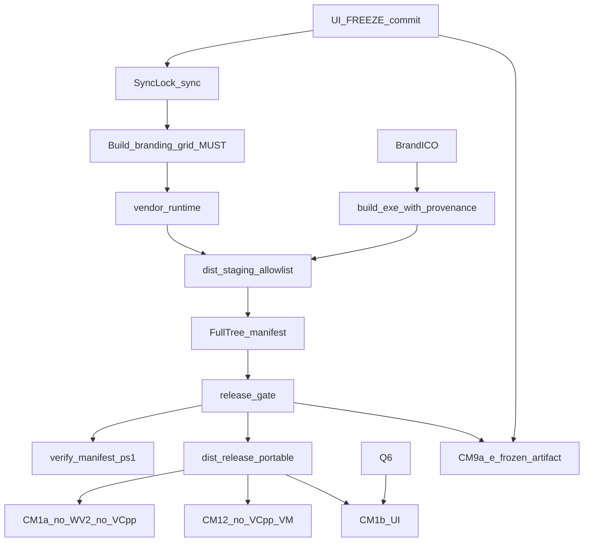

# Planner round 3 draft — DAM portable installer + Synology

```yaml
name: DAM portable installer Synology
overview: >-
  Release Windows z pełnym embed Python, full-tree SHA256 manifest + verify-manifest,
  provenance stale-exe (git+snapshot), branding-grid MUST+freshness, UI RELEASE FREEZE
  do CM9, profile VM CM1a/CM1b + CM12 bez VC++, PI/KV przed Synology prefer, bramka
  RELEASE (nie installer po każdej edycji).
plan_mode: create
revision: 1
draft_round: 3
revisedAt: 2026-08-11
plannerSession: dam-portable-installer-synology/session-01
canonical_plan_path: C:\Users\krzysztof.wieczorek\.cursor\plans\dam-portable-installer-synology.plan.md
isProject: false
status: DRAFT_R3_AWAITING_CRITIC
changelog_from_r2: 13 ACCEPT / 0 REBUT (K+W); 3 Kosmetyczne ACCEPT
```

## 0. Decyzje Plannera (jawne — zero TBD)

| ID | Decyzja |
|----|---------|
| D1 | Dev = sync+smoke; ship tylko przez `release-gate.ps1`. Stale EXE = mismatch **provenance** (nie mtime) — patrz §5 E1.3. |
| D2 | Supported: lokalna instalacja (Q1) LUB kompletny portable NTFS. Unsupported: UNC/`file://` niepełny. |
| D3 | Dist kanoniczny: wyłącznie `GIT_ROOT/dist/{staging,release,evidence,portable}`. Zakaz `bin/dist/` (grep w gate). |
| D4 | Synology prefer dopiero po D0 PI+KV + D2 + D2b + Parent APPROVAL. |
| D5 | Ikony z oficjalnych SVG DK; multi-DPI; surfaces exe/shortcut/installer/uninstaller/taskbar. |
| D6 | Evidence-only; deklaracja bez pliku = FAIL. |
| D7 | Redis = klient w site-packages; serwer NIE w payload; CM13 obowiązkowy. |
| D8 | `build-release-zip.ps1` DEPRECATED; E1 nigdy go nie woła. |
| D9 | **Manifest = full-tree** każdego pliku w staging/portable/installer artefaktach + niezależny `verify-manifest.ps1`. |
| D10 | **RELEASE FREEZE** `apps/web/**` (+ branding preview hot files) od `freeze_commit` do PASS CM9a–e; zmiana = unieważnienie gate. |
| D11 | branding-grid-head/index = **MUST** + freshness/generation gate (PI cold path). |
| D12 | CM1 rozdzielone: **CM1a** engine bez WebView2/VC++; **CM1b** UI wg Q6. CM12 docs nigdy nie dają PASS. |

---

## 0.1 Pytania Parent (AskQuestion) — rekomendacja = A

Debata może trwać bez odpowiedzi. Blokady implementacji poniżej.

### Q1 — Gdzie instalować?
*Blokuje: E3, CM2/CM5/CM6 (ścieżki instalacji). Nie blokuje: E1/E2, portable, CM1a/CM1b na portable, CM11/CM12 lab.*

- **A (rekomendacja):** Inno, per-user `%LOCALAPPDATA%\Programs\DAM` (bez admina).
- **B:** Inno, `C:\Program Files\DAM` (UAC).
- **C:** Inne (napisz).

### Q2 — Podpis SmartScreen?
*Blokuje: expectation „bez ostrzeżeń SmartScreen” przy final ship. Nie blokuje: unsigned lab + hash verify.*

- **A (rekomendacja):** Bez certu teraz; unsigned + README SmartScreen + SHA256.
- **B:** Cert Authenticode — podaj lokalizację/procedurę.
- **C:** Inne.

### Q3 — Hasło Postgres na czystym PC?
*Blokuje: D3 multi-PC online, CM3 PASS online. Nie blokuje: templates, offline CM4/CM4b.*

- **A (rekomendacja):** First-run: user wkleja / importuje `dam-connection.env` (zero sekretów w installerze/git).
- **B:** IT dostarcza sealed file poza gitem; installer = pusty szablon.
- **C:** Inne.

### Q4 — Nowy LAN IP Synology?
*Blokuje: treść example z LAN; przy CM3 FAIL → Q7. Nie blokuje: DDNS primary.*

- **A (rekomendacja):** Podaj aktualny LAN IP jako drugi host po DDNS w example.
- **B:** Example tylko `inyfinn.synology.me`; LAN tylko gitignored lokalnie.
- **C:** Primary = mesh VPN (Tailscale) zamiast publicznego DDNS.

### Q5 — TLS do Postgres w v1?
*Blokuje: D2 implementacja jeśli B. Nie blokuje: TCP checklist przy A.*

- **A (rekomendacja):** TCP 5433 jak ADR-009; bez force TLS w v1; spisać ryzyko.
- **B:** `sslmode=require` + cert policy teraz.
- **C:** Inne.

### Q6 — WebView2?
*Blokuje: E3 logika prereq, CM1b PASS, CM11 Expected. Nie blokuje: CM1a, vendor, staging, ikony.*

- **A (rekomendacja):** Zewnętrzny prereq: heal `?reason=webview2` + link Evergreen (bez silent install).
- **B:** Installer cicho doinstalowuje Evergreen (uprawnienia/sieć przy install).
- **C:** Inne.

### Q7 — (warunkowe) CM3 FAIL DDNS
*Blokuje: pełny ship multi-PC Synology (brief §7). Trigger: CM3 FAIL.*

- **A (rekomendacja):** **Partial ship:** runtime/installer/portable OK + offline SQLite; live PG multi-PC **wstrzymane** — to NIE zamyka brief §7.
- **B:** Przełącz na VPN/Tailscale (jak Q4=C), powtórz CM3.
- **C:** Inne.

### Q8 — (warunkowe) CM12 FAIL ×3
*Trigger: trzy nieudane przebiegi CM12. Nie istnieje w ścieżce happy-path.*

- **A (rekomendacja):** Zostaw VC++ jako zewnętrzny prereq + heal/link; nie bundluj.
- **B:** Bundle VC++ Redistributable w installerze.
- **C:** Inne.

---

## 1. Konwencje

- PI+KV przed decyzjami biznesowymi (AGENTS.md).
- Portable HARD: `bin\runtime\win\python\pythonw.exe`.
- Em-dash ban; evidence-only; Parent = człowiek.
- Dist: tylko `GIT_ROOT/dist/`.
- Debata `min_rounds: 10` ≠ budżet przebiegów implementacji QA (Ko1).

### 1.1 Build machine vs end-user

| Rola | Wymagane | Dowód |
|------|----------|-------|
| Build machine | Host Python, pip, PyInstaller, sieć python.org, Inno (po Q1), opc. signing | C1 |
| End-user engine (CM1a) | Windows + pełny payload embed Python; **bez** wymogu WebView2/VC++ | CM1a |
| End-user UI (CM1b) | + WebView2 wg Q6 (+ VC++ jeśli CM12 wymaga do startu UI) | CM1b |
| Dev | opc. `DAM_ALLOW_SYSTEM_PYTHON=1` | nie ship |

---

## 2. Kontekst (read-only)

Root cause: brak runtime → `boot-heal.html?reason=missing_runtime`.  
PI cold UI: `branding-grid-head.json` + `branding-grid-index.json` = MUST.  
`bin/LICENSE.md` = źródło LICENSE.  
Regresje: branding preview, quiz, titles, gazetka, live indexes → CM9a–e pod FREEZE.

---

## 3. Architektura



### 3.1 Allowlist payload + excludes (jawne, minimalne)

**Root `dist/staging/DAM/`:**
- `DAM.exe`, `DAM.cmd`, `README-START.txt`, `LICENSE.md`, `THIRD_PARTY_NOTICES.txt`, `VERSION.json`, `BUILD_PROVENANCE.json`

**Runtime:** `bin/runtime/win/python/**`  
**Exclude runtime (MUST strip przy stage):** `__pycache__/`, `*.pyc`, `*.pyo`, `*.pdb` (jeśli obecne), `*.log`

**Desktop:** `bin/apps/desktop/**`  
**Exclude desktop:** `*.sqlite*`, `bound-session.json`, `machine-config.json`, `data/pg-config.json`, `dam-connection.env`, `data/oauth-tokens.json`, `.dam-secret.key`, `__pycache__/`, `*.pyc`, `launch-last-error.txt`

**Web:** `bin/apps/web/**`  
**Exclude web machine noise:** `data/dam-runtime.json`, `data/dam-identity.json`, `data/thumbs/**` (zostaw katalog + `.gitkeep`), `__pycache__/`, `*.pyc`

**THEME MUST:**
- `bin/THEME/geex-html-main/**`
- `bin/THEME/inyfinn-geex-kit/**` (FAIL jeśli katalog nie istnieje na build machine)

**Data MUST (Test-Path + freshness §5 E1.0):**
- `bin/apps/web/data/file-index.json`
- `bin/apps/web/data/search-index.json`
- `bin/apps/web/data/naming-dictionary.json`
- `bin/apps/web/data/program-instructions.json`
- `bin/apps/web/data/branding-grid-head.json`
- `bin/apps/web/data/branding-grid-index.json`

**Legal MUST (Ko2):** jeśli UI linkuje lokalnie — `bin/apps/web/license.html` oraz powiązane `privacy.html`, `terms.html`, `consents.html`, `docs-security.html` gdy istnieją w source (Test-Path per plik obecny w `apps/web/*.html` legal set).

**Poza payloadem:** `.git`, `agents/`, planner-runs, `_restore_*`, `_qa_*`, `tooling/`, `node_modules`, SOURCE poza allowlist.

### 3.2 Manifest full-tree (D9) — kontrakt

Plik: `dist/release/manifest-<version>.json`

**Schema (pola wymagane):**
- `schema_version`: `"1.0"`
- `app`, `version`, `built_at` (ISO8601), `git_sha`, `freeze_commit` (sha UI freeze lub = git_sha jeśli ten sam)
- `source_snapshot_sha256`: hash kanonicznego snapshotu źródeł objętych release (patrz §5 E1.3)
- `root`: absolutna lub relative-from-manifest ścieżka korzenia payload (`DAM/` staging lub portable root)
- `artifact_kind`: `staging` | `portable` | `installer`
- `file_count`: liczba plików shashowanych
- `exclusions`: lista globów zastosowanych przy stage (§3.1) — jawna kopia
- `files[]`: **każdy** plik pod `root` po exclusions:
  - `path` (relative posix-style od root)
  - `size` (bytes)
  - `sha256` (hex lowercase)

**Installer:** osobny manifest lub ten sam z `artifact_kind=installer` obejmujący plik `.exe` installera + (jeśli multi-file) cały katalog output Inno.

**Gate FAIL gdy:**
- `file_count` ≠ faktyczna liczba plików na dysku pod root
- jakikolwiek plik na dysku bez wpisu / wpis bez pliku
- mismatch sha256/size
- brak `DAM.exe`, `bin/runtime/win/python/pythonw.exe`, `LICENSE.md`, `THIRD_PARTY_NOTICES.txt`, `BUILD_PROVENANCE.json`, obu branding-grid

**Niezależna weryfikacja:** `scripts/ops/verify-manifest.ps1 -ManifestPath <path> -Root <payloadRoot>`  
- Exit 0 = OK; ≠0 = FAIL.  
- W-QA / IT uruchamia na czystym PC **po skopiowaniu** artefaktu, bez uruchamiania `release-gate.ps1`.  
- Evidence: stdout log w `dist/evidence/verify-manifest/<run>.log`.

---

## 4. Ownership + FREEZE + sync

| Worker | WRITE |
|--------|-------|
| W-Pack | `release-gate.ps1`, `build-release-stage.ps1`, `verify-manifest.ps1`, `dist/**`, deprecation ZIP; sync w join |
| W-Runtime | launcher, VBS, DAM.cmd, boot-heal, vendor script, build-exe, **`launch.py` AUMID exclusively** |
| W-Icons | `build-dam-ico.py`, `dam_app.ico` only (nie AUMID) |
| W-DB | examples config, `dam_db` prefer po PI, **PI json** wpis policy |
| W-QA | evidence, QA scripts; **READ-ONLY** na zainstalowanym/portable artefakcie; **zero** WRITE `apps/web/**` |
| Parent | Q1–Q8, FREEZE APPROVAL, D3 APPROVAL, odbiór |

### Sync lock (bez zmian intencji R2)
`bin/.dam-sync.lock` + wpisy `SYNC_REQUEST` / `SYNC_DONE` w `process.md`; tylko Parent lub W-Pack.

### RELEASE FREEZE (D10) — HARD

1. **Przed E1:** Parent (lub Lead) zapisuje `freeze_commit` = `git rev-parse HEAD` (czyste tree dla `apps/web/**` albo jawny stash zakazany).  
2. Artefakt: `dist/release/FREEZE.json` = `{ freeze_commit, frozen_paths: ["apps/web/**"], note: "branding preview + CM9" }`.  
3. Od freeze do PASS CM9a–e: **zakaz WRITE** do `apps/web/**` (w tym `dam-branding.js`, `dam-media-preview.js`, CSS branding, HTML ładujące te skrypty).  
4. Jakakolwiek zmiana w frozen paths (diff vs `freeze_commit`) → **unieważnia** wynik E1 i wszystkie CM9*; obowiązek: nowy freeze → re-run E1 (pełny gate) → restart CM9 przebiegów od zera.  
5. W-QA testuje **wyłącznie** payload z `dist/release` odpowiadający `freeze_commit` (sprawdzenie `BUILD_PROVENANCE.json` / manifest `freeze_commit`).

---

## 5. Plan wykonawczy

### Faza A
**A0** baseline → `artifacts/baseline.md` + start szablonu `CM1-profile.md`.  
**A1** Parent Q1–Q6 (Q7/Q8 warunkowe) → `artifacts/parent-decisions.md`.

### Faza B — Ikony
**B1** ICO 16/32/48/256 z logo DK; surfaces dla Inno. AUMID **nie** tu — tylko W-Runtime.

### Faza C — Runtime / launcher
**C1** Vendor smoke na build machine (`webview, bcrypt, psycopg2, redis` import). ≠ CM1.  
**C2** Build exe z **provenance** (§E1.3).  
**C3** Heal: missing_runtime, webview2, unsupported UNC, vcredist hint.  
**C4** `scripts/ops/install-desktop-shortcut.ps1` (source) + mirror po sync; bez „Python 3.10+”.  
**C5** AUMID string w `launch.py` (W-Runtime WRITE).  
**C6** Przygotowanie lab VM obrazów pod CM1a / CM12 (profil §6).

### Faza D — DB + PI
**D0** PI `db.synology_prefer_policy` + seed KV; `GET /program-instructions` evidence; STOP bez APPROVAL.  
**D1** Templates DDNS; LAN wg Q4; `REPLACE_ME` only.  
**D2** Connectivity evidence.  
**D2b** `migrate_to_postgres.py` dry-run log (redact secrets).  
**D3** Prefer switch po D0+D2+D2b+APPROVAL.  
**D4** memory + ADR-009 note.

### Faza E — Gate / stage / manifest / installer

**E0 — UI FREEZE**  
Zapis `FREEZE.json`; Parent checkbox w process.md. Bez E0 → E1 nie startuje gdy celem jest CM9 ship.

**E1.0 — Branding grid MUST + freshness**  
- Uruchom `apps/web/scripts/build-branding-grid-index.py` (lub równoważny istniejący pipeline) na build machine przed stage.  
- **FAIL** jeśli brak `branding-grid-head.json` lub `branding-grid-index.json`.  
- **Freshness/generation gate (HARD):**  
  - Oba pliki `LastWriteTimeUtc` ≥ mtime źródłowego fat index użytego do builda **albo** pole `generated_at` / generation id w head ≥ generation z fat (jak definiuje istniejący publish helper).  
  - Dodatkowo: `file-index.json` i `search-index.json` istnieją i size > 0.  
  - Evidence: `dist/evidence/grid-freshness.json` z timestampami i generation ids.  
- Brak WARN→Parent: tylko PASS/FAIL.

**E1 — `release-gate.ps1`** (min. 5 przebiegów; po 3 fail tej samej asercji → ESCALATE; nie twardy sufit)

Kolejność:
1. Assert E0 freeze aktualny (`git rev-parse HEAD` == `freeze_commit` dla dirty check frozen paths; dirty → FAIL).  
2. Sync lock + sync.  
3. **E1.3 Provenance / stale EXE (HARD, nie mtime):**  
   - Oblicz `source_snapshot_sha256` = SHA256 kanonicznego listingu plików: `apps/desktop/dam_root_launcher.py` + `apps/desktop/launch.py` + `scripts/ops/build-dam-root-exe.ps1` + (opcjonalnie lock plików launcher) posortowanych path+content hash (algorytm zapisany w skrypcie; deterministic).  
   - `git_sha` = `git rev-parse HEAD`.  
   - Zawsze przebuduj thin `DAM.exe` w gate **albo** odczytaj osadzone provenance z istniejącego EXE (`BUILD_PROVENANCE` resource / sidecar wymuszony obok EXE).  
   - Zapisz `BUILD_PROVENANCE.json` w root payload: `{ git_sha, freeze_commit, source_snapshot_sha256, built_at }`.  
   - **FAIL** jeśli provenance w EXE/sidecar ≠ `{ git_sha, source_snapshot_sha256 }` z bieżącego gate run.  
   - **Zakaz** opierania decyzji wyłącznie na mtime.  
4. Vendor check + smoke import.  
5. E1.0 grid MUST+freshness.  
6. Stage allowlist → `dist/staging/DAM/` z excludes §3.1.  
7. Full-tree manifest (`artifact_kind=staging`) + `verify-manifest.ps1` lokalnie (musi PASS).  
8. Grep asercja: żaden skrypt w `scripts/ops/*release*` / `*gate*` nie zawiera ścieżki zapisu `bin\dist` / `bin/dist` (FAIL).  
9. Secrets scan.  
10. Spakuj portable → `dist/release/portable/` + manifest `artifact_kind=portable` + verify.  
11. Jeśli Q1+Q6 znane → E3; inaczej STOP E3, kontynuuj CM na portable (W1).

**E2 — README-START.txt** (5 linii jak R2: start, silnik, WebView2, baza/DDNS, VERSION/hash).

**E3 — Installer** (STOP bez Q1+Q6)  
Manifest `artifact_kind=installer` + verify; ikony brand; WebView2 wg Q6; signing wg Q2.

**E4 — SBOM + archive**  
`THIRD_PARTY_NOTICES.txt` z site-packages; archive poprzednich release w `dist/release/archive/`.

### Faza F — Clean-machine

#### F.0 Profil VM — `dist/evidence/CM1-profile.md` (MUST przed CM1*)

Wymagane pola (wypełnione evidence **przed** startem testu):

| Pole | Wartość wymagana (lab v1) |
|------|---------------------------|
| OS | Windows 10 22H2 **lub** Windows 11 23H2+ (zapisać dokładnie) |
| Build number | np. `10.0.22631.x` z `winver` / `(Get-ComputerInfo).WindowsVersion` |
| Arch | **x64** |
| RAM | ≥ 8 GB |
| Snapshot | nazwany snapshot **przed** instalacją DAM; po teście **reset do snapshot** |
| Python w PATH | **brak** (`where.exe python` / `py` → not found) |
| Repo / git / Cursor / VS Build Tools | **brak** na VM |
| Dowód zainstalowanych produktów | export przed testem: `Get-ItemProperty HKLM:\...\Uninstall\*` (+ WOW6432Node) → `dist/evidence/cm1/installed-products-before.txt`; osobno lista obecności WebView2 i VC++ (poniżej) |

**Warianty obrazu:**
- **VM-A (CM1a + CM12 path):** **bez** WebView2 Runtime, **bez** VC++ Redistributable (x64). Dowód negatywny: brak kluczy Uninstall WebView2; brak `System32\vcruntime140.dll` / `msvcp140.dll` (lub Get-Command fail).  
- **VM-B (CM1b):** jak VM-A bazowo, potem WebView2 Evergreen **zainstalowany systemowo** gdy Q6=A (prereq zewnętrzny) **albo** po przebiegu installera gdy Q6=B. VC++: osobno per CM12 wynik.

#### Macierz CM

| ID | VM | Scenariusz | Expected | Docs jako PASS? |
|----|-----|------------|----------|-----------------|
| **CM1a** | VM-A | Portable z `dist/release/portable` (gdy Q1 nieznane — **zawsze portable**; gdy Q1 znane — portable LUB fresh install) | Start silnika: obecny `pythonw`, **brak** `missing_runtime`; heal webview2 **dozwolony** (nie wymaga pełnego okna UI). Evidence: log launch + screenshot heal lub tray/process list | NIE |
| **CM1b** | VM-B zależnie od Q6 | Pełne okno UI | Okno DAM widoczne; screenshot+Read. Q6A: WebView2 preinstall na VM-B przed startem. Q6B: installer zapewnia WV2, potem okno | NIE |
| CM2 | VM-B | Inny user + path ze spacjami | Start OK | NIE |
| CM3 | VM-B + sieć | DDNS | Online lub → Q7 (partial ship przy A) | NIE |
| CM4 | VM-B sieć OFF | Offline SQLite + hint | NIE |
| CM4b | VM-B | Revert prefer→sqlite po fail PG | Dane user-facing zachowane | NIE |
| CM5/CM6 | po Q1 | Reinstall / uninstall | Policy danych + skróty | NIE |
| CM7a–d | VM-B | Ikony exe/shortcut/installer/uninstaller | Logo DK | NIE |
| CM8 | dowolny | UNC niepełny | Heal unsupported | NIE |
| CM9a–e | VM-B + **frozen** artifact | branding latency / quiz / titles / gazetka / indexes | Min. **3 przeloty** UI (screenshot+Read) każdy; artefakt `freeze_commit` zgodny | NIE |
| CM10 / CM10b | build+VM | Secrets + notices+LICENSE | 0 sekretów; pliki obecne | NIE |
| CM11 | VM-A | Brak WebView2 | Heal/bootstrapper per Q6; nie silent crash | NIE |
| **CM12** | **VM-A bez VC++** | Uruchomienie DAM/portable | Jawny komunikat/heal (nie silent crash). **Dokumentacja sama NIGDY nie daje PASS.** Po PASS komunikatu można uzupełnić docs. FAIL×3 → Q8 | **NIGDY** |
| **CM13** | VM-B | Cold-start bez serwera Redis | Import/start OK; log `redis: down` / graceful; brak crash | NIE |

**verify-manifest na VM:** po skopiowaniu portable/installer output — `verify-manifest.ps1` exit 0 (evidence).

Budżet QA implementacji: 20–30 przebiegów (profil + macierz + 3×CM9a–e).

### Faza G
G1 ownership + freeze discipline w process.md.  
G2 po CONVERGED MAD: UPDATE `canonical_plan_path` tylko.

---

## 6. Todos (po CONVERGED)

- `step-A0-baseline-cm1-profile`
- `step-A1-parent-q1-q7` (Q7 warunkowe w briefie decyzji)
- `step-B1-brand-ico`
- `step-C1-vendor-runtime`
- `step-C2-exe-provenance`
- `step-C3-heal`
- `step-C4-shortcut-script`
- `step-C5-aumid-launch-py`
- `step-D0-program-instructions`
- `step-D1-config-templates`
- `step-D2-connectivity`
- `step-D2b-migrate-dry-run`
- `step-D3-prefer-switch`
- `step-D4-adr-memory`
- `step-E0-ui-freeze`
- `step-E1-release-gate`
- `step-E1-0-branding-grid-freshness`
- `step-E2-readme-stage`
- `step-E3-installer`
- `step-E4-sbom-manifest-archive`
- `step-F-cm1a-cm1b-cm12-matrix`
- `step-F-cm9-frozen`
- `step-G-handoff`

---

## 7. DoD ship

- [ ] `CM1-profile.md` + installed-products-before wypełnione  
- [ ] CM1a PASS na VM-A; CM1b PASS per Q6  
- [ ] CM12 PASS/FAIL wyłącznie z testu VM-A bez VC++ (docs ≠ PASS)  
- [ ] Full-tree manifest + `verify-manifest.ps1` PASS na build i na VM  
- [ ] Provenance EXE == git_sha + source_snapshot_sha256  
- [ ] branding-grid MUST + freshness evidence  
- [ ] FREEZE.json; CM9a–e na frozen artifact; brak dirty `apps/web/**`  
- [ ] CM13 redis degrade  
- [ ] grep: brak zapisu `bin/dist/`  
- [ ] D0 PI przed D3; Q7A = partial ship jeśli użyte  
- [ ] Ikony brand CM7a–d; sekrety 0; source nietknięty destrukcyjnie  

---

## 8. Rollback

Prefer/PI / ICO / runtime archive / previous installer SHA / delete staging — jak R2; dodatkowo: przy naruszeniu FREEZE → discard CM9 evidence, nowy freeze+E1.

---

## 9. Guardrails

- Nie mylić C1 / CM1a / CM1b.  
- Nie PASS CM12 przez README.  
- Nie WARN na branding-grid.  
- Nie mtime-only stale exe.  
- Nie partial manifest.  
- Nie WRITE web podczas FREEZE.  
- Nie zgadywać Q1–Q8.  
- Q7A ≠ zamknięcie brief §7.

---

## 10. Kontrakt wykonawcy

Sekwencja A→G; stop on error; max 3 fail → ESCALATE; ship tylko gate+verify-manifest+CM; deliverable = UPDATE kanonu po CONVERGED (min_rounds 10).

---

## 11. Notatki dla Critica (round 3)

Sprawdź domknięcie 6K: profil VM-A/B + CM1a/b, full-tree manifest+verify, provenance algorithm, grid MUST+freshness, FREEZE, CM12 docs≠PASS; oraz 7W (portable CM1, AUMID owner, CM13, grep bin/dist, Q7A partial, pyc exclude, todo Q7).

## Werdykt Plannera

Draft R3 gotowy na **Critic round 3**. Kanon nie tworzony. Implementacja zakazana. Brak tie (0 REBUT).
