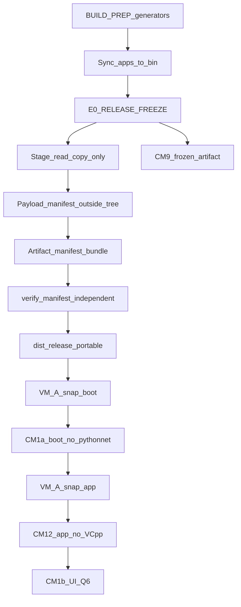

# Planner round 4 draft — DAM portable installer + Synology

```yaml
name: DAM portable installer Synology
overview: >-
  BUILD PREP (indeksy) przed RELEASE FREEZE; po freeze tylko copy do staging;
  full-tree manifest poza payload + artifact manifest; slim indexes (fat 340MB OUT)
  z budżetem rozmiaru i LFS detect; CM1a-boot bez pythonnet oddzielony od CM12;
  VC++ bootstrap w installerze gdy runtime wymaga; Tier-A/Tier-B ship; PI przed
  Synology prefer.
plan_mode: create
revision: 1
draft_round: 4
revisedAt: 2026-08-11
plannerSession: dam-portable-installer-synology/session-01
canonical_plan_path: C:\Users\krzysztof.wieczorek\.cursor\plans\dam-portable-installer-synology.plan.md
isProject: false
status: DRAFT_R4_AWAITING_CRITIC
changelog_from_r3: 11 ACCEPT / 0 REBUT (K+W); 3 Kosmetyczne ACCEPT
```

## 0. Decyzje Plannera (jawne — zero TBD, zero „albo A albo B”)

| ID | Decyzja |
|----|---------|
| D1 | Dev = sync+smoke; ship tylko `release-gate.ps1`. Stale EXE = mismatch provenance (nie mtime). |
| D2 | Supported: instalacja (Q1) LUB kompletny portable NTFS. Unsupported: UNC/`file://` niepełny. |
| D3 | Dist: wyłącznie `GIT_ROOT/dist/{prep,staging,release,evidence}`. Zakaz `bin/dist/`. |
| D4 | Synology prefer po D0 PI+KV + D2 + D2b + Parent APPROVAL. |
| D5 | Ikony z oficjalnych SVG DK; multi-DPI; wszystkie surfaces. |
| D6 | Evidence-only. |
| D7 | Redis = lib only; CM13 obowiązkowy. |
| D8 | `build-release-zip.ps1` DEPRECATED; E1 nie woła. |
| D9 | Manifest full-tree: **poza** drzewem payload (two-phase) + **artifact manifest** nadrzędny; reject junction/symlink/reparse/ADS/traversal. |
| D10 | **RELEASE FREEZE** startuje **dopiero po BUILD PREP**. Po freeze: zero WRITE do `apps/web/**` (w tym `data/**`); stage = **wyłącznie read/copy**. Regeneracja indeksów po freeze = unieważnienie + restart od PREP. |
| D11 | Payload = **slim runtime indexes ONLY**. Fat `branding-index.json` (~340MB) = **OUT** (build input only). |
| D12 | CM rozdzielone: **CM1a-boot** (bez pythonnet/native) → **CM12** (app bez VC++) → **CM1b** (UI/Q6). Crash przed healerem = FAIL. VC++ wymagany do app ⇒ installer bootstrap **przed** startem procesu app. |
| D13 | Ship tiers: **Tier-A** = portable/runtime/installer (+ CM1a/CM11/CM12/CM13/CM9 na freeze). **Tier-B** = CM3 online Synology (pełny brief §7). Q7A = Tier-A only. |
| D14 | Size budgets HARD (§3.3). LFS pointer = FAIL. |

---

## 0.1 Pytania Parent — Q1–Q7 (rekomendacja = A; bez ukrytych forków)

Identyczna intencja jak R3; doprecyzowane blokady Tier:

### Q1 — Gdzie instalować?
*Blokuje: E3, CM5/CM6 (bez Q1 = **SKIP** nie PASS), CM2 ścieżki instalacji. Nie blokuje: PREP, FREEZE, staging, portable, CM1a-boot, CM12, CM11, Tier-A portable.*

- **A (rekomendacja):** Inno, `%LOCALAPPDATA%\Programs\DAM` (per-user).
- **B:** Inno, `C:\Program Files\DAM` (UAC).
- **C:** Inne (napisz).

### Q2 — Podpis SmartScreen?
*Blokuje: expectation „bez ostrzeżeń” przy final. Nie blokuje: Tier-A lab unsigned + hash verify.*

- **A (rekomendacja):** Bez certu; unsigned + README + SHA256.
- **B:** Cert Authenticode — podaj procedurę.
- **C:** Inne.

### Q3 — Hasło Postgres?
*Blokuje: D3 + Tier-B CM3 PASS online. Nie blokuje: Tier-A, offline CM4.*

- **A (rekomendacja):** First-run import `dam-connection.env` (zero sekretów w git/installer).
- **B:** IT sealed file poza gitem; installer = szablon.
- **C:** Inne.

### Q4 — LAN IP Synology?
*Blokuje: treść example z LAN; CM3 FAIL → Q7. Nie blokuje: DDNS primary.*

- **A (rekomendacja):** Aktualny LAN jako drugi host po DDNS w example.
- **B:** Example tylko DDNS; LAN tylko gitignored.
- **C:** Primary = Tailscale/VPN.

### Q5 — TLS Postgres v1?
*Blokuje: implementację sslmode jeśli B. Nie blokuje: TCP checklist przy A.*

- **A (rekomendacja):** TCP 5433 jak ADR-009; bez force TLS v1; spisać ryzyko.
- **B:** `sslmode=require` + cert policy teraz.
- **C:** Inne.

### Q6 — WebView2?
*Blokuje: E3 prereq UI, CM1b, CM11 Expected. Nie blokuje: CM1a-boot, CM12, PREP/FREEZE/stage.*

- **A (rekomendacja):** Zewnętrzny prereq + heal `webview2` + link Evergreen.
- **B:** Installer silent Evergreen.
- **C:** Inne.

### Q7 — (warunkowe) CM3 FAIL
*Blokuje: Tier-B / brief §7. Nie blokuje: Tier-A.*

- **A (rekomendacja):** Tier-A ship; live PG wstrzymane — **nie** zamyka §7.
- **B:** VPN/Tailscale (jak Q4=C), powtórz CM3.
- **C:** Inne.

### Q8 — (warunkowe) CM12 FAIL ×3
*Nie blokuje Tier-A gdy CM12 PASS (heal/komunikat lub bootstrap). Trigger tylko FAIL×3.*

- **A (rekomendacja):** VC++ zewnętrzny prereq + heal/link.
- **B:** Bundle VC++ redist w installerze.
- **C:** Inne.

**Uwaga D12 vs Q8:** Jeśli test wykaże, że **pełny start app** (pythonnet) **wymaga** VC++, to **przed Tier-A installer ship** installer **musi** bootstrapować redist przed startem app (to nie czeka na Q8). Q8 dotyczy strategii gdy heal/bootstrap nadal FAIL×3.

---

## 1. Konwencje

- PI+KV przed decyzjami biznesowymi.
- Portable HARD: `bin\runtime\win\python\pythonw.exe`.
- Dist tylko `GIT_ROOT/dist/`.
- MAD `min_rounds: 10` — kolejne rundy debaty nawet przy 0K treściowych (Ko2).
- Em-dash ban; Parent = człowiek.

### 1.1 Prereq

| Rola | Wymagane | Dowód |
|------|----------|-------|
| Build machine | Host Python, pip, PyInstaller, **ijson**, sieć python.org, Inno po Q1 | C1 + PREP |
| End-user CM1a-boot | Payload + Windows; **bez** WebView2, **bez** VC++, **bez** ładowania pythonnet | CM1a-boot |
| End-user CM12 / app | Jak wyżej + ścieżka app; VC++ wg D12/bootstrap | CM12 |
| End-user CM1b | + WebView2 wg Q6 | CM1b |

---

## 2. Kontekst (read-only)

- Root cause: brak runtime → `boot-heal.html?reason=missing_runtime`.
- Fat `branding-index.json` ~340MB = input generatora; PI cold path = grid-head + grid-index.
- Generator `build-branding-grid-index.py` **pisze** do `apps/web/data/` → wyłącznie w **BUILD PREP**, nigdy po FREEZE.

---

## 3. Architektura



### 3.1 Slim vs fat indexes (D11)

| Artefakt | Rola | W payload release? |
|----------|------|--------------------|
| `apps/web/data/branding-index.json` (~340MB) | **Fat source** — input BUILD PREP only | **OUT — FAIL jeśli obecny** |
| `branding-grid-head.json` | Slim cold UI | **MUST IN** |
| `branding-grid-index.json` | Slim cold UI | **MUST IN** |
| `file-index.json` | Runtime search/explorer | **MUST IN** (budżet §3.3) |
| `search-index.json` | Runtime search | **MUST IN** (budżet §3.3) |
| `naming-dictionary.json` | Runtime | **MUST IN** |
| `program-instructions.json` | Runtime | **MUST IN** |

Build machine trzyma fat lokalnie / poza release. Stage **nigdy** nie kopiuje fat.

### 3.2 Allowlist + excludes

Jak R3 §3.1 z poprawkami:
- **OUT jawne:** `branding-index.json`, `branding-index.json.lz4` (jeśli istnieje), wszelkie `*branding-index*full*`.
- Runtime/desktop/web excludes: `__pycache__/`, `*.pyc`, secrets, thumbs content, machine json.
- THEME MUST: `geex-html-main`, `inyfinn-geex-kit`.
- Legal HTML MUST gdy istnieją w source.
- Stage copy: **materializacja plików** (robocopy `/COPY:DAT` / copy bez junction). **FAIL** jeśli source path jest junction/symlink/reparse point (nie follow).

### 3.3 Size budgets (D14) — gate FAIL

| Limit | Próg | Akcja |
|-------|------|-------|
| Pojedynczy plik w `bin/apps/web/data/` w payload | **> 80 MB** | FAIL |
| Suma `bin/apps/web/data/` w payload | **> 200 MB** | FAIL |
| Pełny portable root (z embed runtime) | **> 1500 MB** | FAIL bez Parent APPROVAL wpisanego w `parent-decisions.md` |
| Fat branding-index w payload | dowolny size | **FAIL zawsze** |
| LFS pointer (pierwsze bajty `version https://git-lfs.github.com/spec/v1`) | dowolny plik w payload | **FAIL** |

Gate loguje `payload_size_mb`, `data_size_mb`, per-file top10 → `dist/evidence/size-budget.json`.

### 3.4 Manifest — two-phase, anti-recursion, anti-reparse (D9)

**Zasada:** pliki manifest **nie leżą wewnątrz** hashowanego `root` payload **albo** stosuje się two-phase:

1. **Phase A — payload tree final** w `dist/staging/DAM/` (bez żadnego `manifest-*.json`).  
2. **Phase B — zapis manifestów** do `dist/release/manifests/` (**poza** `DAM/` root):
   - `payload-<version>.json` — full-tree SHA256 każdego pliku pod `DAM/`
   - `portable-<version>.json` — jeśli portable = kopia/zip content tree
   - `installer-<version>.json` — plik(i) installera (po E3)
   - `artifact-<version>.json` — **nadrzędny** bundle:

```json
{
  "schema_version": "1.1",
  "version": "...",
  "built_at": "...",
  "git_sha": "...",
  "freeze_commit": "...",
  "source_snapshot_sha256": "...",
  "post_sync_web_snapshot_sha256": "...",
  "artifacts": [
    { "kind": "payload", "manifest": "payload-<version>.json", "sha256": "..." },
    { "kind": "portable", "manifest": "portable-<version>.json", "sha256": "..." },
    { "kind": "installer", "manifest": "installer-<version>.json", "sha256": "..." }
  ]
}
```

**Payload manifest pola:** `schema_version`, `version`, `root`, `file_count`, `exclusions[]`, `files[{path,size,sha256}]`.

**HARD przy walk:**
- Reject: junctions, symlinks, reparse points (`Get-Item.Attributes` / `fsutil reparsepoint`) → FAIL stage.
- Reject: path traversal (`..`, absolute escape poza root) → FAIL.
- Hash = SHA256 **stream zawartości pliku** (nie Named ADS `file:stream`).
- `file_count` musi równać się liczbie plików regularnych po walk.
- Test case W-QA: podmiana 1 bajtu w jednym pliku → `verify-manifest.ps1` exit ≠ 0.

**Verifier:** `scripts/ops/verify-manifest.ps1`  
- Tryb 1: `-PayloadManifest … -Root …`  
- Tryb 2: `-ArtifactManifest … -BaseDir dist/release/manifests` (weryfikuje sha każdego sub-manifestu + drzewa).  
Niezależny od gate; IT/W-QA na czystym PC.

---

## 4. Ownership + FREEZE + PREP

| Worker | WRITE |
|--------|-------|
| W-Pack | gate, stage, verify-manifest, dist/**, sync w join |
| W-Runtime | launcher, heal, vendor, build-exe, **AUMID w launch.py**, **minimal boot path bez pythonnet** |
| W-Icons | ICO only |
| W-DB | PI, examples, prefer po APPROVAL |
| W-QA | evidence; READ-ONLY artefakt; zero WRITE `apps/web/**` |
| Parent | Q1–Q8, FREEZE, Tier approvals |

### BUILD PREP (przed FREEZE) — jedyny moment generatorów

W `dist/prep/` logi. Kolejność:
1. Sync lock + `sync-apps-to-bin` (może być ponowiony po PREP jeśli generatory piszą do `apps/` source — wtedy sync ponownie **przed** freeze).  
2. Generatory zapisujące `apps/web/data/**`:
   - `build-branding-grid-index.py` (wymaga fat `apps/web/data/branding-index.json` + **ijson** na build machine — brak ijson = FAIL PREP)
   - inne index builders wymagane do MUST slim files  
3. Freshness: `generation_id` w `branding-grid-head.json` == `compute_generation_id(apps/web/data/branding-index.json)`.  
4. Size/LFS precheck na wygenerowanych slim plikach.  
5. **Commit lub czysty tree** zawierający wygenerowane gridy (freeze obejmuje je w `freeze_commit`).  
6. Dopiero wtedy E0 FREEZE.

### RELEASE FREEZE (po PREP)

- `FREEZE.json`: `{ freeze_commit, frozen_paths: ["apps/web/**"], prep_completed_at }`.  
- Po freeze: **zakaz** uruchamiania generatorów; **zakaz** zapisu `apps/web/**`.  
- Stage: copy z `bin/` (po sync zgodnym z freeze) → staging.  
- `git diff --name-only freeze_commit -- apps/web` musi być **pusty** przed stage; inaczej FAIL + restart od PREP.  
- Jakakolwiek regeneracja / dirty → unieważnij evidence CM9 + E1; restart PREP→FREEZE→gate.

### Sync lock
Bez zmian: `bin/.dam-sync.lock` + process.md.

---

## 5. Plan wykonawczy

### Faza A
A0 baseline + szablon `CM1-profile.md`.  
A1 Parent Q1–Q7 (+ nota Q8 warunkowe w todo).

### Faza B
B1 brand ICO multi-DPI.

### Faza C — Runtime / heal / boot path
**C1** Vendor + ijson na build machine.  
**C2** EXE + provenance.  
**C3** Heal reasons: `missing_runtime`, `webview2`, `vcredist`, unsupported UNC.  
**C4** Shortcut script.  
**C5** AUMID w `launch.py`.  
**C6 — Minimal boot path (HARD dla CM1a-boot):**  
Launcher/`DAM.exe` musi mieć ścieżkę, która **nie importuje pythonnet/webview** zanim sprawdzi obecność `pythonw` i ewentualnie otworzy `boot-heal.html`.  
Env/flag przykładowy kontrakt: `DAM_BOOT_PROBE=1` albo wczesny exit w `dam_root_launcher` przed spawn pełnego `launch.py` gdy brak runtime; gdy runtime OK ale probe-only — exit 0 z logiem `boot_probe_ok` **bez** startu UI.  
Pełny `launch.py` (pythonnet) = osobna ścieżka testowana w CM12/CM1b.

### Faza D — DB/PI
D0 PI → D1 templates → D2 connectivity → D2b migrate dry-run → D3 prefer (APPROVAL) → D4 docs.

### Faza E — PREP → FREEZE → GATE

**E-PREP — BUILD PREP** (§4)  
Output: grid MUST, freshness evidence, `dist/evidence/prep-*.log`.  
FAIL: brak fat input na build machine, brak ijson, generation mismatch, LFS pointer w slim output.

**E0 — RELEASE FREEZE**  
Tylko gdy PREP PASS i tree czysty względem wygenerowanych plików.

**E1 — release-gate** (min 5 przebiegów; 3× ta sama asercja → ESCALATE)

1. Assert freeze: `git diff freeze -- apps/web` empty; brak uruchomionych generatorów.  
2. Sync lock + sync (copy-consistent z freeze; **bez** regeneracji data).  
3. **Provenance E1.3:**  
   - `source_snapshot_sha256` = launcher set (jak R3)  
   - `post_sync_web_snapshot_sha256` = kanoniczny hash listy `bin/apps/web/assets/js/dam-brand*.js` + `dam-media-preview.js` + HTML ładujących je (path+content), po sync  
   - `git_sha`, `freeze_commit` w `BUILD_PROVENANCE.json` (w payload)  
   - Rebuild EXE lub FAIL mismatch provenance  
4. Vendor smoke (build machine).  
5. **Nie** uruchamiaj E1.0 generatorów — freshness już z PREP; ponowny Test-Path + generation_id read-only.  
6. Stage allowlist materialize (reject reparse).  
7. Size budget + LFS scan + fat-OUT scan.  
8. Payload manifest **poza** tree → verify.  
9. Grep zakaz `bin/dist`.  
10. Secrets scan.  
11. Portable tree + portable manifest + artifact manifest.  
12. E3 jeśli Q1+Q6; inaczej Tier-A na portable.

**E2 — README-START.txt** (pełny tekst, 5 linii):

```
1. Uruchom DAM.exe z tego folderu (nie otwieraj niepełnej kopii z dysku sieciowego).
2. Brak silnika: potrzebna oficjalna paczka z bin\runtime\win\python — nie instaluj Pythona.
3. Brak WebView2: zobacz boot-heal (powod webview2) i Evergreen Bootstrapper.
4. Baza: inyfinn.synology.me — haslo tylko lokalnie (nie w tej paczce).
5. Wersja i hashe: VERSION.json oraz dist/release/manifests (verify-manifest.ps1).
```

**E3 — Installer**  
Jeśli app wymaga VC++: **bootstrap redist przed** startem `DAM.exe` (silent or prompted per Q8/Q1 constraints). Manifest installer + update artifact manifest. Signing Q2.

**E4 — SBOM** `THIRD_PARTY_NOTICES.txt` w payload (generowany w PREP/gate **przed** phase A hash? → generuj w PREP lub przed phase A, włącz do payload tree; manifest phase B hasjuje go jako zwykły plik). Archive.

### Faza F — Clean-machine (kolejność HARD)

#### F.0 Profil VM
Jak R3: OS/build/RAM/arch/snapshot/installed-products-before.  
**Dwa snapshoty na VM-A:**
- `snap-boot` — przed CM1a-boot  
- `snap-app` — reset po CM1a-boot, przed CM12 (czysty stan bez efektów ubocznych probe)

#### Macierz (wybrane wiersze + pełne CM z R3)

| ID | Kolejność | Snapshot | Expected |
|----|-----------|----------|----------|
| **CM1a-boot** | **1. na VM-A** | snap-boot | Minimal boot/heal **bez** importu pythonnet/native: obecność `pythonw` LUB heal `missing_runtime`; log `boot_probe_ok` lub heal; **zero crash** (brak native dialog „VCRUNTIME missing” przed healerem). WebView2/VC++ nie wymagane. Artefakt = portable. |
| **CM12** | **2. na VM-A** | snap-app (reset) | Start **pełnej** ścieżki app **bez** VC++: Expected = heal `vcredist` / jawny komunikat **albo** (jeśli installer Tier-A z bootstrap) redist zainstalowany **przed** app start i app nie crashuje. **Docs ≠ PASS.** FAIL×3 → Q8. |
| CM11 | VM-A | — | Brak WebView2 → heal webview2 |
| CM1b | VM-B | — | Pełne UI per Q6 |
| CM3 | VM-B | — | Tier-B; FAIL → Q7 |
| CM4 / CM4b | VM-B | — | Offline / revert prefer |
| CM5 / CM6 | po Q1 | — | **SKIP** (nie PASS) bez Q1 |
| CM7a–d | VM-B | — | Ikony; **CM7b:** evidence AUMID via shortcut/`Get-StartApps` + pin screenshot |
| CM8 | — | — | UNC heal |
| CM9a–e | VM-B | frozen artifact | 3 przeloty UI; zgodność `freeze_commit` |
| CM10 / CM10b | — | — | Secrets / notices |
| CM13 | VM-B | — | Redis down graceful |
| verify-manifest | VM | — | exit 0; negative test podmiany = ≠0 |

**Installer VC++ rule (D12):** Jeśli CM12 wykaże wymóg VC++ dla app path → E3 **musi** bootstrapować redist **zanim** uruchomi `DAM.exe`. Portable Tier-A bez installera: README + heal `vcredist`; ship portable OK dla Tier-A przy PASS heal (nie crash).

---

## 6. Todos (po CONVERGED)

- `step-A0-baseline-cm1-profile`
- `step-A1-parent-q1-q7` (+ nota Q8 warunkowe)
- `step-B1-brand-ico`
- `step-C1-vendor-ijson`
- `step-C2-exe-provenance`
- `step-C3-heal-reasons`
- `step-C4-shortcut`
- `step-C5-aumid`
- `step-C6-minimal-boot-path`
- `step-D0-program-instructions`
- `step-D1-config-templates`
- `step-D2-connectivity`
- `step-D2b-migrate-dry-run`
- `step-D3-prefer-switch`
- `step-D4-adr-memory`
- `step-E-PREP-generators`
- `step-E0-ui-freeze`
- `step-E1-release-gate`
- `step-E2-readme`
- `step-E3-installer-vcredist-bootstrap`
- `step-E4-sbom-artifact-manifest`
- `step-F-cm1a-boot-cm12-order`
- `step-F-cm9-frozen`
- `step-G-handoff-tier-a-b`

---

## 7. DoD ship

### Tier-A (portable/runtime/installer)
- [ ] PREP before FREEZE; po freeze zero WRITE web/data  
- [ ] Fat branding-index OUT; slim MUST IN; budgets PASS; LFS detect PASS  
- [ ] Payload+portable(+installer) manifests poza tree; artifact manifest; verify-manifest PASS (+ negative test)  
- [ ] Reject reparse/junction w stage evidence  
- [ ] Provenance + post_sync_web_snapshot zgodne z freeze  
- [ ] CM1a-boot PASS (no crash before heal)  
- [ ] CM12 PASS per D12 (docs ≠ PASS)  
- [ ] CM11/CM13/CM9a–e / CM7b AUMID evidence  
- [ ] CM5/CM6 SKIP lub PASS tylko po Q1  
- [ ] Q8 nie wymagane jeśli CM12 PASS  

### Tier-B (pełny brief §7)
- [ ] CM3 online Synology PASS (po Q3/Q4/Q5 jak dotyczy)  
- [ ] D0+D3 prefer switch APPROVAL  

Q7A ⇒ Tier-A może być oddany; Tier-B otwarty.

---

## 8. Rollback

Jak R3 + przy naruszeniu FREEZE/regeneracji: discard CM9 + manifests; restart PREP→FREEZE→E1.

---

## 9. Guardrails

- Generatory wyłącznie w PREP.  
- Manifest nigdy nie haszuje siebie w tym samym root bez two-phase.  
- Fat index nigdy w release.  
- CM1a-boot ≠ CM12.  
- Docs ≠ PASS CM12.  
- CM5/CM6 SKIP ≠ PASS.  
- Q7A ≠ Tier-B.  
- Nie zgadywać Q1–Q7.

---

## 10. Kontrakt wykonawcy

A→G; stop on error; 3× fail → ESCALATE; MAD min 10 rund; deliverable po CONVERGED = UPDATE `canonical_plan_path` only.

---

## 11. Notatki dla Critica (round 4)

Sprawdź: PREP≠FREEZE sekwencja; manifest outside + artifact bundle; slim/budgets/LFS; CM1a-boot→CM12 kolejność + VC++ bootstrap; Tier-A/B; sync web snapshot; CM7b metoda; CM5/6 SKIP.

## Werdykt Plannera

Draft R4 gotowy na **Critic round 4**. Kanon nie tworzony. Implementacja zakazana. 0 REBUT / brak tie. MAD nadal wymaga łącznie ≥10 rund.
