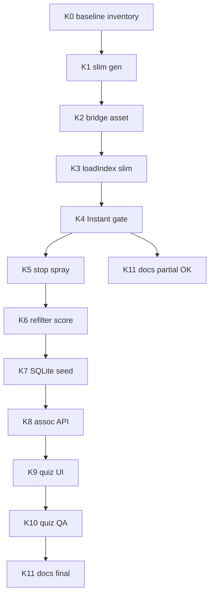

# Instant + skojarzenia + quiz admina (executable)

> **Nota /planner:** draft rundy 1 napisany przez orchestratora (Grok Planner niedostępny — limit użycia). Critic Composer ocenia ten draft.

## Konwencje obowiązujące w projekcie

- Runtime: `D:\...\DAM---Dobra-Kaloria---inyfinn\bin\apps\web` + bridge `bin\apps\desktop\local_bridge.py` (:8766); git track: `apps/web/**` — sync obu po zmianach.
- Stos: vanilla JS IIFE `window.DamX`, bez bundlera; Geex UI; em-dash ban.
- Prawda: `program-instructions.json` > code-doctrine > memory > kod.
- Zakaz: wipe całego `branding-index.json`; OCR nadpisujący overrides; Set-Content na PL JS; PowerShell `&&`.
- Cache-bust: bump `?v=` w każdym HTML ładującym zmieniony JS/CSS.
- Artefakty QA: screenshoty w `%TEMP%\cursor\screenshots` / poza git; w repo: `process.md` + memory.
- Parent = user; stop + AskQuestion przy ESCALATE.
- 1 faza = 1 sesja agenta; WRITE set rozłączny (patrz mapa poniżej).

### WRITE sets (współbieżność — HARD)

| Faza | Sesja | Pliki WRITE | Zakaz równoległy |
|------|-------|-------------|------------------|
| A Instant | agent-A | `scripts/build-branding-grid-index.py`, `dam-branding.js`, `local_bridge.py` (tylko routing asset), `branding.html` | nie edytować `brand_folder_context.py` / quiz |
| B Assoc pipeline | agent-B | `brand_folder_context.py`, `assoc_adequacy.py`, `refilter-branding-links.py`, `program-instructions.json` | nie edytować `dam-branding.js` |
| C SQLite+API | agent-C | `dam_db.py` / auth schema, `local_bridge.py` (assoc routes), seed script | nie edytować quiz UI |
| D Quiz UI | agent-D | `dam-assoc-quiz.js`, CSS, `branding.html` entry | nie edytować bridge schema |
| E Docs | agent-E | ADR, memory, process | tylko docs |

Join: Lead scala po Done gate fazy; tag `instant-phaseN` w process.md.

---

## Kontekst (read-only — NIE wykonywać)

- Cold Branding: `loadIndex` → full `branding-index.json` ~361MB `r.json()` main thread ([`dam-branding.js`](bin/apps/web/assets/js/dam-branding.js) ~2773).
- Search-index ~41MB; grid = `index.assets`.
- Folder spray: [`brand_folder_context.py`](bin/apps/web/scripts/brand_folder_context.py) `enrich_folder_groups` — sibling names → MIX na Kulki w SLIDERY.
- Scores w pipeline (`assoc_adequacy`); brak na published `linked_products`.
- SQLite live: users/meta; skojarzenia dziś w JSON index + overrides (~11 ręcznych).
- `/thumb-cache` istnieje; PAMIEC była pusta — warm ≠ Instant boot.
- Case user: `M-SLI504009` Kulki → błędnie MIX minibatoniki.

---

## KROK 0 — Baseline + inventory pól karty

- **Cel:** Zmierz cold open Branding (ms do pierwszej karty) i wypisz minimalny zestaw pól potrzebny karcie (inventory-first przed slim gen).
- **Pre-conditions:** Serwery :8765/:8766 2xx (`scripts/ops/smoke-dam-ports.ps1`).
- **Komendy:**
  - PowerShell: `curl.exe -s -o NUL -w "%{http_code}" --max-time 5 http://127.0.0.1:8765/branding.html`
  - CDP `Performance.getMetrics` + `Runtime.evaluate`: czas od navigation do `document.querySelectorAll('.dam-branding-card').length > 0`; zapisz baseline_ms.
  - Z jednego assetu w indexie wypisz klucze używane przez kartę (id, path, name, tags, asset_role, media_type, folder_group_id, linked_product_ids, thumb/preview fields).
- **Weryfikacja:** Plik `agents/shared/planner-runs/instant-assoc-quiz/session-01/artifacts/baseline.md` z liczbami (nie „wolno”).
- **Output:** `baseline_ms`, lista pól slim (frozen).
- **Budżet:** 2 przebiegi CDP; stop po 3 nieudanych smoke.

---

## KROK 1 — Generator `branding-grid-index.json`

- **Cel:** Z pełnego indexu zbuduj slim (tylko pola z KROK 0 + linked_product_ids).
- **Pre-conditions:** KROK 0 Done; pełny index istnieje pod `bin/apps/web/data/branding-index.json`.
- **Komendy/Snippety:** Nowy skrypt `bin/apps/web/scripts/build-branding-grid-index.py` — stream/iter assets, write `bin/apps/web/data/branding-grid-index.json` (+ mirror `apps/web/data/` jeśli trackowany). Hook opcjonalny na końcu `build-branding-index.py` (dopisz wywołanie, nie zastępuj full build).
- **Weryfikacja:** `size_mb < 25` (cel &lt;15); `assets.length` = full; sample 3 id obecne; `node`/`python -c` load OK.
- **Output:** plik slim + log size.
- **Backup:** przed pierwszym overwrite slim: skopiuj poprzedni slim do `_restore_backups/` jeśli istnieje.
- **Budżet:** 3 przebiegi gen+verify.

---

## KROK 2 — Bridge `GET /branding/asset`

- **Cel:** Lazy full asset by id (i batch `?ids=a,b`).
- **Pre-conditions:** KROK 1; bridge restart po zmianie `local_bridge.py`.
- **Komendy:** W [`local_bridge.py`](bin/apps/desktop/local_bridge.py) obok `/branding-index`: lookup w `_JSON_FILE_CACHE` full index → jeden obiekt; 404 jeśli brak. Bez re-serializacji całego indexu do klienta przy boot.
- **Weryfikacja:** `curl.exe -s --max-time 8 "http://127.0.0.1:8766/branding/asset?id=br-XXXX"` → 200 + id; czas &lt;500ms przy warm cache bridge.
- **Output:** endpoint live; api_version bump.
- **Budżet:** 2 przebiegi.

---

## KROK 3 — `loadIndex` → slim only

- **Cel:** Branding boot nie parsuje 361MB.
- **Pre-conditions:** KROK 1–2; WRITE tylko `dam-branding.js` + HTML cache-bust (+ sync apps jeśli kopia).
- **Komendy:** `loadIndex` fetch `data/branding-grid-index.json?v=…` (fallback bridge `/branding-grid-index`); modal/open: `fetch /branding/asset?id=` merge w pamięci. Status: „Ładowanie siatki…”. Nie ładować full przy boot. Session share `__damBrandingGridIndex`.
- **Weryfikacja:** Network panel / CDP: brak requestu `branding-index.json` przy cold open; jest `branding-grid-index`; pierwsze karty widoczne.
- **Output:** kod + `?v=restore…g`.
- **Budżet:** 4 przebiegi (regresja filtrów/tagów).

---

## KROK 4 — Done gate Instant

- **Cel:** Udowodnić Instant vs baseline.
- **Pre-conditions:** KROK 3.
- **Komendy:** Powtórz pomiar KROK 0; cel: `cold_ms < max(2000, baseline_ms * 0.15)` lub &lt;2s absolutnie na lokalnym D:. Screenshot+Read siatki (ui-taste 1 przelot smoke).
- **Weryfikacja:** liczby w `artifacts/instant-gate.md`; FAIL → nie idź do fazy B.
- **Output:** APPROVAL_READY_PHASE_A w process.md.
- **Budżet:** 3 przebiegi.

---

## KROK 5 — Zakaz sibling spray (SLIDERY / kategorie główne)

- **Cel:** Link per-plik (OCR + własna nazwa + SKU), nie blob siblingów.
- **Pre-conditions:** Faza A Done (lub świadomy parallel tylko jeśli WRITE set B — nie ruszać dam-branding.js).
- **Komendy:** W `enrich_folder_groups` / `resolve_folder_products`: jeśli `folder_group` path match `SLIDERY` / `KATEGORIE GŁÓWNE` / depth reguła mieszana → **nie** kopiuj `folder_linked_product_ids` na siblings; match tylko z `asset.name`+`ocr_text`+SKU. Zaktualizuj PI `branding.assoc_adequate_not_keyword` must: zakaz spray mieszanych folderów.
- **Weryfikacja:** Unit/script: folder z Kulki+Minibatoniki → Kulki asset **nie** dostaje `mix-6x-mini-batoniki-mixy` z sprayu.
- **Output:** patch py + PI.
- **Budżet:** 4 przebiegi.

---

## KROK 6 — Refilter + score na linkach

- **Cel:** Case Kulki naprawiony; score w pipeline → kolejka.
- **Pre-conditions:** KROK 5.
- **Komendy:** Uruchom `refilter-branding-links.py` (scoped folder SLIDERY SUCHE / asset M-SLI504009*) dry-run → apply. Progi HARD: ≥75 auto, 50–74 pending quiz, &lt;50 drop. Prefer same-line (kulki↔kulki) nad empty; zakaz cross-category kulki↔baton/minibaton bez SKU/OCR. Nie tykać overrides.
- **Weryfikacja:** Asset Kulki linked ≠ MIX; suggestions score w recognition/log; CDP modal pokazuje poprawne lub puste+pending.
- **Output:** log refilter + lista pending count.
- **Budżet:** 5 przebiegów; 3 fail → ESCALATE user.

---

## KROK 7 — SQLite `asset_product_links`

- **Cel:** Jedna prawda skojarzeń w SQLite.
- **Pre-conditions:** Faza B Done gate.
- **Komendy:** Migracja w `dam_db` / desktop data: tabela `(asset_id TEXT, product_id TEXT, score REAL, source TEXT, status TEXT, reason TEXT, updated_at, updated_by, PRIMARY KEY(asset_id, product_id))`. Seed: overrides → status=confirmed source=manual; index linked → source=index score=NULL status=auto|pending wg refilter; recognition suggestions → pending.
- **Weryfikacja:** `sqlite3` counts; overrides count zachowany.
- **Backup:** kopia `dam-local.sqlite` timestamp przed migracją.
- **Output:** schema + seed report.
- **Budżet:** 3 przebiegi.

---

## KROK 8 — API `/assoc/queue` + `/assoc/decide`

- **Cel:** Queue dla quizu; decide zapisuje SQLite + mirror override + patch slim linked ids in-memory/file patch.
- **Pre-conditions:** KROK 7; admin Bearer.
- **Komendy:** GET queue (status=pending order score desc); POST decide `{asset_id, product_ids[], action: confirm|reject|skip}`. Manual confirm → status=confirmed source=quiz|manual; never OCR overwrite confirmed.
- **Weryfikacja:** curl z tokenem admin; round-trip decide zmienia GET queue.
- **Output:** endpoints.
- **Budżet:** 3 przebiegi.

---

## KROK 9 — Quiz UI Branding admin v1

- **Cel:** Lewo materiał (thumb-cache/media), prawo DamSearch produktów, pamięć sesji last product_ids.
- **Pre-conditions:** KROK 8; admin mode ON.
- **Komendy:** Nowy `dam-assoc-quiz.js` + CSS Geex; entry w branding.html (przycisk tylko admin). Reuse wzorce picker z `dam-assoc-edit.js` (nie duplikuj search silnika). Akcje: Zatwierdź / Pomiń / Wyczyść / „Jak poprzednio”. Dirty-close per DamModalShared.
- **Weryfikacja:** CDP: kolejka ładuje się; decide zmniejsza pending; brak 361MB fetch.
- **Output:** UI v1 Branding only (Viz/Explorer = osobna faza później, ten sam moduł).
- **Budżet:** 6 przebiegów kod+CDP.

---

## KROK 10 — Quiz QA (ui-taste)

- **Cel:** 3 przeloty screenshot+Read (desktop); dirty-close; empty queue state.
- **Pre-conditions:** KROK 9.
- **Komendy:** browser_take_screenshot + Read; lista defektów; fix.
- **Weryfikacja:** 3 czyste przeloty lub lista blockerów.
- **Output:** process.md entry.
- **Budżet:** 3–6 przelotów.

---

## KROK 11 — Docs / porządek wierzchu

- **Cel:** ADR SoT skojarzeń; PI; memory; eksport MD nie na wierzchu Marketing (hook → `bin/.../exports/` lub off).
- **Pre-conditions:** Fazy A–D Done lub partial z notatką.
- **Komendy:** ADR-00X-assoc-sqlite-sot.md; PI update; memory; process; wyłącz/przenieś `DAM-PRODUKTY-BAZA.md` generator target.
- **Weryfikacja:** pliki istnieją; user wie gdzie SoT.
- **Output:** docs.
- **Budżet:** 2 przebiegi.

---

## Poza zakresem (jawne)

- MySQL / Postgres NAS live jako wymóg Instant.
- Pełny OCR rewrite (zostaje OLMOCR2).
- `file-index` → SQLite.
- Quiz Viz/Explorer (po v1 Branding — krok follow-up, ten sam `DamAssocQuiz`).
- Warm całej PAMIEC w tej rundzie (osobny job; nie blokuje Instant slim).

---

## Graf zależności

---

## Budżet przebiegów (suma)

| Faza | Kroki | Max przebiegów | Eskalacja |
|------|-------|----------------|-----------|
| A Instant | 0–4 | 14 | 3 fail Instant gate → Parent |
| B Assoc | 5–6 | 9 | 3 fail refilter → Parent |
| C DB/API | 7–8 | 6 | migracja fail → rollback sqlite |
| D Quiz | 9–10 | 12 | UI blocker → Parent |
| E Docs | 11 | 2 | — |
| **Suma** | | **~43** | |

---

## Kontrakt z wykonawcą

- Stop on error; nie kontynuuj fazy bez Done gate.
- Backup sqlite + slim przed destrukcją.
- Lint/`node --check` / `ast.parse` przed oddaniem.
- Max 3 cykle stagnacji → ESCALATE user.
- Nie deklaruj Instant bez liczb z KROK 4.
- Sync bin↔apps dla trackowanych plików.

## Guardrails

- Overrides święte (PI).
- Nie serwuj full index na boot Branding po KROK 3.
- Em-dash ban; Geex; admin-only quiz entry.
- Parent zatwierdza przejście A→B jeśli Instant gate borderline.
