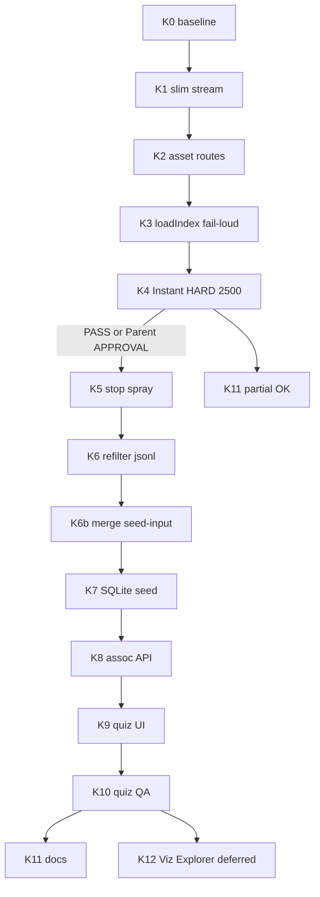

# Instant + skojarzenia + quiz admina (executable)

> **Nota /planner:** draft rundy 2 — ACCEPT krytycznych z critique r1. Grok Task niedostępny (limit); orchestrator = Planner; Critic inline przy limicie Composer Task.

## Konwencje obowiązujące w projekcie

- Runtime D: `...\DAM---Dobra-Kaloria---inyfinn\bin\apps\web` + `bin\apps\desktop\local_bridge.py` (:8766). Git track: `apps/web/**`. Po każdej zmianie JS/HTML/CSS: **sync bin↔apps** (lekcja dashboard `dam-bento-resize.js` tylko w apps).
- Stos: vanilla JS IIFE `window.DamX`; Geex; em-dash ban; PL UI.
- Prawda: `program-instructions.json` > code-doctrine > memory > kod. Krytyczne decyzje → PI **przed** kodem.
- Zakaz: wipe `branding-index.json`; OCR nadpisujący overrides; `Set-Content` na PL JS (UTF-8 byte-safe Write/StrReplace); PowerShell `&&`.
- Cache-bust: bump `?v=` w HTML po zmianie JS/CSS.
- Artefakty QA: screenshoty poza git; w repo: `process.md` + memory.
- Parent = user. Eskalacja: stop + wpis `agents/shared/planner-runs/instant-assoc-quiz/session-01/ESCALATE.md` + AskQuestion.
- 1 faza = 1 sesja; wejście sesji = brief wycinek + ostatni gate artifact + tag `instant-phaseN`.
- Floating index w tytule modala (np. `6300749`) = bug UI; napraw w Faza A/D gdy widoczny (nie zostawiać).

### WRITE sets (HARD — bez A∥C na bridge)

| Faza | Sesja | WRITE | Zakaz |
|------|-------|-------|-------|
| A Instant | agent-A | `scripts/build-branding-grid-index.py`, nowy `bin/apps/desktop/branding_asset_routes.py`, thin import w `local_bridge.py` (1 linia register), `dam-branding.js`, `branding.html` | nie `brand_folder_context.py`, nie quiz, nie assoc schema |
| B Assoc pipeline | agent-B | `brand_folder_context.py`, `assoc_adequacy.py`, `refilter-branding-links.py`, PI, artifact `refilter-pending.jsonl` | nie `dam-branding.js`, nie `local_bridge.py` |
| C SQLite+API | agent-C **po** Done A | `dam_db` schema, seed script, **rozszerzenie** `branding_asset_routes.py` o `/assoc/*` (ten sam plik routes, sekwencyjnie po A) | nie quiz UI; **nie równolegle z A** |
| D Quiz UI | agent-D | `dam-assoc-quiz.js`, CSS, branding.html entry | nie bridge schema |
| E Docs | agent-E | ADR, memory, process, PI mirror | tylko docs |

Join: Lead po Done gate; tag w process.md.

### Checklist wejścia sesji B (po Instant)

1. `artifacts/instant-gate.md` PASS (`cold_ms < 2500`).
2. Tag `instant-phaseA` w process.md.
3. Brief wycinek fazy B (KROK 5–6b).
4. Jeśli Instant FAIL → Parent APPROVAL w ESCALATE.md zanim B.

---

## Kontekst (read-only — NIE wykonywać)

- Cold Branding: `loadIndex` → full ~361MB `branding-index.json` main thread (`dam-branding.js`).
- Folder spray: `brand_folder_context.py` `enrich_folder_groups` → Kulki→MIX w SLIDERY.
- Scores w `assoc_adequacy`; brak na published `linked_products`.
- SQLite live = users/meta; skojarzenia = JSON + overrides (~11).
- `/thumb-cache` OK; warm ≠ Instant boot.
- Case: `M-SLI504009` Kulki → MIX minibatoniki.
- Błędy przeszłości do uniknięcia: sync bin↔apps; UTF-8; cache-bust; ciche full-index fallback; deklaracja Done bez screenshot+Read; race na jednym pliku bridge.

---

## KROK 0 — Baseline + inventory pól karty

- **Cel:** Zmierz cold open (ms do pierwszej karty) + frozen lista pól slim.
- **Pre-conditions:** `:8765`/`:8766` 2xx (`scripts/ops/smoke-dam-ports.ps1`).
- **Komendy:**
  - `curl.exe -s -o NUL -w "%{http_code}" --max-time 5 http://127.0.0.1:8765/branding.html`
  - CDP: czas navigation → `.dam-branding-card` count > 0; zapisz `baseline_ms`.
  - Inventory kluczy karty z 1 assetu (id, path, name, tags, asset_role, media_type, folder_group_id, linked_product_ids, thumb/preview).
- **Weryfikacja:** `.../artifacts/baseline.md` z liczbami.
- **Output:** `baseline_ms`, lista pól slim (frozen).
- **Budżet:** 2 przebiegi CDP; 3 fail smoke → ESCALATE.

---

## KROK 1 — Stream generator `branding-grid-index.json`

- **Cel:** Slim z full index **bez** `json.load` całego 361MB jeśli uniknione (ijson / incremental); peak RAM zmierzony.
- **Pre-conditions:** KROK 0 Done; full index pod `bin/apps/web/data/branding-index.json`.
- **Komendy:** `bin/apps/web/scripts/build-branding-grid-index.py` → `bin/apps/web/data/branding-grid-index.json` (+ mirror `apps/web/data/` jeśli track). Opcjonalny hook na końcu `build-branding-index.py`. Log: size_mb, peak_rss_mb, assets.length.
- **Weryfikacja:** `size_mb < 25` (cel &lt;15); length = full; sample 3 id; peak_rss w logu.
- **Backup:** poprzedni slim → `_restore_backups/branding-grid-index-<ts>.json`.
- **Budżet:** 3 przebiegi. OOM → ESCALATE (chunk strategy).

---

## KROK 2 — `branding_asset_routes.py` + `GET /branding/asset`

- **Cel:** Lazy full asset; **nie** puchnąć `local_bridge.py` — nowy moduł + register.
- **Pre-conditions:** KROK 1.
- **Komendy:** Nowy `bin/apps/desktop/branding_asset_routes.py` (lookup `_JSON_FILE_CACHE` full / on-disk); `local_bridge.py` tylko import+register. Endpointy: `GET /branding/asset?id=`, `GET /branding/asset?ids=a,b`, opcjonalnie `GET /branding-grid-index`. Restart bridge.
- **Weryfikacja:** curl asset 200 &lt;500ms warm; api_version bump.
- **Output:** moduł + thin hook.
- **Budżet:** 2 przebiegi.

---

## KROK 3 — `loadIndex` slim only + fail-loud

- **Cel:** Boot nie parsuje 361MB; **brak** cichego fallbacku do full.
- **Pre-conditions:** KROK 1–2; WRITE `dam-branding.js` + HTML `?v=` + sync apps.
- **Komendy:** fetch `data/branding-grid-index.json?v=…` lub bridge `/branding-grid-index`. Jeśli 404/puste: UI error „Uruchom build-branding-grid-index” — **nie** ładuj `branding-index.json`. Modal: `/branding/asset?id=` merge. Status „Ładowanie siatki…”. `__damBrandingGridIndex` share.
- **Weryfikacja:** CDP Network: brak requestu `branding-index.json` przy cold open; jest grid-index; karty widoczne. Jeśli usuniesz slim → fail-loud (test).
- **Output:** kod + cache-bust; sync bin↔apps.
- **Budżet:** 4 przebiegi (filtry/tagi + floating index w tytule jeśli repro).

---

## KROK 4 — Done gate Instant (HARD)

- **Cel:** Udowodnić Instant.
- **Pre-conditions:** KROK 3.
- **Komendy:** Powtórz pomiar K0. **HARD:** `cold_ms < 2500` na D: lokalnym. Soft: `cold_ms / baseline_ms` w logu (nie zastępuje HARD). Screenshot+Read siatki (1 smoke ui-taste).
- **Weryfikacja:** `artifacts/instant-gate.md` z liczbami. FAIL → stop; Parent APPROVAL w ESCALATE.md przed B.
- **Output:** PASS → tag `instant-phaseA` + process.md.
- **Budżet:** 3 przebiegi.

---

## KROK 5 — Zakaz sibling spray

- **Cel:** Link per-plik, nie blob siblingów w SLIDERY / kategorie główne.
- **Pre-conditions:** Instant PASS lub Parent APPROVAL.
- **Komendy:** `enrich_folder_groups` / resolve: match path SLIDERY / KATEGORIE GŁÓWNE / mixed depth → **nie** kopiuj `folder_linked_product_ids` na siblings; tylko `asset.name`+OCR+SKU. PI must: zakaz spray mieszanych.
- **Weryfikacja:** Script: folder Kulki+Minibatoniki → Kulki **bez** `mix-6x-mini-batoniki-mixy` ze sprayu.
- **Output:** patch py + PI.
- **Budżet:** 4 przebiegi.

---

## KROK 6 — Refilter + score → artifact

- **Cel:** Case Kulki; progi; **wyjście = artifact**, nie drugi SoT.
- **Pre-conditions:** KROK 5.
- **Komendy:** `refilter-branding-links.py` scoped dry-run → apply. Progi: ≥75 auto, 50–74 pending, &lt;50 drop. Prefer same-line; zakaz kulki↔baton bez SKU/OCR. Nie tykać overrides. Zapisz `artifacts/refilter-pending.jsonl` (asset_id, product_id, score, reason, proposed_status).
- **Weryfikacja:** Kulki ≠ MIX; jsonl niepusty lub uzasadnione 0; CDP modal.
- **Output:** log + jsonl.
- **Budżet:** 5; 3 fail → ESCALATE.

---

## KROK 6b — Merge most do seed

- **Cel:** Jeden most: refilter artifact → seed input (nie równoległy JSON SoT vs SQLite).
- **Pre-conditions:** KROK 6.
- **Komendy:** Walidacja jsonl (schema); kopiuje/oznacza jako `seed-input-refilter.jsonl` dla K7. Index JSON linked_products po refilter = staging do seed, nie final SoT po K7.
- **Weryfikacja:** plik seed-input istnieje; count pending = lines status pending.
- **Output:** seed-input artifact.
- **Budżet:** 1 przebieg.

---

## KROK 7 — SQLite `asset_product_links` + seed

- **Cel:** Jedna prawda skojarzeń.
- **Pre-conditions:** 6b Done; backup sqlite.
- **Komendy:** Tabela `(asset_id, product_id, score, source, status, reason, updated_at, updated_by, PRIMARY KEY(asset_id, product_id))`. Seed: overrides → confirmed/manual; seed-input → auto|pending; recognition → pending. Po seed: slim `linked_product_ids` regeneruj z SQLite confirmed+auto (osobny przebieg gen).
- **Weryfikacja:** sqlite3 counts; overrides count zachowany.
- **Backup:** `dam-local.sqlite.<ts>.bak`.
- **Budżet:** 3 przebiegi.

---

## KROK 8 — `/assoc/queue` + `/assoc/decide` (ten sam routes module)

- **Cel:** API quizu; WRITE tylko `branding_asset_routes.py` (+ thin jeśli trzeba) — **sesja C po A**.
- **Pre-conditions:** K7; admin Bearer.
- **Komendy:** GET queue pending score desc; POST decide confirm|reject|skip. Manual/quiz confirmed never OCR-overwrite. Mirror override + patch slim linked ids.
- **Weryfikacja:** curl round-trip.
- **Budżet:** 3 przebiegi.

---

## KROK 9 — Quiz UI Branding admin v1

- **Cel:** Lewo materiał, prawo DamSearch, sesja last product_ids.
- **Pre-conditions:** K8; admin ON.
- **Komendy:** `dam-assoc-quiz.js` + Geex CSS; entry branding.html admin-only. Reuse picker z `dam-assoc-edit.js`. Zatwierdź / Pomiń / Wyczyść / „Jak poprzednio”. Dirty-close DamModalShared. Sync bin↔apps + cache-bust.
- **Weryfikacja:** CDP queue; decide shrinks pending; brak 361MB.
- **Output:** Branding only.
- **Budżet:** 6 przebiegów.

---

## KROK 10 — Quiz QA ui-taste

- **Cel:** ≥3 przeloty screenshot+Read; dirty-close; empty queue.
- **Pre-conditions:** K9.
- **Komendy:** browser_take_screenshot + Read; fix; powtórz.
- **Weryfikacja:** 3 czyste lub blocker list.
- **Budżet:** 3–6 przelotów.

---

## KROK 11 — Docs / porządek

- **Cel:** ADR SoT; PI; memory; MD eksport → `bin/.../exports/` lub off wierzchu Marketing.
- **Pre-conditions:** A–D Done lub partial z notatką.
- **Komendy:** ADR-assoc-sqlite-sot; PI; memory; process; generator MD target.
- **Budżet:** 2 przebiegi.

---

## KROK 12 — Follow-up Viz + Explorer (deferred, w todos)

- **Cel:** Ten sam `DamAssocQuiz` entry w Viz i Explorer.
- **Pre-conditions:** K10 Done Branding; Parent priorytet.
- **Komendy:** podpięcie entry points; smoke 1 URL każdy; bez nowego SoT.
- **Weryfikacja:** admin widzi quiz w 3 powierzchniach.
- **Status planowy:** pending deferred — **nie** „poza zakresem zapomniane”.
- **Budżet:** 4 przebiegi (osobna sesja).

---

## Poza zakresem (jawne)

- MySQL / Postgres NAS jako wymóg Instant.
- Pełny OCR rewrite (OLMOCR2 zostaje).
- `file-index` → SQLite.
- Warm całej PAMIEC w tej rundzie (osobny job).

---

## Graf zależności

---

## Budżet przebiegów

| Faza | Kroki | Max | Eskalacja |
|------|-------|-----|-----------|
| A Instant | 0–4 | 14 | Instant FAIL → Parent |
| B Assoc | 5–6b | 10 | 3 fail refilter → Parent |
| C DB/API | 7–8 | 6 | rollback sqlite |
| D Quiz | 9–10 | 12 | UI blocker → Parent |
| E Docs | 11 | 2 | — |
| F Follow-up | 12 | 4 | osobna sesja |
| **Suma** | | **~48** | |

---

## Kontrakt z wykonawcą

- Stop on error; bez Done gate nie ma następnej fazy.
- Backup sqlite + slim przed destrukcją.
- `node --check` / `ast.parse` przed oddaniem.
- Max 3 cykle stagnacji → ESCALATE.md + Parent.
- Nie deklaruj Instant bez liczb K4 HARD.
- Sync bin↔apps; cache-bust; UTF-8 safe edits.
- Screenshot+Read dla UI (K4 smoke, K10 pełne).

## Guardrails

- Overrides święte (PI).
- Po K3: zero full index na boot Branding.
- Fail-loud bez slim.
- Em-dash ban; Geex; admin-only quiz.
- Parent APPROVAL gdy Instant FAIL przed B.
- Brak równoległego WRITE A∥C na bridge/routes.
